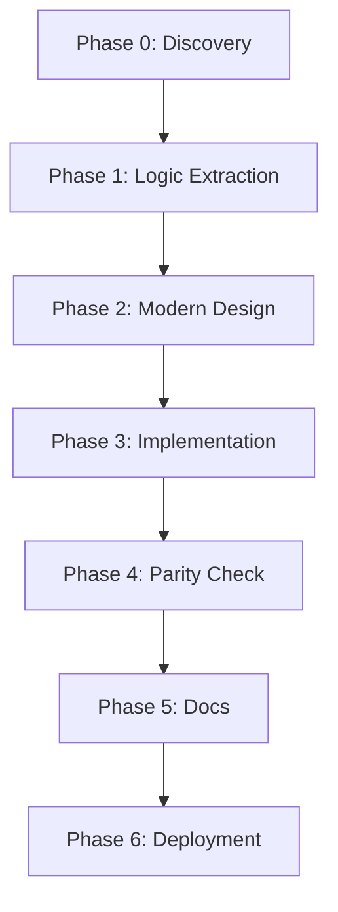

# SMAUG 2.0 TypeScript Port — README.md

> **Experimental Project Disclaimer**
> This project is a controlled experiment to evaluate the real capacity of a local home lab to perform complex agentic coding and legacy refactoring without the use of commercial AI providers. This is a work-in-progress.
>
> **Local Lab Specifications:**
> * **Hardware:** GMKtec EVO-X2 AMD Ryzen™ AI Max+ 395 Mini PC (128 Gb RAM, 2 TB NVMe)
> * **OS:** Ubuntu 24.04 LTS with AMD ROCm 7.2.0
> * **Inference:** Ollama v0.18.3 running Qwen 3.5 122B-A10B LLM
> * **Orchestration:** Opencode.ai v1.3.6
>
> *Note: All prompts in this repository were generated, researched, and iteratively improved by the AI Agent running on the local hardware listed above. This same agent performed all research on the legacy source code to generate the roadmap below.*

---

## Architectural Transition Strategy

The core challenge of this refactor is the transition from a **monolithic, pointer-heavy C architecture** to a **modular, event-driven TypeScript stack**. In the legacy system, global state and manual memory management governed the 'Game Pulse.' Our modern reimplementation replaces these with a **Prisma-backed persistence layer**, **Type-safe Interfaces** for entity management, and an **Asynchronous I/O Event Loop**. This ensures that the original 'feel' and 'tick-rate' of the legacy system are preserved while gaining the scalability, maintainability, and observability of a modern Node.js environment.

---

## Project Status & Progress Tracking

The current feature parity status is documented in [`PARITY.md`](https://github.com/ebrandi/smaug-ts/blob/main/PARITY.md). The baseline legacy source code is available at [https://github.com/smaugmuds/_smaug_](https://github.com/smaugmuds/_smaug_).

---

## Execution Pipeline (The 68-File Roadmap)

**CRITICAL WARNING: Execution must follow this exact sequence (Phase 0 through Phase 6) to maintain structural integrity and ensure data-model consistency.**

### Phase 0: Legacy Codebase Discovery

#### [PHASE_0A_STRUCTURE_DISCOVERY.md](https://github.com/ebrandi/smaug-ts/tree/main/AI_Prompts/PHASE_0A_STRUCTURE_DISCOVERY.md)
Catalogue every `.c` and `.h` file in the legacy `legacy/src/` directory, collecting metadata (filenames, sizes, line counts) without reading any source code. Generate `STRUCTURE.md` with a complete subsystem grouping hypothesis based solely on filename patterns. This phase establishes the physical layout and provides the reading order for subsequent analysis.

#### [PHASE_0B_HEADER_ANALYSIS.md](https://github.com/ebrandi/smaug-ts/tree/main/AI_Prompts/PHASE_0B_HEADER_ANALYSIS.md)
Perform a deep analysis of all header (`.h`) files in the legacy codebase. Extract every `struct`, `enum`, `typedef`, `#define` constant, macro, and function prototype to produce `DATAMODEL.md`. Document field-level details including pointer relationships and bitvector usage. This document becomes the authoritative data model reference for all subsequent phases, capturing the legacy C type system without accessing implementation files.

---

### Phase 1: Legacy Business Logic Analysis

#### [PHASE_1A_BOOT_GAMELOOP.md](https://github.com/ebrandi/smaug-ts/tree/main/AI_Prompts/PHASE_1A_BOOT_GAMELOOP.md)
Extract the boot sequence and game loop implementation details from `comm.c`, `handler.c`, and related files. Document the `game_loop()`, `init_game()`, `new_descriptor()`, and pulse-based timing model. Capture exact formulas for tick intervals (PULSE_VIOLENCE=12, PULSE_MOBILE=16, etc.) and the event processing pipeline.

#### [PHASE_1B_HASHSTR_TABLES.md](https://github.com/ebrandi/smaug-ts/tree/main/AI_Prompts/PHASE_1B_HASHSTR_TABLES.md)
Analyse the string handling and hash table system (`hashstr.c`, `mud.h`). Document the string pooling mechanism, hash function implementation, and `str_dup()`/`str_free()` memory management patterns. Extract the exact hash table size parameters and collision resolution strategy used throughout the codebase.

#### [PHASE_1C_DATABASE_LOADING.md](https://github.com/ebrandi/smaug-ts/tree/main/AI_Prompts/PHASE_1C_DATABASE_LOADING.md)
Extract database file loading logic from files like `save.c`, `db.c`, and `loader.c`. Document the player save file format, area file format, and object loading pipeline. Capture the exact data parsing routines and error handling patterns used for legacy `.sav` and `.are` files.

#### [PHASE_1D_PERSISTENCE_RESETS.md](https://github.com/ebrandi/smaug-ts/tree/main/AI_Prompts/PHASE_1D_PERSISTENCE_RESETS.md)
Analyse area reset logic (`reset.c`, `db.c`). Document the reset queue system, mob/obj placement algorithms, and area-level reset timers. Extract the exact formula for determining room resets and the state machine for area lifecycle management.

#### [PHASE_1E_NETWORKING_IO.md](https://github.com/ebrandi/smaug-ts/tree/main/AI_Prompts/PHASE_1E_NETWORKING_IO.md)
Extract network I/O implementation from `comm.c`, `mud_comm.c`. Document the socket handling, input/output buffering, and telnet protocol negotiation. Capture the descriptor state machine, idle timeout logic, and connection tracking mechanisms.

#### [PHASE_1F_COLOUR_DNS_PROTOCOLS.md](https://github.com/ebrandi/smaug-ts/tree/main/AI_Prompts/PHASE_1F_COLOUR_DNS_PROTOCOLS.md)
Analyse colour code handling (`color.c`), DNS lookup routines, and protocol extensions (MCCP, MSDP, MSSP). Document escape sequence parsing, colour mapping, and the exact protocols for terminal type detection and compression negotiation.

#### [PHASE_1G_COMMAND_INTERPRETER.md](https://github.com/ebrandi/smaug-ts/tree/main/AI_Prompts/PHASE_1G_COMMAND_INTERPRETER.md)
Extract the command dispatch system from `interpreter.c`. Document the hash table lookup, abbreviation matching, trust/position checks, and command flags. Capture the exact formula for command lookup success, disambiguation rules, and the substate handler routing mechanism.

#### [PHASE_1H_HANDLER.md](https://github.com/ebrandi/smaug-ts/tree/main/AI_Prompts/PHASE_1H_HANDLER.md)
Analyse the core handler system (`handler.c`) and its utility functions. Document character/object creation/destruction, linked list manipulation macros, and the exact implementation of common operations like `extract_char()`, `obj_to_char()`, and `get_char_room()`.

#### [PHASE_1I_COMBAT.md](https://github.com/ebrandi/smaug-ts/tree/main/AI_Prompts/PHASE_1I_COMBAT.md)
Extract combat logic from `fight.c`. Document the complete combat engine: violence tick timing, multi-hit processing, damage calculation formulas, hit-roll algorithms, and death handling. Capture the exact formulas for damage mitigation, critical hits, and XP award calculation.

#### [PHASE_1J_MAGIC.md](https://github.com/ebrandi/smaug-ts/tree/main/AI_Prompts/PHASE_1J_MAGIC.md)
Analyse the spell system (`magic.c`, `magic2.c`, `spells.c`). Document spell casting pipeline, saving throw mechanics, spell formulae, component requirements, and the exact implementation of all 50+ spell types.

#### [PHASE_1K_SKILLS.md](https://github.com/ebrandi/smaug-ts/tree/main/AI_Prompts/PHASE_1K_SKILLS.md)
Extract skill system logic from `skills.c`. Document proficiency calculation, learning mechanics, skill usage costs, and the exact formulas for skill check success rates and experience gain.

#### [PHASE_1L_PLAYER_INFO.md](https://github.com/ebrandi/smaug-ts/tree/main/AI_Prompts/PHASE_1L_PLAYER_INFO.md)
Analyse player creation and management files (`player.c`, `genboard.c`). Document character creation flow, stat rolling algorithms, race/class selection, and the exact implementation of boards and communication channels.

#### [PHASE_1M_MOVEMENT.md](https://github.com/ebrandi/smaug-ts/tree/main/AI_Prompts/PHASE_1M_MOVEMENT.md)
Extract movement logic (`move.c`, `overland.c`). Document room-to-room navigation, door handling, mount mechanics, command lag, and the exact formulas for movement costs by sector type and encumbrance.

#### [PHASE_1N_OBJECTS_INVENTORY.md](https://github.com/ebrandi/smaug-ts/tree/main/AI_Prompts/PHASE_1N_OBJECTS_INVENTORY.md)
Analyse object system (`obj.c`, `shop.c`). Document inventory management, equipment slot logic, wear/remove handling, and the exact implementation of shop pricing, repair costs, and banking transactions.

#### [PHASE_1O_COMMUNICATION.md](https://github.com/ebrandi/smaug-ts/tree/main/AI_Prompts/PHASE_1O_COMMUNICATION.md)
Extract communication system logic (`social.c`, `comm.c`, `language.c`). Document channel broadcasting, tell/reply systems, ignore lists, language translation, and the exact implementation of social commands.

#### [PHASE_1P_ECONOMY_SHOPS.md](https://github.com/ebrandi/smaug-ts/tree/main/AI_Prompts/PHASE_1P_ECONOMY_SHOPS.md)
Analyse economy handlers (`shop.c`, `bank.c`). Document shop keeper behavior, buying/selling markup formulas, bank interest rates, and the exact pricing algorithms for repairs and services.

#### [PHASE_1Q_QUESTS_HOUSING.md](https://github.com/ebrandi/smaug-ts/tree/main/AI_Prompts/PHASE_1Q_QUESTS_HOUSING.md)
Extract quest system (`quest.c`, `housing.c`). Document quest tracking, housing allocation, rent system, and the exact algorithms for house ownership and maintenance.

#### [PHASE_1R_CLANS_DEITY_SOCIAL.md](https://github.com/ebrandi/smaug-ts/tree/main/AI_Prompts/PHASE_1R_CLANS_DEITY_SOCIAL.md)
Analyse social organisations (`clan.c`, `deity.c`). Document clan registration, deity worship mechanics, and the exact implementation of social group membership and benefits.

#### [PHASE_1S_MUDPROGS.md](https://github.com/ebrandi/smaug-ts/tree/main/AI_Prompts/PHASE_1S_MUDPROGS.md)
Extract MUDProg scripting engine (`mud_prog.c`). Document the MXP grammar, ifcheck conditions, action queue, and the exact implementation of trigger execution and variable substitution.

#### [PHASE_1T_OLC_EDITORS.md](https://github.com/ebrandi/smaug-ts/tree/main/AI_Prompts/PHASE_1T_OLC_EDITORS.md)
Analyse Online Creation editors (`redit.c`, `medit.c`, `oedit.c`, `aedit.c`). Document the editor state machines, field validation, and save format for each OLC module.

#### [PHASE_1U_ADMIN_COMMANDS.md](https://github.com/ebrandi/smaug-ts/tree/main/AI_Prompts/PHASE_1U_ADMIN_COMMANDS.md)
Extract admin command handlers (`wizard.c`, `ban.c`). Document authority checks, trust level validation, and the exact implementation of freeze, ban, transfer, and other immortal commands.

#### [PHASE_1V_OVERLAND_SPECIAL.md](https://github.com/ebrandi/smaug-ts/tree/main/AI_Prompts/PHASE_1V_OVERLAND_SPECIAL.md)
Analyse overland map system (`overland.c`). Document the grid-based navigation, sector costs, and the exact implementation of overland travel mechanics.

#### [PHASE_1W_PLAYER_MISC.md](https://github.com/ebrandi/smaug-ts/tree/main/AI_Prompts/PHASE_1W_PLAYER_MISC.md)
Extract player.miscellaneous logic (`genboard.c`, `board.c`). Document notice/idea systems, voting mechanics, and the exact implementation of board interactions.

#### [PHASE_1X_UTILITIES_REMAINING.md](https://github.com/ebrandi/smaug-ts/tree/main/AI_Prompts/PHASE_1X_UTILITIES_REMAINING.md)
Analyse remaining utility files (`utils.c`, `boards.c`). Document dice rolling, number parsing, and the exact implementation of helper functions used throughout the codebase.

#### [PHASE_1Y_UPDATE_TICK.md](https://github.com/ebrandi/smaug-ts/tree/main/AI_Prompts/PHASE_1Y_UPDATE_TICK.md)
Extract tick update and pulse management logic. Document the update cycle for all subsystems (combat, magic, economy) and the exact synchronization mechanisms between pulse intervals.

#### [PHASE_1Z_GAP_REVIEW_SYNTHESIS.md](https://github.com/ebrandi/smaug-ts/tree/main/AI_Prompts/PHASE_1Z_GAP_REVIEW_SYNTHESIS.md)
Produce the final gap analysis document synthesising all Phase 1 findings. Identify missing features, ambiguousbehaviour, and create the complete command table with trust levels, positions, and flags.

---

### Phase 2: Modern Architecture Design

#### [PHASE_2A_EXECUTIVE_SUMMARY.md](https://github.com/ebrandi/smaug-ts/tree/main/AI_Prompts/PHASE_2A_EXECUTIVE_SUMMARY.md)
Create `ARCHITECTURE.md` with the technical stack decision (Node.js 20+, TypeScript, PostgreSQL, Prisma), folder structure, and high-level design philosophy (event-driven, type-safe, backward-compatible). Document the 26-section roadmap for the complete architecture document.

#### [PHASE_2B_CORE_ENGINE.md](https://github.com/ebrandi/smaug-ts/tree/main/AI_Prompts/PHASE_2B_CORE_ENGINE.md)
Design the core engine subsystem: `EventBus` for typed pub/sub, `TickEngine` for pulse counters, and `GameLoop` for the main event loop. Document the 4-pulse-per-second model and event cataloguing system.

#### [PHASE_2C_NETWORK_LAYER.md](https://github.com/ebrandi/smaug-ts/tree/main/AI_Prompts/PHASE_2C_NETWORK_LAYER.md)
Design the network infrastructure: `WebSocketServer` for dual WebSocket/Socket.IO, `ConnectionManager` for connection states, and `Descriptor` for per-connection data. Document telnet protocol support and backpressure handling.

#### [PHASE_2D_ENTITY_SYSTEM.md](https://github.com/ebrandi/smaug-ts/tree/main/AI_Prompts/PHASE_2D_ENTITY_SYSTEM.md)
Design the entity class hierarchy: `Character`, `Player`, `Mobile`, `Room`, `Area`, `GameObject`, `Affect`. Document interfaces for all legacy `struct` types and the `bigint`-based bitvector system.

#### [PHASE_2E_COMMAND_SYSTEM.md](https://github.com/ebrandi/smaug-ts/tree/main/AI_Prompts/PHASE_2E_COMMAND_SYSTEM.md)
Design the command dispatch pipeline: `CommandRegistry` with hash table lookup, full trust/position/flag checks, and substate routing. Document the 200+ legacy commands and their exact parameter handling.

#### [PHASE_2F_COMBAT_SYSTEM.md](https://github.com/ebrandi/smaug-ts/tree/main/AI_Prompts/PHASE_2F_COMBAT_SYSTEM.md)
Design the combat subsystem: `CombatEngine` for violence ticks, `DamageCalculator` with exact formulas, and `DeathHandler` for corpse and XP logic. Document the multi-hit round system and damage application.

#### [PHASE_2G_MAGIC_SPELL_SYSTEM.md](https://github.com/ebrandi/smaug-ts/tree/main/AI_Prompts/PHASE_2G_MAGIC_SPELL_SYSTEM.md)
Design the spell system: `SpellEngine` for casting pipeline, `spell` registry with all 50+ spell implementations, and saving throw mechanics. Document component requirements and spell formulae.

#### [PHASE_2H_SKILL_AFFECT_SYSTEM.md](https://github.com/ebrandi/smaug-ts/tree/main/AI_Prompts/PHASE_2H_SKILL_AFFECT_SYSTEM.md)
Design the skill and affect system: `SkillSystem` for proficiency/learning, `AffectManager` for stat modifiers, and the exact duration/timing model for status effects.

#### [PHASE_2I_WORLD_MOVEMENT.md](https://github.com/ebrandi/smaug-ts/tree/main/AI_Prompts/PHASE_2I_WORLD_MOVEMENT.md)
Design the world system: `AreaManager` for area loading, `RoomManager` for room navigation, and `MovementHandler` for player travel. Document door mechanics, mounts, and sector costs.

#### [PHASE_2J_COMMUNICATION_SYSTEM.md](https://github.com/ebrandi/smaug-ts/tree/main/AI_Prompts/PHASE_2J_COMMUNICATION_SYSTEM.md)
Design the communication system: `ChannelManager` for broadcasting, `SocialManager` for social commands, `LanguageSystem` for translation, and `Pager` for multi-page output.

#### [PHASE_2K_PERSISTENCE_PRISMA.md](https://github.com/ebrandi/smaug-ts/tree/main/AI_Prompts/PHASE_2K_PERSISTENCE_PRISMA.md)
Design the persistence layer: Prisma schema for PostgreSQL, `PlayerRepository` for CRUD operations, and `WorldRepository` for area loading. Document the exact mapping from legacy file formats to database schema.

#### [PHASE_2L_ECONOMY_SOCIAL_GUILD.md](https://github.com/ebrandi/smaug-ts/tree/main/AI_Prompts/PHASE_2L_ECONOMY_SOCIAL_GUILD.md)
Design economy and social systems: `ShopSystem` for NPC торговля, `BankSystem` for deposits/withdrawals, `ClanSystem` for guilds, and `BoardSystem` for communication boards.

#### [PHASE_2M_MUDPROG_OLC.md](https://github.com/ebrandi/smaug-ts/tree/main/AI_Prompts/PHASE_2M_MUDPROG_OLC.md)
Design the scripting and OLC systems: `MudProgEngine` for MXP triggers, `IfcheckRegistry` for conditions, and OLC editors (redit, medit, oedit, aedit) with full validation.

#### [PHASE_2N_ADMIN_DASHBOARD_BROWSER.md](https://github.com/ebrandi/smaug-ts/tree/main/AI_Prompts/PHASE_2N_ADMIN_DASHBOARD_BROWSER.md)
Design admin and UI systems: Admin dashboard with JWT auth, REST API endpoints, and React-based dashboard. Document browser play UI with Socket.IO and ANSI rendering.

#### [PHASE_2O_WORLD_SCHEMA_IMPORT.md](https://github.com/ebrandi/smaug-ts/tree/main/AI_Prompts/PHASE_2O_WORLD_SCHEMA_IMPORT.md)
Design world data migration: JSON schema for area files, `AreaParser` for importing legacy `.are` files, and validation tools for world data integrity.

#### [PHASE_2P_ERROR_TESTING_MIGRATION.md](https://github.com/ebrandi/smaug-ts/tree/main/AI_Prompts/PHASE_2P_ERROR_TESTING_MIGRATION.md)
Design testing strategy: Unit/Integration/E2E test structure, mock patterns for network and database layers, and the exact acceptance criteria for the port.

#### [PHASE_2Q_QUALITY_PASS.md](https://github.com/ebrandi/smaug-ts/tree/main/AI_Prompts/PHASE_2Q_QUALITY_PASS.md)
Perform final architecture quality pass: cross-reference audit, consistency check, gap analysis, and appendices. Ensure `ARCHITECTURE.md` is complete and ready for implementation.

---

### Phase 3: TypeScript Reimplementation

#### [PHASE_3A_PROJECT_INIT.md](https://github.com/ebrandi/smaug-ts/tree/main/AI_Prompts/PHASE_3A_PROJECT_INIT.md)
Initialise the project: `package.json`, `tsconfig.json` with strict mode, ESLint, Vitest configuration, `.env` files, and the complete `src/` directory tree with stub files. Generate Prisma schema and ensure clean compilation.

#### [PHASE_3B_CORE_INFRASTRUCTURE.md](https://github.com/ebrandi/smaug-ts/tree/main/AI_Prompts/PHASE_3B_CORE_INFRASTRUCTURE.md)
Implement core engine: `EventBus` with 72 typed events, `TickEngine` for pulse counters, `GameLoop` at 250ms intervals, `Logger` with domain tags, and `AnsiColors/Dice/BitVector` utilities. Implement WebSocket/Socket.IO dual protocol and the connection state machine.

#### [PHASE_3C_UTILITIES_HELPERS.md](https://github.com/ebrandi/smaug-ts/tree/main/AI_Prompts/PHASE_3C_UTILITIES_HELPERS.md)
Expand utility layer: advanced string manipulation (`wordWrap`, `truncate`, `pluralize`), text formatting, file I/O helpers, and legacy format converters for `.are` and player saves.

#### [PHASE_3D_WORLD_LOADER.md](https://github.com/ebrandi/smaug-ts/tree/main/AI_Prompts/PHASE_3D_WORLD_LOADER.md)
Implement world loading: `AreaManager` for area registration, `VnumRegistry` for unique ID tracking, `ResetEngine` for mob/obj placement, and full area file parsing with JSON output.

#### [PHASE_3E_AREA_PARSER.md](https://github.com/ebrandi/smaug-ts/tree/main/AI_Prompts/PHASE_3E_AREA_PARSER.md)
Extract area parsing logic: full `.are` file parser supporting all SMAUG 2.0 area file extensions. Document room, mob, object, and exit parsing with error recovery.

#### [PHASE_3F_MOVEMENT_SYSTEM.md](https://github.com/ebrandi/smaug-ts/tree/main/AI_Prompts/PHASE_3F_MOVEMENT_SYSTEM.md)
Implement movement system: room-to-room navigation, door handling (locked, closed, keys), mount mechanics, follower systems, and movement lag. Document sector costs and overland travel.

#### [PHASE_3G_LOOK_PERCEPTION.md](https://github.com/ebrandi/smaug-ts/tree/main/AI_Prompts/PHASE_3G_LOOK_PERCEPTION.md)
Implement look/examine system: room description rendering, entity perception (invisibility, darkness), inventory listing, and the exact implementation of `do_look` and `do_examine`.

#### [PHASE_3H_COMBAT_CORE.md](https://github.com/ebrandi/smaug-ts/tree/main/AI_Prompts/PHASE_3H_COMBAT_CORE.md)
Implement core combat: violence tick processing, multi-hit rounds, damage calculation with exact formulas, death handling, corpse creation, and XP reward calculation.

#### [PHASE_3I_MAGIC_SYSTEM.md](https://github.com/ebrandi/smaug-ts/tree/main/AI_Prompts/PHASE_3I_MAGIC_SYSTEM.md)
Implement spell system: `do_cast` pipeline, spell registry with all 50+ spell implementations, component management, saving throws, and spell formulae for effect calculation.

#### [PHASE_3J_SKILLS_SYSTEM.md](https://github.com/ebrandi/smaug-ts/tree/main/AI_Prompts/PHASE_3J_SKILLS_SYSTEM.md)
Implement skill system: proficiency calculation, learning mechanics, skill usage costs, and the exact formulas for skill check success rates.

#### [PHASE_3K_AFFECTS_CONDITIONS.md](https://github.com/ebrandi/smaug-ts/tree/main/AI_Prompts/PHASE_3K_AFFECTS_CONDITIONS.md)
Implement affect system: `AffectManager` for stat modifiers, duration ticking, equipment affects, and condition tracking (poison, disease, etc.).

#### [PHASE_3L_INVENTORY_SYSTEM.md](https://github.com/ebrandi/smaug-ts/tree/main/AI_Prompts/PHASE_3L_INVENTORY_SYSTEM.md)
Implement object system: inventory management, equipment slots, wear/remove handling, item interaction (get, drop, give, eat, drink), and containers.

#### [PHASE_3M_ECONOMY_SHOPS.md](https://github.com/ebrandi/smaug-ts/tree/main/AI_Prompts/PHASE_3M_ECONOMY_SHOPS.md)
Implement economy: shop system with buying/selling, repair shops with markup formulas, banking with deposits/withdrawals, and auction system with bidding logic.

#### [PHASE_3N_PROGRESSION_LEVELING.md](https://github.com/ebrandi/smaug-ts/tree/main/AI_Prompts/PHASE_3N_PROGRESSION_LEVELING.md)
Implement progression: levelling system with XP formulas, class advancement, skill training, and quest tracking.

#### [PHASE_3O_COMMUNICATION.md](https://github.com/ebrandi/smaug-ts/tree/main/AI_Prompts/PHASE_3O_COMMUNICATION.md)
Implement communication: all channels (say, tell, gossip, etc.), language system, ignore lists, social commands, and pager for multi-page output.

#### [PHASE_3P_SOCIAL_GROUPS.md](https://github.com/ebrandi/smaug-ts/tree/main/AI_Prompts/PHASE_3P_SOCIAL_GROUPS.md)
Implement social groups: clan registration, deity worship, council membership, and group benefits with exact implementation.

#### [PHASE_3Q_PERSISTENCE_SAVE.md](https://github.com/ebrandi/smaug-ts/tree/main/AI_Prompts/PHASE_3Q_PERSISTENCE_SAVE.md)
Implement persistence: `PlayerRepository` for save/load, auto-save with debouncing, hotboot support, and full legacy save file compatibility.

#### [PHASE_3R_MUDPROGS.md](https://github.com/ebrandi/smaug-ts/tree/main/AI_Prompts/PHASE_3R_MUDPROGS.md)
Implement MudProgs: MXP trigger parsing, ifcheck conditions, action queue, variable substitution, and trigger execution with full legacy compatibility.

#### [PHASE_3S_ADMIN_OLC.md](https://github.com/ebrandi/smaug-ts/tree/main/AI_Prompts/PHASE_3S_ADMIN_OLC.md)
Implement admin commands and OLC: full admin command set (authorize, ban, set, etc.), OLC editors (redit, medit, oedit, aedit) with field validation, and admin dashboard API.

#### [PHASE_3T_DASHBOARD_BROWSER.md](https://github.com/ebrandi/smaug-ts/tree/main/AI_Prompts/PHASE_3T_DASHBOARD_BROWSER.md)
Implement admin dashboard and browser UI: React dashboard with real-time updates, Socket.IO for browser play, ANSI terminal renderer, and full client-side state management.

---

### Phase 4: Parity Verification

#### [PHASE_4_PARITY_VERIFICATION.md](https://github.com/ebrandi/smaug-ts/tree/main/AI_Prompts/PHASE_4_PARITY_VERIFICATION.md)
Perform comprehensive gap analysis: compare every legacy C command and game system against the TypeScript implementation. Document missing features with `// TODO PARITY:` comments and test stubs for incomplete functionality.

---

### Phase 5: Documentation

#### [PHASE_5_DEVEX_DOCUMENTATION.md](https://github.com/ebrandi/smaug-ts/tree/main/AI_Prompts/PHASE_5_DEVEX_DOCUMENTATION.md)
Generate high-level documentation: comprehensive README, developer guide, admin guide, player guide. Document API endpoints, configuration options, and legacy data migration procedures.

---

### Phase 6: Deployment

#### [PHASE_6_DEPLOYMENT_SCRIPT.md](https://github.com/ebrandi/smaug-ts/tree/main/AI_Prompts/PHASE_6_DEPLOYMENT_SCRIPT.md)
Create deployment automation: idempotent Bash script for Ubuntu 24.04 LTS. Document Node.js 22, PostgreSQL 16, Nginx, PM2 installation, environment configuration, and health checks.

---

## Quick Start

To use these prompts:

1. Copy the content of any `PHASE_*.md` file into your AI Agent
2. Provide the legacy C source code (from `https://github.com/smaugmuds/_smaug_`) as context
3. Execute the phase in sequence, starting with Phase 0

---

## Summary Statistics

- **Legacy Codebase:** ~200,555 lines of C code across 86 files
- **Phase Files:** 68 sequential prompt files
- **Target Platform:** Node.js 20+ LTS with TypeScript 5.x
- **Database:** PostgreSQL 16 with Prisma ORM
- **Test Coverage Goal:** ≥80% game logic code coverage
- **Feature Parity:** 100% legacy SMAUG 2.0 behavior reproduction

---

*This README is generated by the AI Agent running on the local lab infrastructure listed in the disclaimer above. All phase files were generated, researched, and iteratively improved by the same agent using the legacy SMAUG 2.0 source code as documentation source.*
