# SMAUG 2.0 → Node.js/TypeScript — Architecture Document

**Version:** 1.0.0  
**Date:** 2026-03-28  
**Status:** Design Phase  
**Legacy Codebase:** ~200,000 lines of ANSI C89  
**Target:** Node.js (LTS) + TypeScript (strict mode)

---

## Table of Contents

1. [Executive Summary](#1-executive-summary)
2. [Core Engine](#2-core-engine)
3. [Network Layer](#3-network-layer)
4. [Entity System](#4-entity-system)
5. [Command System](#5-command-system)
6. [Combat System](#6-combat-system)
7. [Magic and Spell System](#7-magic-and-spell-system)
8. [Skill System](#8-skill-system)
9. [Affect/Buff System](#9-affectbuff-system)
10. [World Management](#10-world-management)
11. [Movement System](#11-movement-system)
12. [Communication System](#12-communication-system)
13. [Persistence Layer](#13-persistence-layer)
14. [Economy System](#14-economy-system)
15. [Social and Guild Systems](#15-social-and-guild-systems)
16. [MUD Programming/Scripting System](#16-mud-programmingscripting-system)
17. [OLC System](#17-olc-system)
18. [Administration System](#18-administration-system)
19. [Admin Dashboard](#19-admin-dashboard)
20. [Browser Play UI](#20-browser-play-ui)
21. [Prisma Schema](#21-prisma-schema)
22. [World Data Schema](#22-world-data-schema)
23. [Legacy Import Utility](#23-legacy-import-utility)
24. [Error Handling and Logging](#24-error-handling-and-logging)
25. [Testing Strategy](#25-testing-strategy)
26. [Migration Path](#26-migration-path)

---

## §1. Executive Summary

### Purpose

This document defines the complete architecture for porting the SMAUG 2.0 MUD engine from ~200,000 lines of C to a modern Node.js/TypeScript application. The port preserves every gameplay mechanic, timing characteristic, and world-building capability of the original while introducing modern infrastructure: WebSocket transport, PostgreSQL persistence, a browser-based play client, and a React admin dashboard.

### Design Philosophy

1. **Preserve game feel** — Tick timing (70s), combat rounds (3s), command responsiveness, and the text-first experience must be indistinguishable from legacy.
2. **Prototype-instance pattern** — The vnum-based prototype/instance model is fundamental to area resets and must be preserved as a first-class architectural concept.
3. **Single-threaded model** — All game logic executes on the main thread. No worker threads for game state. This mirrors the legacy `select()`-based loop and eliminates concurrency bugs.
4. **Backward compatibility** — Legacy `.are` files importable, player saves migratable, all commands functional with identical abbreviation matching.
5. **No over-engineering** — No CQRS, event sourcing, GraphQL, or microservices. A single Node.js process serves the game, REST API, and WebSocket connections.

### Technology Stack

| Layer | Technology | Rationale |
|---|---|---|
| Runtime | Node.js (LTS) | Single-threaded event loop mirrors `select()` model |
| Language | TypeScript (strict) | Type safety for 200k+ LOC port; catches errors at compile time |
| Transport | `ws` library + Socket.IO adapter | Raw WebSocket for telnet-like clients; Socket.IO for browser |
| Database | PostgreSQL + Prisma ORM | Relational model suits entity relationships; Prisma for type-safe queries |
| World Data | JSON flat files | Human-readable, git-diffable, hot-reloadable (replaces `.are` text format) |
| Admin UI | React + Vite | Modern SPA for monitoring; lightweight build tooling |
| Browser Client | React + Vite (separate app) | Full play experience in-browser with ANSI rendering |
| Process Manager | Single Node.js process | Matches legacy single-process model |
| Auth | JWT + bcrypt + optional TOTP 2FA | Modern security replacing unsalted SHA256 |

### Folder Structure

```
smaug-ts/
├── src/
│   ├── core/               # Game loop, tick engine, event bus
│   │   ├── GameLoop.ts
│   │   ├── TickEngine.ts
│   │   ├── EventBus.ts
│   │   └── index.ts
│   ├── network/            # WebSocket server, connection manager
│   │   ├── WebSocketServer.ts
│   │   ├── ConnectionManager.ts
│   │   ├── SocketIOAdapter.ts
│   │   ├── TelnetProtocol.ts
│   │   └── index.ts
│   ├── game/
│   │   ├── commands/       # One file per command or command group
│   │   │   ├── CommandRegistry.ts
│   │   │   ├── movement.ts
│   │   │   ├── combat.ts
│   │   │   ├── communication.ts
│   │   │   ├── information.ts
│   │   │   ├── objects.ts
│   │   │   ├── magic.ts
│   │   │   └── social.ts
│   │   ├── combat/         # Combat engine
│   │   │   ├── CombatEngine.ts
│   │   │   ├── DamageCalculator.ts
│   │   │   └── DeathHandler.ts
│   │   ├── world/          # Room, area loader and manager
│   │   │   ├── AreaManager.ts
│   │   │   ├── RoomManager.ts
│   │   │   ├── ResetEngine.ts
│   │   │   └── VnumRegistry.ts
│   │   ├── entities/       # Player, Mobile, Item, Object classes
│   │   │   ├── Character.ts
│   │   │   ├── Player.ts
│   │   │   ├── Mobile.ts
│   │   │   ├── GameObject.ts
│   │   │   ├── Room.ts
│   │   │   ├── Area.ts
│   │   │   └── Affect.ts
│   │   ├── spells/         # Spell and skill system
│   │   │   ├── SpellEngine.ts
│   │   │   ├── SpellRegistry.ts
│   │   │   ├── SavingThrows.ts
│   │   │   └── ComponentSystem.ts
│   │   └── affects/        # Affect/buff/debuff system
│   │       ├── AffectManager.ts
│   │       ├── AffectRegistry.ts
│   │       └── StatModifier.ts
│   ├── persistence/        # Prisma models, save/load logic
│   │   ├── PlayerRepository.ts
│   │   ├── WorldRepository.ts
│   │   └── index.ts
│   ├── admin/              # Admin command handlers and REST API
│   │   ├── AdminRouter.ts
│   │   ├── AuthController.ts
│   │   └── MonitoringController.ts
│   ├── dashboard/          # React admin UI (Vite project)
│   │   ├── src/
│   │   ├── index.html
│   │   ├── vite.config.ts
│   │   └── package.json
│   ├── client/             # Browser play UI (Vite project)
│   │   ├── src/
│   │   │   ├── App.tsx
│   │   │   ├── Terminal.tsx
│   │   │   ├── AnsiRenderer.tsx
│   │   │   └── SocketManager.ts
│   │   ├── index.html
│   │   ├── vite.config.ts
│   │   └── package.json
│   ├── scripting/          # MUD programming system
│   │   ├── MudProgEngine.ts
│   │   ├── IfcheckRegistry.ts
│   │   ├── ScriptParser.ts
│   │   └── VariableSubstitution.ts
│   ├── utils/              # Helpers, string formatting, ANSI colors
│   │   ├── AnsiColors.ts
│   │   ├── Dice.ts
│   │   ├── StringUtils.ts
│   │   ├── BitVector.ts
│   │   └── Logger.ts
│   └── migration/          # Legacy file import utilities
│       ├── AreFileParser.ts
│       ├── PlayerFileParser.ts
│       ├── MigrationRunner.ts
│       └── index.ts
├── prisma/
│   └── schema.prisma
├── world/                  # JSON world files (areas, rooms, mobs, items)
│   ├── midgaard/
│   │   ├── area.json
│   │   ├── rooms.json
│   │   ├── mobiles.json
│   │   ├── objects.json
│   │   ├── resets.json
│   │   ├── shops.json
│   │   └── programs.json
│   └── ...
├── legacy/                 # Original C source (read-only reference)
│   └── src/
├── tests/
│   ├── unit/
│   ├── integration/
│   └── fixtures/
├── tsconfig.json
├── package.json
└── .env
```

### Component Hierarchy Diagram

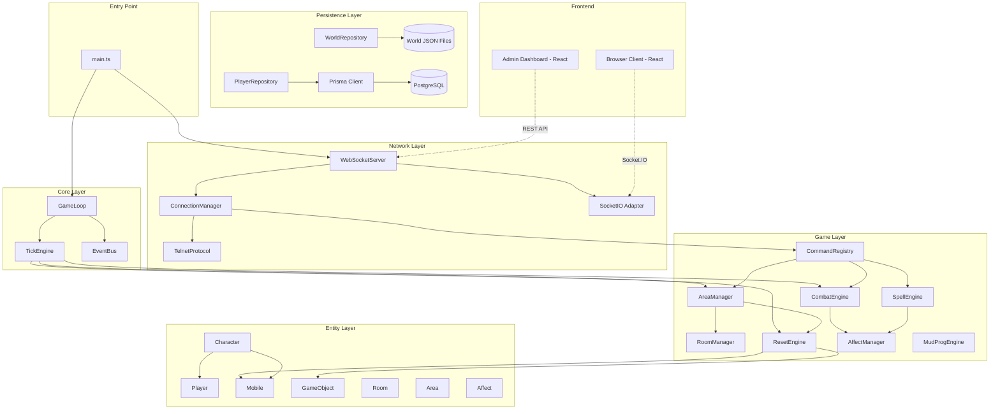

---

## §2. Core Engine

### 2.1 Game Loop

The game loop is the heartbeat of the engine. It runs on `setInterval` at 250ms (4 pulses per second), matching the legacy `PULSE_PER_SECOND = 4`.

**Why:** The legacy engine uses `select()` with a stall time of ~250ms per iteration. Node.js's event loop naturally provides this via `setInterval`. We use a fixed-interval approach rather than `setImmediate` to guarantee timing consistency and prevent CPU spinning. The 250ms granularity matches the original and is sufficient for all game timing needs.

```typescript
// src/core/GameLoop.ts

import { EventEmitter } from 'events';
import { TickEngine } from './TickEngine';
import { ConnectionManager } from '../network/ConnectionManager';

export interface GameLoopConfig {
  /** Milliseconds per pulse. Default 250 (4 pulses/sec). */
  pulseInterval: number;
  /** Whether to randomize area/tick pulse intervals like legacy. */
  randomizePulses: boolean;
}

export class GameLoop extends EventEmitter {
  private intervalHandle: ReturnType<typeof setInterval> | null = null;
  private pulseCount: number = 0;
  private running: boolean = false;
  private readonly tickEngine: TickEngine;
  private readonly connectionManager: ConnectionManager;
  private readonly config: GameLoopConfig;

  constructor(
    tickEngine: TickEngine,
    connectionManager: ConnectionManager,
    config: Partial<GameLoopConfig> = {}
  ) {
    super();
    this.tickEngine = tickEngine;
    this.connectionManager = connectionManager;
    this.config = {
      pulseInterval: config.pulseInterval ?? 250,
      randomizePulses: config.randomizePulses ?? true,
    };
  }

  start(): void {
    if (this.running) return;
    this.running = true;
    this.emit('start');

    this.intervalHandle = setInterval(() => {
      this.pulse();
    }, this.config.pulseInterval);
  }

  stop(): void {
    if (!this.running) return;
    this.running = false;
    if (this.intervalHandle) {
      clearInterval(this.intervalHandle);
      this.intervalHandle = null;
    }
    this.emit('stop');
  }

  private pulse(): void {
    this.pulseCount++;
    const startTime = performance.now();

    // 1. Process all pending input from connections
    this.connectionManager.processInput();

    // 2. Run tick-based updates (combat, mobile AI, area resets, etc.)
    this.tickEngine.pulse(this.pulseCount);

    // 3. Flush output buffers to all connections
    this.connectionManager.flushOutput();

    // 4. Performance monitoring
    const elapsed = performance.now() - startTime;
    if (elapsed > 100) {
      this.emit('lagWarning', { pulseCount: this.pulseCount, elapsedMs: elapsed });
    }
  }

  get isRunning(): boolean { return this.running; }
  get currentPulse(): number { return this.pulseCount; }
}
```

### 2.2 Tick Engine

The tick engine manages all pulse-based counters that drive autonomous game updates. Each subsystem fires at its own cadence.

**Why:** The legacy `update_handler()` in `update.c` uses static counters that decrement each loop iteration. We replicate this exactly — including the randomized intervals for area resets and full ticks — to preserve the staggered update pattern that prevents all entities from updating simultaneously.

```typescript
// src/core/TickEngine.ts

import { EventBus, GameEvent } from './EventBus';
import { numberRange } from '../utils/Dice';

/** Pulse constants matching legacy mud.h values exactly. */
export const PULSE = {
  PER_SECOND: 4,       // 0.25s per pulse
  VIOLENCE: 12,        // 3s   — combat rounds
  MOBILE: 16,          // 4s   — NPC AI
  AUCTION: 36,         // 9s   — auction ticks
  AREA: 240,           // 60s  — area reset checks
  TICK: 280,           // 70s  — full game tick (SECONDS_PER_TICK = 70)
  CASINO: 32,          // 8s   — casino
} as const;

export class TickEngine {
  private counters = {
    violence: PULSE.VIOLENCE,
    mobile: PULSE.MOBILE,
    area: this.randomizeArea(),
    tick: this.randomizeTick(),
    second: PULSE.PER_SECOND,
    auction: PULSE.AUCTION,
  };

  constructor(private readonly eventBus: EventBus) {}

  /**
   * Called once per game loop pulse (~250ms).
   * Decrements all counters and fires events when they reach zero.
   */
  pulse(pulseNumber: number): void {
    // Per-second updates
    if (--this.counters.second <= 0) {
      this.counters.second = PULSE.PER_SECOND;
      this.eventBus.emit(GameEvent.SecondTick, { pulse: pulseNumber });
    }

    // Combat round
    if (--this.counters.violence <= 0) {
      this.counters.violence = PULSE.VIOLENCE;
      this.eventBus.emit(GameEvent.ViolenceTick, { pulse: pulseNumber });
    }

    // NPC AI
    if (--this.counters.mobile <= 0) {
      this.counters.mobile = PULSE.MOBILE;
      this.eventBus.emit(GameEvent.MobileTick, { pulse: pulseNumber });
    }

    // Area reset check (randomized interval)
    if (--this.counters.area <= 0) {
      this.counters.area = this.randomizeArea();
      this.eventBus.emit(GameEvent.AreaTick, { pulse: pulseNumber });
    }

    // Full game tick (randomized interval)
    if (--this.counters.tick <= 0) {
      this.counters.tick = this.randomizeTick();
      this.eventBus.emit(GameEvent.FullTick, { pulse: pulseNumber });
    }

    // Auction
    if (--this.counters.auction <= 0) {
      this.counters.auction = PULSE.AUCTION;
      this.eventBus.emit(GameEvent.AuctionTick, { pulse: pulseNumber });
    }
  }

  /** Legacy: number_range(PULSE_AREA/2, 3*PULSE_AREA/2) = 120-360 pulses */
  private randomizeArea(): number {
    return numberRange(PULSE.AREA / 2, (3 * PULSE.AREA) / 2);
  }

  /** Legacy: number_range(PULSE_TICK*0.75, PULSE_TICK*1.25) = 210-350 pulses */
  private randomizeTick(): number {
    return numberRange(Math.floor(PULSE.TICK * 0.75), Math.floor(PULSE.TICK * 1.25));
  }
}
```

### 2.3 Event Bus

The event bus decouples subsystems by providing a typed publish/subscribe mechanism. Subsystems register listeners at startup; the tick engine and command handlers emit events.

**Why:** The legacy engine uses direct function calls between subsystems (e.g., `violence_update()` calls `affect_update()` inline). This creates tight coupling. An event bus preserves the same execution order (synchronous emission) while allowing subsystems to be developed, tested, and loaded independently. Events are fired synchronously on the main thread — no async gaps that could cause state inconsistency.

```typescript
// src/core/EventBus.ts

import { EventEmitter } from 'events';

export enum GameEvent {
  // Tick events
  SecondTick    = 'tick:second',
  ViolenceTick  = 'tick:violence',
  MobileTick    = 'tick:mobile',
  AreaTick      = 'tick:area',
  FullTick      = 'tick:full',
  AuctionTick   = 'tick:auction',

  // Character events
  CharacterEnterRoom  = 'char:enterRoom',
  CharacterLeaveRoom  = 'char:leaveRoom',
  CharacterDeath      = 'char:death',
  CharacterLogin      = 'char:login',
  CharacterLogout     = 'char:logout',
  CharacterLevelUp    = 'char:levelUp',

  // Combat events
  CombatStart     = 'combat:start',
  CombatEnd       = 'combat:end',
  CombatDamage    = 'combat:damage',
  CombatDeath     = 'combat:death',

  // Object events
  ObjectPickup    = 'object:pickup',
  ObjectDrop      = 'object:drop',
  ObjectEquip     = 'object:equip',
  ObjectRemove    = 'object:remove',
  ObjectDecay     = 'object:decay',

  // Communication events
  ChannelMessage  = 'comm:channel',
  TellMessage     = 'comm:tell',
  SayMessage      = 'comm:say',

  // World events
  AreaReset       = 'world:areaReset',
  WeatherChange   = 'world:weatherChange',
  TimeChange      = 'world:timeChange',

  // Admin events
  AdminAction     = 'admin:action',
  PlayerAuthorize = 'admin:authorize',

  // System events
  Shutdown        = 'system:shutdown',
  Reboot          = 'system:reboot',
  LagWarning      = 'system:lagWarning',

  // MudProg events
  MudProgTrigger  = 'mudprog:trigger',
}

export interface TickPayload {
  pulse: number;
}

export interface CharacterRoomPayload {
  characterId: string;
  roomVnum: number;
  direction?: number;
}

export interface CombatDamagePayload {
  attackerId: string;
  victimId: string;
  damage: number;
  damageType: string;
  skillName?: string;
}

/**
 * Synchronous event bus. All listeners fire on the main thread in
 * registration order, matching legacy direct-call behavior.
 */
export class EventBus extends EventEmitter {
  constructor() {
    super();
    // High limit — many subsystems register many listeners
    this.setMaxListeners(200);
  }

  /** Type-safe emit wrapper. */
  emitEvent<T>(event: GameEvent, payload: T): boolean {
    return this.emit(event, payload);
  }
}
```

### State Management Flow

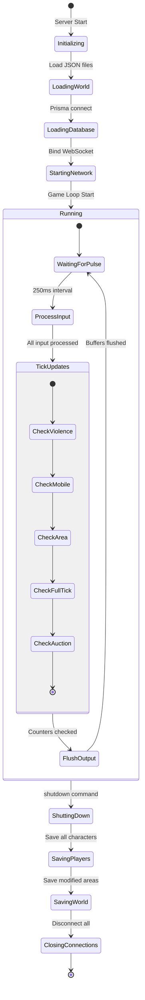

---

## §3. Network Layer

### 3.1 WebSocket Server

The network layer accepts WebSocket connections from two types of clients: raw WebSocket (for MUD clients like Mudlet, TinTin++) and Socket.IO (for the browser play UI).

**Why:** The legacy engine listens on a raw TCP socket and speaks the telnet protocol with option negotiation (MCCP, MSDP, MXP). Modern MUD clients like Mudlet support WebSocket natively. Socket.IO provides automatic reconnection and message framing for the browser client. We serve both from a single HTTP server to keep the single-process model.

```typescript
// src/network/WebSocketServer.ts

import { createServer, Server as HttpServer } from 'http';
import { WebSocketServer as WSServer, WebSocket } from 'ws';
import { Server as SocketIOServer } from 'socket.io';
import { ConnectionManager } from './ConnectionManager';
import { EventBus } from '../core/EventBus';

export interface NetworkConfig {
  port: number;
  wsPath: string;          // e.g., '/ws'
  socketioPath: string;    // e.g., '/play'
  maxConnections: number;
  idleTimeoutSec: number;
}

export class NetworkServer {
  private httpServer: HttpServer;
  private wsServer: WSServer;
  private ioServer: SocketIOServer;
  private readonly connectionManager: ConnectionManager;

  constructor(
    private readonly config: NetworkConfig,
    private readonly eventBus: EventBus
  ) {
    this.httpServer = createServer();
    this.connectionManager = new ConnectionManager(eventBus, config);

    // Raw WebSocket for MUD clients
    this.wsServer = new WSServer({
      server: this.httpServer,
      path: this.config.wsPath,
    });

    // Socket.IO for browser client
    this.ioServer = new SocketIOServer(this.httpServer, {
      path: this.config.socketioPath,
      cors: { origin: '*' },
    });

    this.setupHandlers();
  }

  private setupHandlers(): void {
    this.wsServer.on('connection', (ws, req) => {
      const host = req.socket.remoteAddress ?? 'unknown';
      const port = req.socket.remotePort ?? 0;
      this.connectionManager.acceptWebSocket(ws, host, port);
    });

    this.ioServer.on('connection', (socket) => {
      const host = socket.handshake.address ?? 'unknown';
      this.connectionManager.acceptSocketIO(socket, host, 0);
    });
  }

  async start(): Promise<void> {
    return new Promise((resolve) => {
      this.httpServer.listen(this.config.port, () => resolve());
    });
  }

  async stop(): Promise<void> {
    this.wsServer.close();
    this.ioServer.close();
    this.httpServer.close();
  }

  getConnectionManager(): ConnectionManager { return this.connectionManager; }
}
```

### 3.2 Connection Manager & Descriptor

Each connection is wrapped in a `Descriptor` object — the TypeScript equivalent of the legacy `descriptor_data`.

**Why:** The legacy `descriptor_data` struct is the bridge between a network socket and a `char_data`. It manages connection state (CON_PLAYING, CON_GET_NAME, etc.), input/output buffering, paging, and OLC editor state. We replicate this as a class with the same lifecycle, but using typed enums and proper encapsulation.

```typescript
// src/network/ConnectionManager.ts

import { WebSocket } from 'ws';
import { Socket as SocketIOSocket } from 'socket.io';
import { EventBus, GameEvent } from '../core/EventBus';
import type { Player } from '../game/entities/Player';

export enum ConnectionState {
  GetName          = 'CON_GET_NAME',
  GetOldPassword   = 'CON_GET_OLD_PASSWORD',
  ConfirmNewName   = 'CON_CONFIRM_NEW_NAME',
  GetNewPassword   = 'CON_GET_NEW_PASSWORD',
  ConfirmPassword  = 'CON_CONFIRM_NEW_PASSWORD',
  GetNewSex        = 'CON_GET_NEW_SEX',
  GetNewRace       = 'CON_GET_NEW_RACE',
  GetNewClass      = 'CON_GET_NEW_CLASS',
  GetPKill         = 'CON_GET_PKILL',
  ReadMotd         = 'CON_READ_MOTD',
  ReadImotd        = 'CON_READ_IMOTD',
  PressEnter       = 'CON_PRESS_ENTER',
  Playing          = 'CON_PLAYING',
  Editing          = 'CON_EDITING',
  CopyoverRecover  = 'CON_COPYOVER_RECOVER',
}

export interface ProtocolCapabilities {
  msdp: boolean;
  mssp: boolean;
  mccp: boolean;
  mxp: boolean;
  color256: boolean;
  utf8: boolean;
  gmcp: boolean;
  screenWidth: number;
  screenHeight: number;
}

export class Descriptor {
  readonly id: string;
  readonly host: string;
  readonly port: number;
  readonly connectedAt: Date = new Date();

  state: ConnectionState = ConnectionState.GetName;
  character: Player | null = null;
  original: Player | null = null;  // For switch/return
  idle: number = 0;

  /** Protocol negotiation results. */
  capabilities: ProtocolCapabilities = {
    msdp: false, mssp: false, mccp: false, mxp: false,
    color256: false, utf8: false, gmcp: false,
    screenWidth: 80, screenHeight: 24,
  };

  /** Input queue: lines waiting to be processed. */
  private inputQueue: string[] = [];
  /** Output buffer: text waiting to be flushed. */
  private outputBuffer: string = '';
  /** Pager buffer for long output. */
  private pagerBuffer: string | null = null;
  private pagerPosition: number = 0;
  /** OLC editor data. */
  olcData: OlcEditorData | null = null;

  private readonly transport: ITransport;

  constructor(id: string, host: string, port: number, transport: ITransport) {
    this.id = id;
    this.host = host;
    this.port = port;
    this.transport = transport;

    transport.onData((data: string) => {
      // Split by newlines, queue each line
      const lines = data.split(/\r?\n/);
      for (const line of lines) {
        if (line.length > 0) {
          this.inputQueue.push(line);
        }
      }
    });

    transport.onClose(() => {
      this.state = ConnectionState.GetName;
    });
  }

  /** Dequeue next input line, or null if empty. */
  nextInput(): string | null {
    return this.inputQueue.shift() ?? null;
  }

  /** Append text to output buffer. */
  write(text: string): void {
    this.outputBuffer += text;
  }

  /** Write to pager instead of direct output. */
  writePaged(text: string): void {
    if (!this.pagerBuffer) {
      this.pagerBuffer = text;
      this.pagerPosition = 0;
    } else {
      this.pagerBuffer += text;
    }
  }

  /** Flush output buffer to the transport. */
  flush(): void {
    if (this.outputBuffer.length > 0) {
      this.transport.send(this.outputBuffer);
      this.outputBuffer = '';
    }
  }

  /** Close the connection. */
  close(): void {
    this.transport.close();
  }

  get isConnected(): boolean {
    return this.transport.isOpen;
  }
}

/** Transport abstraction over WebSocket and Socket.IO. */
export interface ITransport {
  send(data: string): void;
  close(): void;
  onData(callback: (data: string) => void): void;
  onClose(callback: () => void): void;
  readonly isOpen: boolean;
}

export interface OlcEditorData {
  mode: 'room' | 'mobile' | 'object' | 'area' | 'shop' | 'program';
  vnum: number;
  modified: boolean;
}

export class ConnectionManager {
  private descriptors: Map<string, Descriptor> = new Map();
  private nextId: number = 1;

  constructor(
    private readonly eventBus: EventBus,
    private readonly config: { maxConnections: number; idleTimeoutSec: number }
  ) {}

  acceptWebSocket(ws: WebSocket, host: string, port: number): Descriptor | null {
    if (this.descriptors.size >= this.config.maxConnections) {
      ws.close(1013, 'Server full');
      return null;
    }

    const id = `desc-${this.nextId++}`;
    const transport = new WebSocketTransport(ws);
    const desc = new Descriptor(id, host, port, transport);
    this.descriptors.set(id, desc);

    // Send initial greeting
    desc.write(this.getGreeting());
    desc.write('\r\nBy what name do you wish to be known? ');
    desc.flush();

    return desc;
  }

  acceptSocketIO(socket: SocketIOSocket, host: string, port: number): Descriptor | null {
    if (this.descriptors.size >= this.config.maxConnections) {
      socket.disconnect(true);
      return null;
    }

    const id = `desc-${this.nextId++}`;
    const transport = new SocketIOTransport(socket);
    const desc = new Descriptor(id, host, port, transport);
    this.descriptors.set(id, desc);

    desc.write(this.getGreeting());
    desc.write('\r\nBy what name do you wish to be known? ');
    desc.flush();

    return desc;
  }

  /** Process one line of input per descriptor per pulse. */
  processInput(): void {
    for (const [id, desc] of this.descriptors) {
      if (!desc.isConnected) {
        this.removeDescriptor(id);
        continue;
      }

      // Increment idle counter; reset on input
      desc.idle++;

      const line = desc.nextInput();
      if (line !== null) {
        desc.idle = 0;
        this.handleInput(desc, line);
      }

      // Idle timeout check
      if (desc.idle > this.config.idleTimeoutSec * 4) {
        desc.write('\r\nIdle timeout. Goodbye.\r\n');
        desc.flush();
        desc.close();
      }
    }
  }

  /** Flush all output buffers. */
  flushOutput(): void {
    for (const desc of this.descriptors.values()) {
      desc.flush();
    }
  }

  private handleInput(desc: Descriptor, line: string): void {
    switch (desc.state) {
      case ConnectionState.Playing:
        if (desc.character) {
          desc.character.interpretCommand(line);
        }
        break;
      // Character creation state machine handled here...
      default:
        this.handleNannyState(desc, line);
        break;
    }
  }

  private handleNannyState(desc: Descriptor, input: string): void {
    // State machine for character creation/login — mirrors legacy nanny()
    // Each state transitions to the next via desc.state assignment
  }

  private removeDescriptor(id: string): void {
    const desc = this.descriptors.get(id);
    if (desc?.character) {
      this.eventBus.emit(GameEvent.CharacterLogout, { characterId: desc.character.id });
    }
    this.descriptors.delete(id);
  }

  private getGreeting(): string {
    return `
\x1b[1;36m╔══════════════════════════════════════╗
║     Welcome to SMAUG 2.0 (TS)       ║
╚══════════════════════════════════════╝\x1b[0m
`;
  }

  getAllDescriptors(): Descriptor[] {
    return Array.from(this.descriptors.values());
  }

  getPlayingDescriptors(): Descriptor[] {
    return this.getAllDescriptors().filter(d => d.state === ConnectionState.Playing);
  }
}

/** WebSocket transport adapter. */
class WebSocketTransport implements ITransport {
  private dataCallbacks: Array<(data: string) => void> = [];
  private closeCallbacks: Array<() => void> = [];

  constructor(private readonly ws: WebSocket) {
    ws.on('message', (data) => {
      const text = data.toString();
      for (const cb of this.dataCallbacks) cb(text);
    });
    ws.on('close', () => {
      for (const cb of this.closeCallbacks) cb();
    });
  }

  send(data: string): void { if (this.isOpen) this.ws.send(data); }
  close(): void { this.ws.close(); }
  onData(cb: (data: string) => void): void { this.dataCallbacks.push(cb); }
  onClose(cb: () => void): void { this.closeCallbacks.push(cb); }
  get isOpen(): boolean { return this.ws.readyState === WebSocket.OPEN; }
}

/** Socket.IO transport adapter. */
class SocketIOTransport implements ITransport {
  private dataCallbacks: Array<(data: string) => void> = [];
  private closeCallbacks: Array<() => void> = [];
  private connected = true;

  constructor(private readonly socket: SocketIOSocket) {
    socket.on('input', (data: string) => {
      for (const cb of this.dataCallbacks) cb(data);
    });
    socket.on('disconnect', () => {
      this.connected = false;
      for (const cb of this.closeCallbacks) cb();
    });
  }

  send(data: string): void {
    if (this.connected) this.socket.emit('output', data);
  }
  close(): void { this.socket.disconnect(true); this.connected = false; }
  onData(cb: (data: string) => void): void { this.dataCallbacks.push(cb); }
  onClose(cb: () => void): void { this.closeCallbacks.push(cb); }
  get isOpen(): boolean { return this.connected; }
}
```

### Connection State Machine

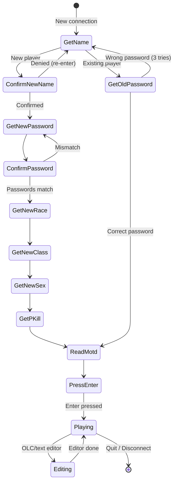

### Dataflow Diagram

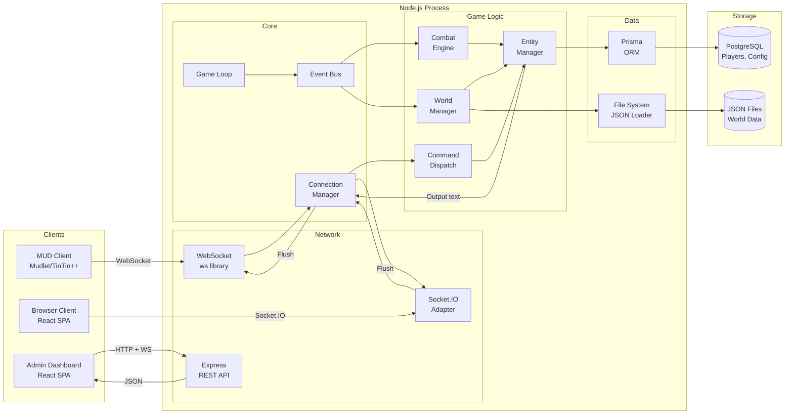

---

## §4. Entity System

### 4.1 Overview

The entity system mirrors the legacy prototype-instance pattern. Prototypes (loaded from JSON files at startup, identified by vnum) are templates. Instances are created from prototypes at runtime via area resets or player actions.

**Why:** The legacy engine's `mob_index_data` / `char_data` and `obj_index_data` / `obj_data` duality is fundamental to area resets. When an area resets, it creates new instances from prototypes without modifying the prototype. This pattern must be preserved exactly, because area builders author prototypes and resets reference them by vnum.

### 4.2 Class Hierarchy

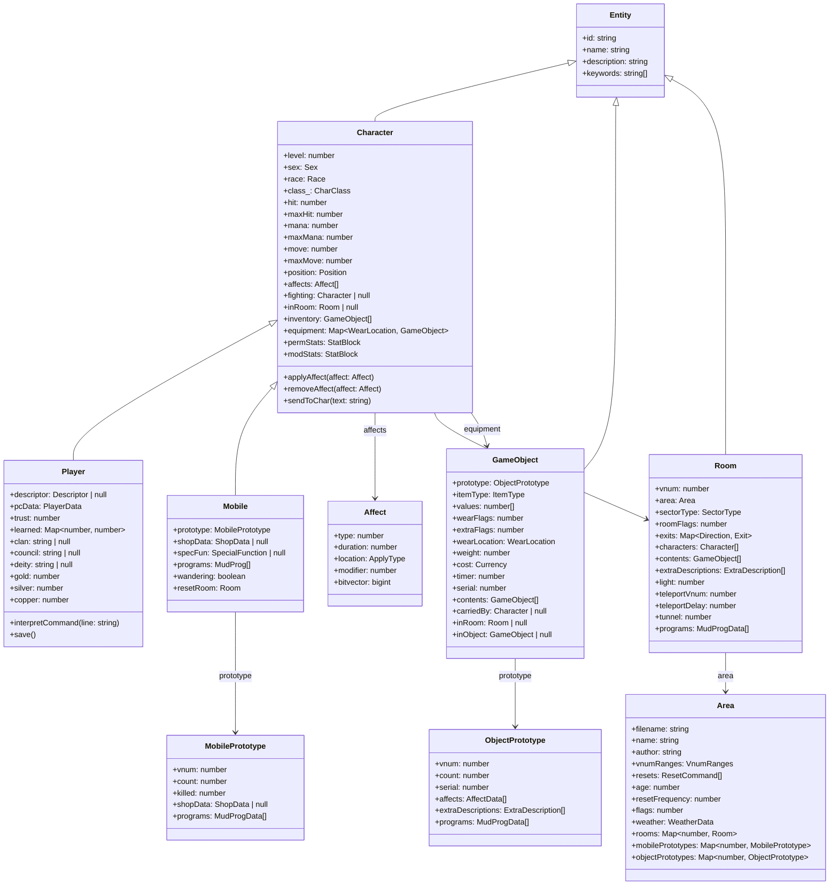

### 4.3 Core Interfaces

```typescript
// src/game/entities/types.ts

/** Matches legacy sex_types */
export enum Sex {
  Neutral = 0,
  Male    = 1,
  Female  = 2,
}

/** Matches legacy positions (POS_DEAD through POS_DRAG) */
export enum Position {
  Dead       = 0,
  Mortal     = 1,
  Incap      = 2,
  Stunned    = 3,
  Sleeping   = 4,
  Berserk    = 5,
  Resting    = 6,
  Aggressive = 7,
  Sitting    = 8,
  Fighting   = 9,
  Defensive  = 10,
  Evasive    = 11,
  Standing   = 12,
  Mounted    = 13,
  Shove      = 14,
  Drag       = 15,
}

/** Legacy dir_types */
export enum Direction {
  North     = 0,
  East      = 1,
  South     = 2,
  West      = 3,
  Up        = 4,
  Down      = 5,
  Northeast = 6,
  Northwest = 7,
  Southeast = 8,
  Southwest = 9,
  Somewhere = 10,
}

/** Legacy sector_types */
export enum SectorType {
  Inside      = 0,
  City        = 1,
  Field       = 2,
  Forest      = 3,
  Hills       = 4,
  Mountain    = 5,
  WaterSwim   = 6,
  WaterNoSwim = 7,
  Underwater  = 8,
  Air         = 9,
  Desert      = 10,
  Unknown     = 11,
  OceanFloor  = 12,
  Underground = 13,
  Lava        = 14,
  Swamp       = 15,
}

/** Legacy wear_locations */
export enum WearLocation {
  None        = -1,
  Light       = 0,
  FingerL     = 1,
  FingerR     = 2,
  Neck1       = 3,
  Neck2       = 4,
  Body        = 5,
  Head        = 6,
  Legs        = 7,
  Feet        = 8,
  Hands       = 9,
  Arms        = 10,
  Shield      = 11,
  About       = 12,
  Waist       = 13,
  WristL      = 14,
  WristR      = 15,
  Wield       = 16,
  Hold        = 17,
  DualWield   = 18,
  Ears        = 19,
  Eyes        = 20,
  MissileWield = 21,
  Back        = 22,
  Face        = 23,
  AnkleL      = 24,
  AnkleR      = 25,
}

/** Legacy item_types */
export enum ItemType {
  None         = 0,
  Light        = 1,
  Scroll       = 2,
  Wand         = 3,
  Staff        = 4,
  Weapon       = 5,
  Fireweapon   = 6,
  Missile      = 7,
  Treasure     = 8,
  Armor        = 9,
  Potion       = 10,
  Worn         = 11,
  Furniture    = 12,
  Trash        = 13,
  OldTrap      = 14,
  Container    = 15,
  Note         = 16,
  DrinkCon     = 17,
  Key          = 18,
  Food         = 19,
  Money        = 20,
  Pen          = 22,
  Boat         = 23,
  CorpseNpc    = 24,
  CorpsePc     = 25,
  Fountain     = 26,
  Pill         = 27,
  Blood        = 28,
  Bloodstain   = 29,
  Scraps       = 30,
  Pipe         = 31,
  HerbCon      = 32,
  Herb         = 33,
  Incense      = 34,
  Fire         = 35,
  Book         = 36,
  Switch       = 37,
  Lever        = 38,
  PullChain    = 39,
  Button       = 40,
  Dial         = 41,
  Rune         = 42,
  RunePouch    = 43,
  Match        = 44,
  Trap         = 45,
  Map          = 46,
  Portal       = 47,
  Paper        = 48,
  Tinder       = 49,
  Lockpick     = 50,
  Spike        = 51,
  Disease      = 52,
  Oil          = 53,
  Fuel         = 54,
  Puddle       = 55,
  Abacus       = 56,
  MissileWeapon = 57,
  Projectile   = 58,
  Quiver       = 59,
  Shovel       = 60,
  Salve        = 61,
  Cook         = 62,
  Keyring      = 63,
  Odor         = 64,
  Chance       = 65,
  Silver       = 66,
  Copper       = 67,
  Piece        = 69,
  HouseKey     = 70,
  Journal      = 71,
  DrinkMix     = 72,
}

/** Legacy apply types */
export enum ApplyType {
  None       = 0,
  Str        = 1,
  Dex        = 2,
  Int        = 3,
  Wis        = 4,
  Con        = 5,
  Sex        = 6,
  Class      = 7,
  Level      = 8,
  Age        = 9,
  Height     = 10,
  Weight     = 11,
  Mana       = 12,
  Hit        = 13,
  Move       = 14,
  Gold       = 15,
  Exp        = 16,
  Ac         = 17,
  Hitroll    = 18,
  Damroll    = 19,
  SavePoison = 20,
  SaveRod    = 21,
  SavePara   = 22,
  SaveBreath = 23,
  SaveSpell  = 24,
  Cha        = 25,
  Affected   = 26,
  Resistant  = 27,
  Immune     = 28,
  Susceptible = 29,
  Weaponspell = 30,
  Lck        = 31,
  Backstab   = 32,
  Pick       = 33,
  Track      = 34,
  Steal      = 35,
  Sneak      = 36,
  Hide       = 37,
  Palm       = 38,
  Detrap     = 39,
  Dodge      = 40,
  Peek       = 41,
  Scan       = 42,
  Gouge      = 43,
  Search     = 44,
  Mount      = 45,
  Disarm     = 46,
  Kick       = 47,
  Parry      = 48,
  Bash       = 49,
  Stun       = 50,
  Punch      = 51,
  Climb      = 52,
  Grip       = 53,
  ScribeSkill = 54,
  BrewSkill  = 55,
  WearSpell  = 56,
  RemoveSpell = 57,
  Emotion    = 58,
  MentalState = 59,
  StripSn    = 60,
  Remove     = 61,
  Dig        = 62,
  Full       = 63,
  Thirst     = 64,
  Drunk      = 65,
  Blood      = 66,
}

export interface StatBlock {
  str: number;
  int: number;
  wis: number;
  dex: number;
  con: number;
  cha: number;
  lck: number;
}

export interface Currency {
  gold: number;
  silver: number;
  copper: number;
}

export interface ExtraDescription {
  keywords: string[];
  description: string;
}

export interface Exit {
  direction: Direction;
  toRoom: Room | null;
  toVnum: number;
  keyword: string;
  description: string;
  exitFlags: number;
  key: number;
  distance: number;
  pull: number;
  pullType: number;
}

/** Legacy save_types */
export enum SaveType {
  None         = 0,
  PoisonDeath  = 1,
  RodWands     = 2,
  ParaPetri    = 3,
  Breath       = 4,
  SpellStaff   = 5,
}

/** Legacy damage_types */
export enum DamageType {
  Hit    = 0,
  Slash  = 1,
  Stab   = 2,
  Hack   = 3,
  Crush  = 4,
  Lash   = 5,
  Pierce = 6,
  Thrust = 7,
}

/** Affected-by bitvector flags (as bigint for >32 bits) */
export const AFF = {
  BLIND:           1n << 0n,
  INVISIBLE:       1n << 1n,
  DETECT_EVIL:     1n << 2n,
  DETECT_INVIS:    1n << 3n,
  DETECT_MAGIC:    1n << 4n,
  DETECT_HIDDEN:   1n << 5n,
  HOLD:            1n << 6n,
  SANCTUARY:       1n << 7n,
  FAERIE_FIRE:     1n << 8n,
  INFRARED:        1n << 9n,
  CURSE:           1n << 10n,
  FLAMING:         1n << 11n,
  POISON:          1n << 12n,
  PROTECT:         1n << 13n,
  PARALYSIS:       1n << 14n,
  SNEAK:           1n << 15n,
  HIDE:            1n << 16n,
  SLEEP:           1n << 17n,
  CHARM:           1n << 18n,
  FLYING:          1n << 19n,
  PASS_DOOR:       1n << 20n,
  FLOATING:        1n << 21n,
  TRUESIGHT:       1n << 22n,
  DETECT_TRAPS:    1n << 23n,
  SCRYING:         1n << 24n,
  FIRESHIELD:      1n << 25n,
  SHOCKSHIELD:     1n << 26n,
  HAUS1:           1n << 27n,
  ICESHIELD:       1n << 28n,
  POSSESS:         1n << 29n,
  BERSERK:         1n << 30n,
  AQUA_BREATH:     1n << 31n,
} as const;

/** Room flags */
export const ROOM_FLAGS = {
  DARK:          1 << 0,
  DEATH:         1 << 1,
  NO_MOB:        1 << 2,
  INDOORS:       1 << 3,
  HOUSE:         1 << 4,
  NEUTRAL:       1 << 5,
  CHAOTIC:       1 << 6,
  NO_MAGIC:      1 << 7,
  TUNNEL:        1 << 8,
  PRIVATE:       1 << 9,
  SAFE:          1 << 10,
  SOLITARY:      1 << 11,
  PET_SHOP:      1 << 12,
  NO_RECALL:     1 << 13,
  DONATION:      1 << 14,
  NO_DROP:       1 << 15,
  SILENCE:       1 << 16,
  LOG_NORMAL:    1 << 17,
  LOG_ALWAYS:    1 << 18,
  NO_SUMMON:     1 << 19,
  NO_ASTRAL:     1 << 20,
  TELEPORT:      1 << 21,
  NO_YELL:       1 << 22,
  NO_FLOOR:      1 << 23,
} as const;
```

### 4.4 Character Base Class

```typescript
// src/game/entities/Character.ts

import { EventBus, GameEvent } from '../../core/EventBus';
import type { Affect } from './Affect';
import type { GameObject } from './GameObject';
import type { Room } from './Room';
import {
  Sex, Position, ApplyType, StatBlock, Currency,
  WearLocation, Direction
} from './types';

export abstract class Character {
  readonly id: string;
  name: string;
  shortDescription: string;
  longDescription: string;
  description: string;
  keywords: string[];

  // Core attributes
  level: number = 1;
  sex: Sex = Sex.Neutral;
  race: number = 0;
  class_: number = 0;
  trust: number = 0;

  // Vitals
  hit: number = 20;
  maxHit: number = 20;
  mana: number = 100;
  maxMana: number = 100;
  move: number = 100;
  maxMove: number = 100;

  // Position and state
  position: Position = Position.Standing;
  defaultPosition: Position = Position.Standing;
  style: number = 0;

  // Stats
  permStats: StatBlock = { str: 13, int: 13, wis: 13, dex: 13, con: 13, cha: 13, lck: 13 };
  modStats: StatBlock = { str: 0, int: 0, wis: 0, dex: 0, con: 0, cha: 0, lck: 0 };

  // Combat
  hitroll: number = 0;
  damroll: number = 0;
  armor: number = 100;
  numAttacks: number = 1;
  alignment: number = 0;
  wimpy: number = 0;
  fighting: Character | null = null;
  numFighting: number = 0;

  // Saving throws
  savingPoison: number = 0;
  savingRod: number = 0;
  savingPara: number = 0;
  savingBreath: number = 0;
  savingSpell: number = 0;

  // Economy
  gold: number = 0;
  silver: number = 0;
  copper: number = 0;
  exp: number = 0;

  // Bitvectors (use bigint for >32 flags)
  actFlags: bigint = 0n;
  affectedBy: bigint = 0n;
  immune: number = 0;
  resistant: number = 0;
  susceptible: number = 0;
  attacks: number = 0;
  defenses: number = 0;

  // Language
  speaking: number = 0;
  speaks: number = 0;

  // Timers
  timer: number = 0;
  wait: number = 0;
  mentalState: number = 0;
  emotionalState: number = 0;

  // Substate for multi-step commands
  substate: number = 0;

  // Relationships
  inRoom: Room | null = null;
  wasInRoom: Room | null = null;
  master: Character | null = null;
  leader: Character | null = null;
  mount: Character | null = null;
  reply: Character | null = null;

  // Collections
  affects: Affect[] = [];
  inventory: GameObject[] = [];
  equipment: Map<WearLocation, GameObject> = new Map();

  // Physical
  height: number = 72;
  weight: number = 180;

  constructor(id: string, name: string) {
    this.id = id;
    this.name = name;
    this.shortDescription = name;
    this.longDescription = `${name} is here.`;
    this.description = '';
    this.keywords = [name.toLowerCase()];
  }

  /** Get effective stat (permanent + modifications from affects/equipment). */
  getStat(stat: keyof StatBlock): number {
    return this.permStats[stat] + this.modStats[stat];
  }

  /** Get effective trust level. Overridden in Player. */
  getTrust(): number {
    return this.trust > 0 ? this.trust : this.level;
  }

  /** Whether this character is an NPC. */
  abstract get isNpc(): boolean;

  /** Send text to this character (no-op for NPCs without desc). */
  abstract sendToChar(text: string): void;

  /** Apply an affect to this character. */
  applyAffect(affect: Affect): void {
    this.affects.push(affect);
    affect.applyTo(this);
  }

  /** Remove an affect from this character. */
  removeAffect(affect: Affect): void {
    const idx = this.affects.indexOf(affect);
    if (idx !== -1) {
      affect.removeFrom(this);
      this.affects.splice(idx, 1);
    }
  }

  /** Check if character has an affected-by flag. */
  isAffected(flag: bigint): boolean {
    return (this.affectedBy & flag) !== 0n;
  }

  /** Check if character is in a given position or better. */
  isPositionAtLeast(pos: Position): boolean {
    return this.position >= pos;
  }

  /** Check if character is fighting. */
  get isFighting(): boolean {
    return this.fighting !== null;
  }

  /** Check if character is immortal (trust >= 50). */
  get isImmortal(): boolean {
    return this.getTrust() >= 50;
  }
}
```

### 4.5 Player Class

```typescript
// src/game/entities/Player.ts

import { Character } from './Character';
import { Descriptor } from '../../network/ConnectionManager';

export interface PlayerData {
  passwordHash: string;
  email: string;
  title: string;
  rank: string;
  bio: string;
  prompt: string;
  fightPrompt: string;
  bamfIn: string;
  bamfOut: string;
  homepage: string;

  // Clan/Council/Deity
  clanName: string | null;
  councilName: string | null;
  deityName: string | null;

  // Skills learned[sn] = percentage (0-100)
  learned: Map<number, number>;

  // Conditions: [hunger, thirst, blood, bleed]
  condition: [number, number, number, number];

  // PK stats
  pkills: number;
  pdeaths: number;
  mkills: number;
  mdeaths: number;
  illegalPk: number;

  // Admin
  authState: number;
  wizInvis: number;
  minSnoop: number;
  bestowments: string;
  flags: number;

  // Editor ranges
  rRangeLo: number; rRangeHi: number;
  mRangeLo: number; mRangeHi: number;
  oRangeLo: number; oRangeHi: number;

  // Quest
  questNumber: number;
  questCurrent: number;
  questAccum: number;

  // Bank
  goldBalance: number;
  silverBalance: number;
  copperBalance: number;

  // Ignore list
  ignored: Set<string>;

  // Tell history
  tellHistory: Map<string, string>;

  // Stances
  stances: number[];

  // Pager
  pagerLen: number;
  pagerOn: boolean;

  // Colours
  colors: Map<string, string>;
}

export class Player extends Character {
  descriptor: Descriptor | null = null;
  pcData: PlayerData;

  constructor(id: string, name: string, pcData: PlayerData) {
    super(id, name);
    this.pcData = pcData;
  }

  get isNpc(): boolean { return false; }

  sendToChar(text: string): void {
    this.descriptor?.write(text);
  }

  getTrust(): number {
    if (this.trust > 0) return this.trust;
    if (this.descriptor?.original) {
      return this.descriptor.original.getTrust();
    }
    return this.level;
  }

  interpretCommand(line: string): void {
    // Wait state check — skip command if still lagged
    if (this.wait > 0) return;

    // Delegate to CommandRegistry (see §5)
    // CommandRegistry.dispatch(this, line);
  }

  /** Check if player has learned a skill/spell to the given threshold. */
  hasLearned(sn: number, minPercent: number = 1): boolean {
    return (this.pcData.learned.get(sn) ?? 0) >= minPercent;
  }

  /** Get proficiency percentage for a skill. NPCs always return 75. */
  getLearnedPercent(sn: number): number {
    return this.pcData.learned.get(sn) ?? 0;
  }

  async save(): Promise<void> {
    // Delegate to PlayerRepository (see §13)
  }
}
```

### 4.6 Mobile (NPC) Class

```typescript
// src/game/entities/Mobile.ts

import { Character } from './Character';
import type { MobilePrototype } from './types';

export class Mobile extends Character {
  readonly prototype: MobilePrototype;
  shopData: import('./types').ShopData | null = null;
  repairShopData: import('./types').RepairShopData | null = null;
  specFun: ((mob: Mobile) => boolean) | null = null;
  resetRoom: import('./Room').Room | null = null;

  constructor(prototype: MobilePrototype) {
    super(`mob-${prototype.vnum}-${++Mobile.instanceCounter}`, prototype.name);
    this.prototype = prototype;

    // Copy prototype attributes to instance
    this.level = prototype.level;
    this.sex = prototype.sex;
    this.race = prototype.race;
    this.class_ = prototype.class_;
    this.alignment = prototype.alignment;
    this.actFlags = prototype.actFlags;
    this.affectedBy = prototype.affectedBy;
    this.hit = prototype.maxHit;
    this.maxHit = prototype.maxHit;
    this.gold = prototype.gold;
    this.silver = prototype.silver;
    this.copper = prototype.copper;
    this.position = prototype.defaultPosition;
    this.defaultPosition = prototype.defaultPosition;
    this.permStats = { ...prototype.permStats };
    this.hitroll = prototype.hitroll;
    this.damroll = prototype.damroll;
    this.armor = prototype.armor;
    this.numAttacks = prototype.numAttacks;
    this.shortDescription = prototype.shortDescription;
    this.longDescription = prototype.longDescription;
    this.description = prototype.description;
    this.keywords = [...prototype.keywords];

    prototype.count++;
  }

  private static instanceCounter = 0;

  get isNpc(): boolean { return true; }

  sendToChar(_text: string): void {
    // NPCs don't have descriptors — no-op
    // (unless switched into by an immortal, handled via desc.original)
  }

  /** NPCs always return 75% proficiency for skill checks. */
  getLearnedPercent(_sn: number): number {
    return 75;
  }
}
```

---

## §5. Command System

### 5.1 Overview

The command system replicates the legacy hash-table dispatch with abbreviation matching, trust gating, and position checking.

**Why:** The legacy `interpret()` function in `interp.c` is the single entry point for all player input. It uses a hash table indexed by the first character of the command name, walks the chain with `str_prefix()` for abbreviation matching, checks trust and position, then calls the handler function pointer. We replicate this exactly so that "nor" still matches "north", "k" still matches "kill", and all trust levels are respected.

### 5.2 Command Handler Pattern

```typescript
// src/game/commands/CommandRegistry.ts

import { Player } from '../entities/Player';
import { Position } from '../entities/types';

export enum LogLevel {
  Never  = 0,  // LOG_NEVER — don't log, replace with XXXX
  Normal = 1,  // LOG_NORMAL
  Build  = 2,  // LOG_BUILD
  High   = 3,  // LOG_HIGH
  Always = 4,  // LOG_ALWAYS
}

export interface CommandDef {
  name: string;
  handler: CommandHandler;
  minPosition: Position;
  minTrust: number;
  logLevel: LogLevel;
  flags: CommandFlags;
  /** Usage tracking */
  useCount: number;
  lagCount: number;
}

export interface CommandFlags {
  /** Blocked when AFF_POSSESS is set. */
  noPossess: boolean;
  /** Blocked when polymorphed. */
  noPolymorphed: boolean;
  /** Logged via watch system. */
  watched: boolean;
  /** Available to retired immortals. */
  retired: boolean;
  /** Cannot be aborted by timer. */
  noAbort: boolean;
}

export type CommandHandler = (ch: Player, argument: string) => void;

export class CommandRegistry {
  /**
   * Hash table: 126 buckets indexed by first char of command name.
   * Each bucket is an array (replaces linked list).
   * Matches legacy command_hash[126].
   */
  private hashTable: CommandDef[][] = Array.from({ length: 126 }, () => []);

  /** Social table: 27 buckets (a-z + overflow). */
  private socialTable: Map<string, SocialDef> = new Map();

  register(cmd: CommandDef): void {
    const bucket = cmd.name.charCodeAt(0) % 126;
    this.hashTable[bucket].push(cmd);
  }

  registerSocial(social: SocialDef): void {
    this.socialTable.set(social.name.toLowerCase(), social);
  }

  /**
   * Main command dispatch — replicates legacy interpret().
   *
   * Flow:
   * 1. Parse command word from input
   * 2. Hash lookup by first character
   * 3. Abbreviation match via strPrefix()
   * 4. Trust check (direct, council powers, bestowments, retired)
   * 5. Position check
   * 6. Flag checks (possess, polymorph)
   * 7. Execute handler
   * 8. Log if needed
   */
  dispatch(ch: Player, input: string): void {
    const [command, argument] = this.parseCommand(input);
    if (!command) return;

    const trust = ch.getTrust();
    const bucket = command.charCodeAt(0) % 126;

    // Search command hash table
    for (const cmd of this.hashTable[bucket]) {
      if (!this.strPrefix(command, cmd.name)) continue;
      if (cmd.minTrust > trust && !this.hasBestowment(ch, cmd)) continue;

      // Position check
      if (!this.checkPosition(ch, cmd)) return;

      // Flag checks
      if (cmd.flags.noPossess && ch.isAffected(0n /* AFF.POSSESS */)) {
        ch.sendToChar("You can't do that while possessed!\r\n");
        return;
      }

      // Execute with lag tracking
      const start = performance.now();
      cmd.handler(ch, argument);
      cmd.useCount++;

      const elapsed = performance.now() - start;
      if (elapsed > 1500) {
        cmd.lagCount++;
        // Log lag warning
      }

      // Logging
      this.logCommand(ch, cmd, command, argument);
      return;
    }

    // Check skills
    // if (this.checkSkill(ch, command, argument)) return;

    // Check socials
    if (this.checkSocial(ch, command, argument)) return;

    ch.sendToChar("Huh?\r\n");
  }

  /**
   * Legacy str_prefix() — returns true if `astr` is a prefix of `bstr`.
   * Case-insensitive.
   */
  private strPrefix(astr: string, bstr: string): boolean {
    const a = astr.toLowerCase();
    const b = bstr.toLowerCase();
    return b.startsWith(a);
  }

  /** Split input into command word and argument. */
  private parseCommand(input: string): [string, string] {
    const trimmed = input.trim();
    const spaceIdx = trimmed.indexOf(' ');
    if (spaceIdx === -1) return [trimmed.toLowerCase(), ''];
    return [
      trimmed.substring(0, spaceIdx).toLowerCase(),
      trimmed.substring(spaceIdx + 1).trim(),
    ];
  }

  /**
   * Position check — replicates legacy check_pos().
   * Returns false and sends message if position too low.
   */
  private checkPosition(ch: Player, cmd: CommandDef): boolean {
    if (ch.position >= cmd.minPosition) return true;

    switch (ch.position) {
      case Position.Dead:
        ch.sendToChar("A little difficult to do when you are DEAD...\r\n");
        break;
      case Position.Mortal:
      case Position.Incap:
        ch.sendToChar("You are hurt far too badly for that.\r\n");
        break;
      case Position.Stunned:
        ch.sendToChar("You are too stunned to do that.\r\n");
        break;
      case Position.Sleeping:
        ch.sendToChar("In your dreams, or what?\r\n");
        break;
      case Position.Resting:
        ch.sendToChar("Nah... You feel too relaxed...\r\n");
        break;
      case Position.Sitting:
        ch.sendToChar("You can't do that sitting down.\r\n");
        break;
      case Position.Fighting:
      case Position.Defensive:
      case Position.Aggressive:
      case Position.Evasive:
        ch.sendToChar("No way! You are still fighting!\r\n");
        break;
      default:
        ch.sendToChar("You can't do that right now.\r\n");
    }
    return false;
  }

  private hasBestowment(ch: Player, cmd: CommandDef): boolean {
    if (!ch.pcData.bestowments) return false;
    return ch.pcData.bestowments.split(' ').includes(cmd.name);
  }

  private checkSocial(ch: Player, command: string, argument: string): boolean {
    for (const [name, social] of this.socialTable) {
      if (this.strPrefix(command, name)) {
        this.executeSocial(ch, social, argument);
        return true;
      }
    }
    return false;
  }

  private executeSocial(ch: Player, social: SocialDef, argument: string): void {
    // Find target, display appropriate message strings
  }

  private logCommand(ch: Player, cmd: CommandDef, command: string, argument: string): void {
    if (cmd.logLevel === LogLevel.Never) return;
    // Log to system and watch files
  }
}

export interface SocialDef {
  name: string;
  charNoArg: string;
  othersNoArg: string;
  charFound: string;
  othersFound: string;
  victFound: string;
  charAuto: string;
  othersAuto: string;
}
```

---

## §6. Combat System

### 6.1 Overview

The combat system fires every `PULSE_VIOLENCE` (12 pulses = 3 seconds). Each combat round, every fighting character executes one or more attacks via `multiHit()`, which calls `oneHit()` for each swing. Damage is calculated, applied, and the result may end in death.

**Why:** The legacy `violence_update()` iterates the global character list every 12 pulses and calls `multi_hit()` for each fighting character. The 3-second round is a fundamental gameplay rhythm that players rely on for skill timing and flee decisions. We preserve this exactly.

### Combat Round Flow

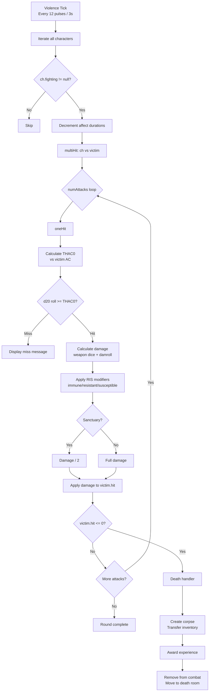

### 6.2 Core Combat Types

```typescript
// src/game/combat/CombatEngine.ts

import { Character } from '../entities/Character';
import { Mobile } from '../entities/Mobile';
import { Player } from '../entities/Player';
import { EventBus, GameEvent } from '../../core/EventBus';
import { PULSE } from '../../core/TickEngine';
import { numberRange, rollDice } from '../../utils/Dice';

export interface CombatResult {
  attacker: Character;
  victim: Character;
  damage: number;
  damageType: number;
  skillName?: string;
  wasCritical: boolean;
  wasKill: boolean;
}

export class CombatEngine {
  constructor(private readonly eventBus: EventBus) {
    // Register for violence tick
    this.eventBus.on(GameEvent.ViolenceTick, () => this.violenceUpdate());
  }

  /**
   * Called every PULSE_VIOLENCE (3s). Iterates all fighting characters.
   * Replicates legacy violence_update() in fight.c.
   */
  private violenceUpdate(): void {
    // Get all characters currently fighting
    for (const ch of this.getAllFightingCharacters()) {
      if (!ch.fighting || ch.position <= 3 /* POS_STUNNED */) continue;

      // Decrement affect durations during combat (legacy behavior)
      this.tickAffects(ch);

      // Execute combat round
      this.multiHit(ch, ch.fighting, -1);

      // Decrement wait state
      if (ch.wait > 0) ch.wait--;
    }
  }

  /**
   * Multi-attack handler. Replicates legacy multi_hit().
   * `dt` = damage type / skill number (-1 = default weapon attack).
   */
  multiHit(ch: Character, victim: Character, dt: number): void {
    if (!ch.inRoom || !victim.inRoom) return;

    // Main hand attack
    const weapon = ch.equipment.get(16 /* WEAR_WIELD */);
    this.oneHit(ch, victim, dt);

    if (this.charDied(victim)) return;

    // Dual wield attack
    const dualWeapon = ch.equipment.get(18 /* WEAR_DUAL_WIELD */);
    if (dualWeapon) {
      this.oneHit(ch, victim, dt);
      if (this.charDied(victim)) return;
    }

    // Extra attacks from numattacks
    for (let i = 1; i < ch.numAttacks; i++) {
      this.oneHit(ch, victim, dt);
      if (this.charDied(victim)) return;
    }

    // Haste extra attack
    if (ch.isAffected(0n /* AFF_HASTE */)) {
      this.oneHit(ch, victim, dt);
    }
  }

  /**
   * Single attack resolution. Replicates legacy one_hit().
   */
  oneHit(ch: Character, victim: Character, dt: number): CombatResult {
    // THAC0 calculation
    const thac0 = 21 - ch.level - ch.hitroll;
    const victimAc = Math.max(-15, victim.armor / 10);
    const diceRoll = numberRange(1, 20);

    const result: CombatResult = {
      attacker: ch,
      victim,
      damage: 0,
      damageType: dt,
      wasCritical: false,
      wasKill: false,
    };

    if (diceRoll === 1 || (diceRoll !== 20 && diceRoll < thac0 - victimAc)) {
      // Miss
      this.damageMessage(ch, victim, 0, dt);
      return result;
    }

    // Damage calculation
    const weapon = ch.equipment.get(16 /* WEAR_WIELD */);
    let dam: number;
    if (weapon && weapon.itemType === 5 /* ITEM_WEAPON */) {
      dam = rollDice(weapon.values[1], weapon.values[2]);
    } else {
      dam = numberRange(1, ch.level);
    }

    dam += ch.damroll;

    // Critical hit on natural 20
    if (diceRoll === 20) {
      dam *= 2;
      result.wasCritical = true;
    }

    result.damage = Math.max(1, dam);

    // Apply damage
    this.applyDamage(ch, victim, result.damage, dt);

    if (victim.hit <= 0) {
      result.wasKill = true;
      this.handleDeath(ch, victim);
    }

    return result;
  }

  /**
   * Apply damage with RIS (Resistant/Immune/Susceptible) checks.
   * Replicates legacy damage() in fight.c.
   */
  applyDamage(ch: Character, victim: Character, damage: number, dt: number): number {
    let dam = damage;

    // Sanctuary halves damage
    if (victim.isAffected(0n /* AFF.SANCTUARY */)) {
      dam = Math.floor(dam / 2);
    }

    // RIS checks (simplified — full implementation checks element type)
    // Immune = 0 damage, Resistant = dam/2, Susceptible = dam*2

    // Apply
    victim.hit -= dam;

    // Position update
    this.updatePosition(victim);

    // Emit combat damage event
    this.eventBus.emit(GameEvent.CombatDamage, {
      attackerId: ch.id,
      victimId: victim.id,
      damage: dam,
      damageType: dt.toString(),
    });

    return dam;
  }

  /**
   * Handle character death. Replicates legacy raw_kill().
   */
  private handleDeath(killer: Character, victim: Character): void {
    // Stop fighting
    this.stopFighting(victim, true);

    // Create corpse with victim's inventory
    // Transfer equipped items to corpse
    // Award experience to killer
    // Move victim to death room / altar
    // For PCs: save character, apply death penalties
    // For NPCs: extract from game

    this.eventBus.emit(GameEvent.CombatDeath, {
      attackerId: killer.id,
      victimId: victim.id,
    });
  }

  /** Set two characters as fighting each other. */
  startFighting(ch: Character, victim: Character): void {
    ch.fighting = victim;
    ch.numFighting++;
    ch.position = 9; // POS_FIGHTING
    this.eventBus.emit(GameEvent.CombatStart, { attackerId: ch.id, victimId: victim.id });
  }

  /** Stop fighting for a character. */
  stopFighting(ch: Character, both: boolean): void {
    ch.fighting = null;
    ch.numFighting = 0;
    if (ch.position === 9) ch.position = ch.defaultPosition;

    if (both && ch.fighting) {
      this.stopFighting(ch.fighting, false);
    }
  }

  private tickAffects(ch: Character): void {
    for (let i = ch.affects.length - 1; i >= 0; i--) {
      const aff = ch.affects[i];
      if (aff.duration > 0) {
        aff.duration--;
      } else if (aff.duration === 0) {
        // Expired — send wear-off message, remove
        ch.removeAffect(aff);
      }
      // duration < 0 means permanent, never decrement
    }
  }

  private updatePosition(ch: Character): void {
    if (ch.hit > 0) return;
    if (ch.hit <= -11) ch.position = 0; // POS_DEAD
    else if (ch.hit <= -6) ch.position = 1; // POS_MORTAL
    else if (ch.hit <= -3) ch.position = 2; // POS_INCAP
    else ch.position = 3; // POS_STUNNED
  }

  private charDied(ch: Character): boolean {
    return ch.hit <= -11 || ch.position === 0;
  }

  private damageMessage(ch: Character, victim: Character, dam: number, dt: number): void {
    // Generate and send damage message based on damage amount
  }

  private getAllFightingCharacters(): Character[] {
    // Return all characters in the world who are currently fighting
    return [];
  }
}
```

---

## §7. Magic and Spell System

### 7.1 Overview

The spell system replicates the legacy `do_cast()` pipeline from `magic.c`. Spells are defined in the skill table with per-class level requirements, mana costs, target types, components, and a spell function.

**Why:** The legacy casting pipeline has 10+ validation steps that must execute in exact order: spell lookup, position check, room flags, guild restrictions, sector type, mana calculation, target resolution, component processing, failure chance, mana deduction, spell execution. Changing the order would alter gameplay. We replicate step-for-step.

### Spell Casting Pipeline

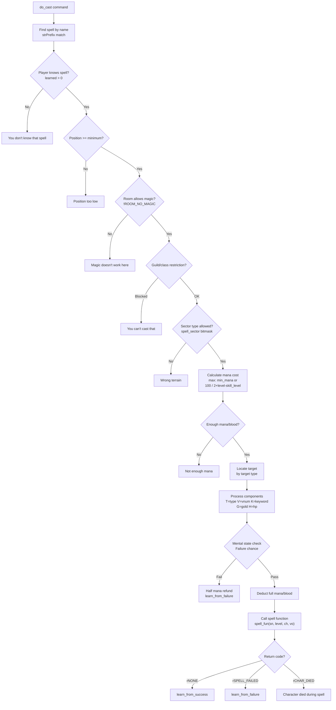

### 7.2 Spell Definition Interface

```typescript
// src/game/spells/SpellEngine.ts

import { Character } from '../entities/Character';
import { Player } from '../entities/Player';
import { GameObject } from '../entities/GameObject';
import { SaveType } from '../entities/types';

/** Return codes matching legacy ch_ret. */
export enum SpellReturn {
  None        = 0,  // rNONE — success
  SpellFailed = 1,  // rSPELL_FAILED
  CharDied    = 2,  // rCHAR_DIED
  Error       = 3,  // rERROR
}

/** Target types matching legacy TAR_* constants. */
export enum TargetType {
  Ignore          = 0,  // TAR_IGNORE — no target
  CharOffensive   = 1,  // TAR_CHAR_OFFENSIVE — enemy
  CharDefensive   = 2,  // TAR_CHAR_DEFENSIVE — friendly
  CharSelf        = 3,  // TAR_CHAR_SELF — self only
  ObjInventory    = 4,  // TAR_OBJ_INV — object in inventory
}

/** Spell info flags matching legacy SF_* constants. */
export const SPELL_FLAG = {
  PK_SENSITIVE: 1 << 0,  // SF_PKSENSITIVE
  NO_MOB:       1 << 1,  // SF_NOMOB
  NO_SELF:      1 << 2,  // SF_NOSELF
  NO_DISPEL:    1 << 3,  // SF_NODISPEL
} as const;

export type SpellFunction = (
  sn: number,
  level: number,
  ch: Character,
  vo: Character | GameObject | null
) => SpellReturn;

export interface SpellDef {
  name: string;
  sn: number;               // Spell number (slot)
  type: 'spell' | 'skill' | 'weapon' | 'herb';
  spellFun: SpellFunction | null;
  target: TargetType;
  minimumPosition: number;
  minMana: number;
  beats: number;             // Wait state in pulses
  nounDamage: string;        // e.g., "fireball"
  msgOff: string;            // Wear-off message
  guild: number;             // -1 = no restriction
  minLevel: number;
  range: number;
  infoFlags: number;         // SF_* flags
  saves: SaveType;
  difficulty: number;

  /** Per-class level requirements. Index = class number. */
  skillLevel: number[];      // MAX_CLASS entries
  /** Per-class max proficiency. */
  skillAdept: number[];
  /** Per-race level requirements. */
  raceLevel: number[];
  raceAdept: number[];

  /** Messages */
  hitChar: string;
  hitVict: string;
  hitRoom: string;
  missChar: string;
  missVict: string;
  missRoom: string;
  dieChar: string;
  dieVict: string;
  dieRoom: string;
  immChar: string;
  immVict: string;
  immRoom: string;

  /** Damage dice string, e.g., "3d8+10" */
  dice: string;

  /** Component string, e.g., "V1234 T5 Ksilver G100" */
  components: string;

  /** SMAUG affects attached to this spell */
  affects: SpellAffectDef[];
}

export interface SpellAffectDef {
  duration: string;    // Dice string for duration
  location: number;    // ApplyType
  modifier: string;    // Dice string for modifier
  bitvector: bigint;   // AFF_* flag
}

/**
 * Saving throw calculation.
 * Replicates legacy saves_spell_staff() etc. from fight.c.
 *
 * Formula: save = 50 + (victim.level - casterLevel - victim.saving_X) * 5
 *          clamped to [5, 95], then roll percentile
 *
 * RIS modifiers via ris_save():
 *   Immune → save = 1000 (auto-save)
 *   Resistant → modifier - 2
 *   Susceptible → modifier + 2
 */
export function savingThrow(
  level: number,
  victim: Character,
  saveType: SaveType
): boolean {
  let saveValue: number;
  switch (saveType) {
    case SaveType.PoisonDeath: saveValue = victim.savingPoison; break;
    case SaveType.RodWands:    saveValue = victim.savingRod; break;
    case SaveType.ParaPetri:   saveValue = victim.savingPara; break;
    case SaveType.Breath:      saveValue = victim.savingBreath; break;
    case SaveType.SpellStaff:  saveValue = victim.savingSpell; break;
    default: saveValue = 0;
  }

  let save = 50 + (victim.level - level - saveValue) * 5;
  save = Math.max(5, Math.min(95, save));

  return Math.floor(Math.random() * 100) < save;
}
```

---

## §8. Skill System

### 8.1 Overview

Skills differ from spells in their dispatch mechanism: skills are invoked directly as commands (e.g., `backstab`, `kick`) rather than through `cast`. They share the same `SpellDef` structure but use a different function signature and have no mana cost by default.

**Why:** The legacy engine stores skills and spells in the same `skill_table[]` array, distinguished by the `type` field (`SKILL_SPELL` vs `SKILL_SKILL`). Skills use `DO_FUN` (void function) while spells use `SPELL_FUN` (returns `ch_ret`). We preserve this unified table so that `sset` (admin skill editor) works uniformly across both.

### 8.2 Proficiency and Learning

```typescript
// src/game/spells/SkillSystem.ts

import { Character } from '../entities/Character';
import { Player } from '../entities/Player';
import { SpellDef } from './SpellEngine';

/**
 * Check if character can use a skill.
 * Replicates legacy can_use_skill().
 */
export function canUseSkill(ch: Character, sn: number, skill: SpellDef): boolean {
  if (ch.isNpc) return true;  // NPCs can use all skills

  const player = ch as Player;
  const learned = player.getLearnedPercent(sn);
  if (learned <= 0) return false;

  // Check class level requirement
  if (skill.skillLevel[ch.class_] > ch.level) return false;

  return true;
}

/**
 * Skill success check.
 * Replicates legacy: (number_percent() + difficulty*5) > LEARNED(ch, sn)
 */
export function skillSuccessCheck(ch: Character, sn: number, skill: SpellDef): boolean {
  const learned = ch.isNpc ? 75 : (ch as Player).getLearnedPercent(sn);
  const roll = Math.floor(Math.random() * 100) + 1;
  return (roll + skill.difficulty * 5) <= learned;
}

/**
 * Learn from success.
 * Replicates legacy learn_from_success() in skills.c.
 *
 * - 2-point gain: random >= calculated chance
 * - 1-point gain: chance - percent <= 25
 * - 0-point gain: too easy (chance - percent > 25)
 * - Capped at skill_adept[class] (typically 95%)
 */
export function learnFromSuccess(ch: Character, sn: number, skill: SpellDef): void {
  if (ch.isNpc) return;
  const player = ch as Player;
  const current = player.getLearnedPercent(sn);
  const adept = skill.skillAdept[ch.class_] ?? 95;

  if (current >= adept) return;

  const chance = ch.getStat('int') + ch.getStat('wis');
  if (Math.floor(Math.random() * 1000) < chance) {
    const gain = (chance - current <= 25) ? 1 : 2;
    player.pcData.learned.set(sn, Math.min(current + gain, adept));

    if (current + gain >= adept) {
      player.sendToChar(`You are now an adept of ${skill.name}!\r\n`);
      // Bonus XP: ×5 for mages, ×2 for clerics
    }
  }
}

/**
 * Learn from failure.
 * Only 1-point gain, only if within 25% of threshold.
 * Capped at adept - 1.
 */
export function learnFromFailure(ch: Character, sn: number, skill: SpellDef): void {
  if (ch.isNpc) return;
  const player = ch as Player;
  const current = player.getLearnedPercent(sn);
  const adept = skill.skillAdept[ch.class_] ?? 95;

  if (current >= adept - 1) return;

  const chance = ch.getStat('int') + ch.getStat('wis');
  if (chance - current <= 25 && Math.floor(Math.random() * 1000) < chance) {
    player.pcData.learned.set(sn, current + 1);
  }
}

/**
 * Practice command handler.
 * Players practice at guild masters to improve skill percentages.
 */
export function doPractice(ch: Player, argument: string): void {
  // If no argument: list all known skills with percentages
  // If argument: find skill, check for practice mob in room, improve
}
```

---

## §9. Affect/Buff System

### 9.1 Overview

Affects modify character stats for a duration. They come from spells, equipment, potions, and MUD programs. Each affect specifies a stat to modify, the modifier amount, and optionally a bitvector flag to set.

**Why:** The legacy `affect_data` structure is the universal mechanism for all temporary (and permanent) stat modifications. Spells create affects, equipment applies them, and the combat tick decrements durations. The three operations — `affect_to_char()`, `affect_join()`, `affect_remove()` — are called from dozens of places. Centralizing them in an `AffectManager` ensures consistent behavior.

### 9.2 Affect Class

```typescript
// src/game/entities/Affect.ts

import { Character } from './Character';
import { ApplyType } from './types';

export class Affect {
  /** Spell/skill number that created this affect. -1 for equipment. */
  type: number;
  /** Duration in combat rounds. -1 = permanent. 0 = expires this tick. */
  duration: number;
  /** Which stat to modify. */
  location: ApplyType;
  /** Amount to modify (positive or negative). */
  modifier: number;
  /** Bitvector flag to set on the character (AFF_INVISIBLE, etc.). */
  bitvector: bigint;

  constructor(
    type: number,
    duration: number,
    location: ApplyType,
    modifier: number,
    bitvector: bigint = 0n
  ) {
    this.type = type;
    this.duration = duration;
    this.location = location;
    this.modifier = modifier;
    this.bitvector = bitvector;
  }

  /**
   * Apply this affect's stat modification to a character.
   * Replicates legacy affect_modify().
   */
  applyTo(ch: Character): void {
    this.modifyStat(ch, this.modifier);
    if (this.bitvector !== 0n) {
      ch.affectedBy |= this.bitvector;
    }
  }

  /**
   * Remove this affect's stat modification from a character.
   */
  removeFrom(ch: Character): void {
    this.modifyStat(ch, -this.modifier);
    if (this.bitvector !== 0n) {
      // Only remove bitvector if no other affect sets it
      ch.affectedBy &= ~this.bitvector;
    }
  }

  private modifyStat(ch: Character, mod: number): void {
    switch (this.location) {
      case ApplyType.Str: ch.modStats.str += mod; break;
      case ApplyType.Dex: ch.modStats.dex += mod; break;
      case ApplyType.Int: ch.modStats.int += mod; break;
      case ApplyType.Wis: ch.modStats.wis += mod; break;
      case ApplyType.Con: ch.modStats.con += mod; break;
      case ApplyType.Cha: ch.modStats.cha += mod; break;
      case ApplyType.Lck: ch.modStats.lck += mod; break;
      case ApplyType.Hit: ch.maxHit += mod; break;
      case ApplyType.Mana: ch.maxMana += mod; break;
      case ApplyType.Move: ch.maxMove += mod; break;
      case ApplyType.Ac: ch.armor += mod; break;
      case ApplyType.Hitroll: ch.hitroll += mod; break;
      case ApplyType.Damroll: ch.damroll += mod; break;
      case ApplyType.SavePoison: ch.savingPoison += mod; break;
      case ApplyType.SaveRod: ch.savingRod += mod; break;
      case ApplyType.SavePara: ch.savingPara += mod; break;
      case ApplyType.SaveBreath: ch.savingBreath += mod; break;
      case ApplyType.SaveSpell: ch.savingSpell += mod; break;
      // ... handle all other apply types
    }
  }
}
```

### 9.3 Affect Manager

```typescript
// src/game/affects/AffectManager.ts

import { Character } from '../entities/Character';
import { Affect } from '../entities/Affect';

export class AffectManager {
  /**
   * Add an affect to a character.
   * Replicates legacy affect_to_char().
   */
  addAffect(ch: Character, affect: Affect): void {
    ch.applyAffect(affect);
  }

  /**
   * Merge or add affect. If an affect of the same type already exists,
   * combine durations and modifiers.
   * Replicates legacy affect_join().
   */
  joinAffect(ch: Character, affect: Affect): void {
    const existing = ch.affects.find(a => a.type === affect.type && a.location === affect.location);
    if (existing) {
      existing.duration = Math.max(existing.duration, affect.duration);
      existing.removeFrom(ch);
      existing.modifier += affect.modifier;
      existing.applyTo(ch);
    } else {
      this.addAffect(ch, affect);
    }
  }

  /**
   * Remove all affects of a given spell/skill type.
   * Replicates legacy affect_strip().
   */
  stripAffects(ch: Character, spellSn: number): void {
    for (let i = ch.affects.length - 1; i >= 0; i--) {
      if (ch.affects[i].type === spellSn) {
        ch.removeAffect(ch.affects[i]);
      }
    }
  }

  /**
   * Check if character has any affect of a given type.
   * Replicates legacy is_affected().
   */
  isAffectedBy(ch: Character, spellSn: number): boolean {
    return ch.affects.some(a => a.type === spellSn);
  }
}
```

---

## §10. World Management

### 10.1 Vnum System

Virtual numbers (vnums) are integer keys that uniquely identify prototypes across the entire game world. Three parallel registries store prototypes: rooms, mobiles, and objects.

**Why:** The legacy engine uses three hash tables of 1024 buckets each (`mob_index_hash`, `obj_index_hash`, `room_index_hash`). Vnums are the universal reference mechanism — resets, shops, exits, portals, and quest definitions all reference entities by vnum. We use `Map<number, T>` which provides O(1) lookup, matching the legacy hash table performance.

```typescript
// src/game/world/VnumRegistry.ts

import { MobilePrototype, ObjectPrototype } from '../entities/types';
import { Room } from '../entities/Room';

export class VnumRegistry {
  private rooms: Map<number, Room> = new Map();
  private mobilePrototypes: Map<number, MobilePrototype> = new Map();
  private objectPrototypes: Map<number, ObjectPrototype> = new Map();

  registerRoom(vnum: number, room: Room): void {
    if (this.rooms.has(vnum)) throw new Error(`Duplicate room vnum: ${vnum}`);
    this.rooms.set(vnum, room);
  }

  registerMobile(vnum: number, proto: MobilePrototype): void {
    if (this.mobilePrototypes.has(vnum)) throw new Error(`Duplicate mob vnum: ${vnum}`);
    this.mobilePrototypes.set(vnum, proto);
  }

  registerObject(vnum: number, proto: ObjectPrototype): void {
    if (this.objectPrototypes.has(vnum)) throw new Error(`Duplicate obj vnum: ${vnum}`);
    this.objectPrototypes.set(vnum, proto);
  }

  getRoom(vnum: number): Room | undefined { return this.rooms.get(vnum); }
  getMobile(vnum: number): MobilePrototype | undefined { return this.mobilePrototypes.get(vnum); }
  getObject(vnum: number): ObjectPrototype | undefined { return this.objectPrototypes.get(vnum); }

  get roomCount(): number { return this.rooms.size; }
  get mobileCount(): number { return this.mobilePrototypes.size; }
  get objectCount(): number { return this.objectPrototypes.size; }
}
```

### 10.2 Area Loading

```typescript
// src/game/world/AreaManager.ts

import { Area } from '../entities/Area';
import { VnumRegistry } from './VnumRegistry';
import { ResetEngine } from './ResetEngine';
import { EventBus, GameEvent } from '../../core/EventBus';
import * as fs from 'fs/promises';
import * as path from 'path';

export class AreaManager {
  private areas: Map<string, Area> = new Map();

  constructor(
    private readonly vnumRegistry: VnumRegistry,
    private readonly resetEngine: ResetEngine,
    private readonly eventBus: EventBus
  ) {
    this.eventBus.on(GameEvent.AreaTick, () => this.areaUpdate());
  }

  /**
   * Load all areas from the world/ directory.
   * Each area is a subdirectory containing JSON files.
   */
  async loadAllAreas(worldDir: string): Promise<void> {
    const entries = await fs.readdir(worldDir, { withFileTypes: true });

    for (const entry of entries) {
      if (!entry.isDirectory()) continue;
      const areaDir = path.join(worldDir, entry.name);
      await this.loadArea(areaDir);
    }
  }

  private async loadArea(areaDir: string): Promise<void> {
    const areaJson = JSON.parse(await fs.readFile(path.join(areaDir, 'area.json'), 'utf-8'));
    const area = new Area(areaJson);

    // Load rooms
    const roomsJson = JSON.parse(await fs.readFile(path.join(areaDir, 'rooms.json'), 'utf-8'));
    for (const roomData of roomsJson) {
      const room = area.createRoom(roomData);
      this.vnumRegistry.registerRoom(room.vnum, room);
    }

    // Load mobile prototypes
    const mobsJson = JSON.parse(await fs.readFile(path.join(areaDir, 'mobiles.json'), 'utf-8'));
    for (const mobData of mobsJson) {
      const proto = area.createMobilePrototype(mobData);
      this.vnumRegistry.registerMobile(proto.vnum, proto);
    }

    // Load object prototypes
    const objsJson = JSON.parse(await fs.readFile(path.join(areaDir, 'objects.json'), 'utf-8'));
    for (const objData of objsJson) {
      const proto = area.createObjectPrototype(objData);
      this.vnumRegistry.registerObject(proto.vnum, proto);
    }

    // Load resets
    const resetsJson = JSON.parse(await fs.readFile(path.join(areaDir, 'resets.json'), 'utf-8'));
    area.resets = resetsJson;

    this.areas.set(area.filename, area);

    // Initial reset
    this.resetEngine.resetArea(area, this.vnumRegistry);
  }

  /**
   * Area update — called every PULSE_AREA (randomized ~60s).
   * Checks each area's age against reset frequency.
   * Replicates legacy area_update().
   */
  private areaUpdate(): void {
    for (const area of this.areas.values()) {
      area.age++;
      if (area.age >= area.resetFrequency) {
        if (area.playerCount === 0 || area.age >= area.resetFrequency * 2) {
          this.resetEngine.resetArea(area, this.vnumRegistry);
          area.age = Math.floor(Math.random() * (area.resetFrequency / 2));
          this.eventBus.emit(GameEvent.AreaReset, { areaName: area.name });
        }
      }
    }
  }

  getArea(filename: string): Area | undefined { return this.areas.get(filename); }
  getAllAreas(): Area[] { return Array.from(this.areas.values()); }
}
```

### 10.3 Reset Engine

```typescript
// src/game/world/ResetEngine.ts

import { Area } from '../entities/Area';
import { Mobile } from '../entities/Mobile';
import { GameObject } from '../entities/GameObject';
import { VnumRegistry } from './VnumRegistry';

/** Reset commands matching legacy format. */
export interface ResetCommand {
  command: 'M' | 'O' | 'P' | 'G' | 'E' | 'D' | 'R';
  arg1: number;
  arg2: number;
  arg3: number;
  extra?: number;
}

export class ResetEngine {
  /**
   * Reset an area — repopulate mobs and objects per reset commands.
   * Replicates legacy reset_area().
   */
  resetArea(area: Area, vnums: VnumRegistry): void {
    let lastMob: Mobile | null = null;

    for (const reset of area.resets) {
      switch (reset.command) {
        case 'M': {
          // Spawn mob in room (up to max_count)
          const proto = vnums.getMobile(reset.arg1);
          const room = vnums.getRoom(reset.arg3);
          if (!proto || !room) break;
          if (proto.count >= (reset.extra ?? 1)) break;

          const mob = new Mobile(proto);
          mob.inRoom = room;
          room.characters.push(mob);
          mob.resetRoom = room;
          lastMob = mob;
          break;
        }
        case 'O': {
          // Place object in room
          const proto = vnums.getObject(reset.arg1);
          const room = vnums.getRoom(reset.arg2);
          if (!proto || !room) break;

          const obj = new GameObject(proto);
          obj.inRoom = room;
          room.contents.push(obj);
          break;
        }
        case 'G': {
          // Give object to last created mob
          if (!lastMob) break;
          const proto = vnums.getObject(reset.arg1);
          if (!proto) break;

          const obj = new GameObject(proto);
          obj.carriedBy = lastMob;
          lastMob.inventory.push(obj);
          break;
        }
        case 'E': {
          // Equip last mob with object at wear_loc
          if (!lastMob) break;
          const proto = vnums.getObject(reset.arg1);
          if (!proto) break;

          const obj = new GameObject(proto);
          obj.carriedBy = lastMob;
          lastMob.equipment.set(reset.arg2, obj);
          break;
        }
        case 'D': {
          // Set door state
          const room = vnums.getRoom(reset.arg1);
          if (!room) break;
          // Set exit flags on door reset.arg2 to reset.arg3
          break;
        }
        case 'R': {
          // Randomize exits
          const room = vnums.getRoom(reset.arg1);
          if (!room) break;
          // Shuffle exits 0..reset.arg2
          break;
        }
        case 'P': {
          // Put object inside container
          break;
        }
      }
    }
  }
}
```

---

## §11. Movement System

### 11.1 Overview

Movement deducts move points based on sector type and encumbrance, validates exits, handles doors, mounts, flying, and triggers follower movement.

**Why:** The legacy `move_char()` in `act_move.c` checks a dozen conditions before allowing movement: exit existence, door state, room flags, flying requirement, underwater checks, mount movement, follower recursion. The movement cost table (`movement_loss[]`) and encumbrance multiplier are hard-coded gameplay constants. We replicate them as readonly arrays.

```typescript
// src/game/commands/movement.ts

import { Player } from '../entities/Player';
import { Character } from '../entities/Character';
import { Room } from '../entities/Room';
import { Direction, SectorType, Position } from '../entities/types';
import { AFF, ROOM_FLAGS } from '../entities/types';
import { EventBus, GameEvent } from '../../core/EventBus';

/** Movement cost per sector type. Index = SectorType enum value. */
const MOVEMENT_COST: readonly number[] = [
  1,   // Inside
  2,   // City
  2,   // Field
  3,   // Forest
  4,   // Hills
  6,   // Mountain
  4,   // WaterSwim
  1,   // WaterNoSwim (need boat)
  6,   // Underwater
  10,  // Air
  6,   // Desert
  2,   // Unknown
  7,   // OceanFloor
  4,   // Underground
  6,   // Lava
  4,   // Swamp
];

/**
 * Encumbrance multiplier based on carry weight percentage.
 * Replicates legacy encumbrance().
 */
function encumbranceMultiplier(ch: Character): number {
  // Simplified: calculate weight ratio
  const ratio = 0; // ch.carryWeight / ch.maxCarryWeight
  if (ratio >= 1.0) return 4.0;
  if (ratio >= 0.95) return 3.5;
  if (ratio >= 0.90) return 3.0;
  if (ratio >= 0.85) return 2.5;
  if (ratio >= 0.80) return 2.0;
  return 1.0;
}

/**
 * Move a character in a direction.
 * Replicates legacy move_char() in act_move.c.
 */
export function moveChar(
  ch: Character,
  direction: Direction,
  eventBus: EventBus
): boolean {
  const room = ch.inRoom;
  if (!room) return false;

  const exit = room.exits.get(direction);
  if (!exit) {
    ch.sendToChar("Alas, you cannot go that way.\r\n");
    return false;
  }

  const toRoom = exit.toRoom;
  if (!toRoom) {
    ch.sendToChar("Alas, you cannot go that way.\r\n");
    return false;
  }

  // Door check
  if (exit.exitFlags & 0x02 /* EX_CLOSED */) {
    if (exit.exitFlags & 0x08 /* EX_SECRET */) {
      ch.sendToChar("Alas, you cannot go that way.\r\n");
    } else {
      ch.sendToChar(`The ${exit.keyword || 'door'} is closed.\r\n`);
    }
    return false;
  }

  // Flying requirement
  if (toRoom.sectorType === SectorType.Air && !ch.isAffected(AFF.FLYING)) {
    ch.sendToChar("You'd need to fly to go there.\r\n");
    return false;
  }

  // Water requirement (need boat)
  if (toRoom.sectorType === SectorType.WaterNoSwim && !ch.isAffected(AFF.FLYING)) {
    ch.sendToChar("You need a boat to go there.\r\n");
    return false;
  }

  // Movement cost
  let moveCost = MOVEMENT_COST[toRoom.sectorType] ?? 2;
  moveCost = Math.floor(moveCost * encumbranceMultiplier(ch));

  // Mount uses mount's movement
  const mover = ch.mount ?? ch;
  if (mover.move < moveCost) {
    ch.sendToChar("You are too exhausted.\r\n");
    return false;
  }

  // Floating mount = 1 move regardless
  if (ch.mount?.isAffected(AFF.FLOATING)) {
    moveCost = 1;
  }

  mover.move -= moveCost;

  // Tunnel capacity check
  if (toRoom.tunnel > 0) {
    const count = toRoom.characters.length;
    if (count >= toRoom.tunnel) {
      ch.sendToChar("There isn't enough room.\r\n");
      return false;
    }
  }

  // Leave room
  eventBus.emit(GameEvent.CharacterLeaveRoom, {
    characterId: ch.id,
    roomVnum: room.vnum,
    direction,
  });

  // Remove from old room
  const idx = room.characters.indexOf(ch);
  if (idx !== -1) room.characters.splice(idx, 1);
  ch.wasInRoom = room;

  // Enter new room
  ch.inRoom = toRoom;
  toRoom.characters.push(ch);

  eventBus.emit(GameEvent.CharacterEnterRoom, {
    characterId: ch.id,
    roomVnum: toRoom.vnum,
    direction,
  });

  // Auto-look
  // doLook(ch, 'auto');

  // Move followers
  moveFollowers(ch, direction, eventBus);

  return true;
}

/** Recursively move all followers. */
function moveFollowers(leader: Character, direction: Direction, eventBus: EventBus): void {
  if (!leader.wasInRoom) return;

  for (const fch of leader.wasInRoom.characters) {
    if (fch.master === leader && fch.position === Position.Standing) {
      moveChar(fch, direction, eventBus);
    }
  }
}

/** BFS pathfinding. Replicates legacy find_first_step() in track.c. */
export function findFirstStep(from: Room, to: Room, maxDist: number): Direction | null {
  if (from === to) return null;

  const visited = new Set<number>();
  const queue: Array<{ room: Room; firstDir: Direction }> = [];

  for (const [dir, exit] of from.exits) {
    if (exit.toRoom && !(exit.exitFlags & 0x02)) {
      queue.push({ room: exit.toRoom, firstDir: dir });
      visited.add(exit.toRoom.vnum);
    }
  }

  while (queue.length > 0) {
    const { room, firstDir } = queue.shift()!;
    if (room === to) return firstDir;
    if (visited.size > maxDist) return null;

    for (const [, exit] of room.exits) {
      if (exit.toRoom && !visited.has(exit.toRoom.vnum) && !(exit.exitFlags & 0x02)) {
        visited.add(exit.toRoom.vnum);
        queue.push({ room: exit.toRoom, firstDir });
      }
    }
  }

  return null;
}
```

---

## §12. Communication System

### 12.1 Overview

The communication system handles all player-to-player and player-to-room messaging, including channels, languages, the color system, and the pager.

**Why:** The legacy `talk_channel()` in `act_comm.c` handles 15+ distinct channels with different scope rules, the language system scrambles unlearned languages, and the color system converts `&X` codes to ANSI sequences. These are core to the MUD experience and must be replicated exactly — including the ignore system that silences specific players and the deaf bitvector that mutes channels.

### 12.2 Channel System

```typescript
// src/game/commands/communication.ts

import { Player } from '../entities/Player';
import { ConnectionManager } from '../../network/ConnectionManager';

export enum Channel {
  Chat      = 'chat',
  Yell      = 'yell',
  Shout     = 'shout',
  Tell      = 'tell',

  Clan      = 'clantalk',
  Order     = 'ordertalk',
  Council   = 'counciltalk',
  Guild     = 'guildtalk',
  Music     = 'music',
  Newbie    = 'newbiechat',
  Immtalk   = 'immtalk',
  Muse      = 'muse',
  Think     = 'think',
  Avatar    = 'avtalk',
  Wartalk   = 'wartalk',
  Racetalk  = 'racetalk',
}

export interface ChannelConfig {
  name: Channel;
  scope: 'global' | 'area' | 'room' | 'group' | 'private';
  minTrust: number;
  requiresGroup?: 'clan' | 'order' | 'council' | 'guild' | 'race';
  requiresPK?: boolean;
}

const CHANNEL_CONFIGS: ChannelConfig[] = [
  { name: Channel.Chat,    scope: 'global',  minTrust: 0 },
  { name: Channel.Yell,    scope: 'room',    minTrust: 0 },
  { name: Channel.Shout,   scope: 'area',    minTrust: 0 },
  { name: Channel.Tell,    scope: 'private', minTrust: 0 },
  { name: Channel.Clan,    scope: 'group',   minTrust: 0, requiresGroup: 'clan' },
  { name: Channel.Order,   scope: 'group',   minTrust: 0, requiresGroup: 'order' },
  { name: Channel.Council, scope: 'group',   minTrust: 0, requiresGroup: 'council' },
  { name: Channel.Guild,   scope: 'group',   minTrust: 0, requiresGroup: 'guild' },
  { name: Channel.Music,   scope: 'global',  minTrust: 0 },
  { name: Channel.Newbie,  scope: 'global',  minTrust: 0 },
  { name: Channel.Immtalk, scope: 'global',  minTrust: 61 },
  { name: Channel.Muse,    scope: 'global',  minTrust: 58 },
  { name: Channel.Think,   scope: 'global',  minTrust: 55 },
  { name: Channel.Avatar,  scope: 'global',  minTrust: 50 },
  { name: Channel.Wartalk, scope: 'global',  minTrust: 0, requiresPK: true },
  { name: Channel.Racetalk, scope: 'group',  minTrust: 0, requiresGroup: 'race' },
];

/**
 * Send a message on a channel.
 * Replicates legacy talk_channel() in act_comm.c.
 */
export function talkChannel(
  ch: Player,
  message: string,
  channel: Channel,
  connectionMgr: ConnectionManager
): void {
  const config = CHANNEL_CONFIGS.find(c => c.name === channel);
  if (!config) return;

  // Trust check
  if (ch.getTrust() < config.minTrust) {
    ch.sendToChar("You can't use that channel.\r\n");
    return;
  }

  // Apply language translation
  const translated = translateMessage(ch, message);

  // Send to qualifying recipients
  for (const desc of connectionMgr.getPlayingDescriptors()) {
    const victim = desc.character;
    if (!victim || victim === ch) continue;

    // Deaf check
    // Group membership check
    // Ignore check
    // Room/area scope check
    // Room silence flags

    victim.sendToChar(`[${channel}] ${ch.name}: ${translated}\r\n`);
  }

  ch.sendToChar(`[${channel}] You: ${message}\r\n`);
}

/**
 * Language translation.
 * Replicates legacy translate() — 85% comprehension threshold.
 */
function translateMessage(speaker: Player, message: string): string {
  // If listener knows speaker's language at >= 85%, pass through
  // Otherwise, apply scramble() substitution tables
  return message;
}
```

### 12.3 Color System

```typescript
// src/utils/AnsiColors.ts

/**
 * ANSI color code mapping.
 * Legacy uses &X for foreground, ^X for background, }X for blink.
 *
 * Why: The legacy color.c converts &R to \x1b[31m etc. Players and builders
 * use these codes in room descriptions, prompts, and channel messages.
 * We must support the exact same codes for backward compatibility with
 * existing world data files.
 */
export const COLOR_MAP: Record<string, string> = {
  // Foreground (normal)
  '&x': '\x1b[0;30m',   // Dark/Black
  '&r': '\x1b[0;31m',   // Dark Red
  '&g': '\x1b[0;32m',   // Dark Green
  '&O': '\x1b[0;33m',   // Orange/Brown
  '&b': '\x1b[0;34m',   // Dark Blue
  '&p': '\x1b[0;35m',   // Purple
  '&c': '\x1b[0;36m',   // Cyan
  '&w': '\x1b[0;37m',   // Grey

  // Foreground (bold/bright)
  '&z': '\x1b[1;30m',   // Dark Grey
  '&R': '\x1b[1;31m',   // Red
  '&G': '\x1b[1;32m',   // Green
  '&Y': '\x1b[1;33m',   // Yellow
  '&B': '\x1b[1;34m',   // Blue
  '&P': '\x1b[1;35m',   // Pink
  '&C': '\x1b[1;36m',   // Light Cyan
  '&W': '\x1b[1;37m',   // White

  // Reset
  '&D': '\x1b[0m',
  '&d': '\x1b[0m',
};

/**
 * Convert SMAUG color codes to ANSI escape sequences.
 */
export function colorize(text: string, ansiEnabled: boolean = true): string {
  if (!ansiEnabled) {
    return text.replace(/[&^}][a-zA-Z0-9]/g, '');
  }

  let result = text;
  for (const [code, ansi] of Object.entries(COLOR_MAP)) {
    result = result.split(code).join(ansi);
  }
  return result;
}

/**
 * Calculate visible string length (excluding color codes).
 * Replicates legacy color_strlen().
 */
export function colorStrlen(text: string): number {
  return text.replace(/[&^}][a-zA-Z0-9]/g, '').replace(/\x1b\[[0-9;]*m/g, '').length;
}
```

### 12.4 Pager System

```typescript
// src/network/Pager.ts

import { Descriptor } from './ConnectionManager';

/**
 * Pager for long output.
 * Replicates legacy descriptor_data.pagebuf system.
 *
 * Why: When commands like 'help', 'who', or 'look' produce output longer
 * than the player's screen, it must be paginated. The legacy pager buffers
 * the full output, then sends one screen at a time. Player presses Space
 * for next page, Enter for next line, or 'q' to quit.
 */
export class Pager {
  private buffer: string = '';
  private position: number = 0;
  private pageSize: number;

  constructor(private readonly desc: Descriptor) {
    this.pageSize = desc.capabilities.screenHeight - 2;
  }

  /** Load text into the pager. */
  load(text: string): void {
    this.buffer = text;
    this.position = 0;
    this.sendPage();
  }

  /** Process pager input. Returns true if pager consumed the input. */
  handleInput(input: string): boolean {
    if (!this.buffer) return false;

    if (input === 'q' || input === 'Q') {
      this.buffer = '';
      this.position = 0;
      return true;
    }

    if (input === '' || input === ' ') {
      const lines = input === '' ? 1 : this.pageSize;
      this.sendLines(lines);
      return true;
    }

    return false;
  }

  private sendPage(): void {
    this.sendLines(this.pageSize);
  }

  private sendLines(count: number): void {
    const lines = this.buffer.substring(this.position).split('\n');
    const toSend = lines.slice(0, count);
    this.position += toSend.join('\n').length + 1;

    this.desc.write(toSend.join('\r\n'));

    if (this.position >= this.buffer.length) {
      this.buffer = '';
      this.position = 0;
    } else {
      this.desc.write('\r\n[Hit Return, Space, or (Q)uit] ');
    }
  }

  get isActive(): boolean { return this.buffer.length > 0; }
}
```

---

## §13. Persistence Layer

### 13.1 Overview

Persistence is split into two layers:

1. **PostgreSQL (via Prisma)** — Player accounts, characters, settings, bans, clans, councils, deities, boards, and system configuration.
2. **JSON flat files** — World data (areas, rooms, mobs, objects, resets, shops, MUD programs).

**Why:** The legacy engine uses text files for everything — player saves, areas, commands, socials. Moving player data to PostgreSQL enables proper transactions, indexing, and concurrent access (admin dashboard reads while game writes). World data stays in flat files because builders need to edit it with text editors, diff it with git, and hot-reload it without database migrations. This is the same model used by most modern MUD engines.

### 13.2 Player Repository

```typescript
// src/persistence/PlayerRepository.ts

import { PrismaClient } from '@prisma/client';
import { Player, PlayerData } from '../game/entities/Player';
import { Affect } from '../game/entities/Affect';
import * as bcrypt from 'bcrypt';

const SALT_ROUNDS = 12;

export class PlayerRepository {
  constructor(private readonly prisma: PrismaClient) {}

  async findByName(name: string): Promise<Player | null> {
    const record = await this.prisma.playerCharacter.findUnique({
      where: { name: name.toLowerCase() },
      include: {
        affects: true,
        skills: true,
        equipment: true,
        inventory: true,
        aliases: true,
      },
    });

    if (!record) return null;
    return this.mapToPlayer(record);
  }

  async save(player: Player): Promise<void> {
    await this.prisma.playerCharacter.upsert({
      where: { name: player.name.toLowerCase() },
      create: this.mapToRecord(player),
      update: this.mapToRecord(player),
    });

    // Save affects
    await this.prisma.playerAffect.deleteMany({
      where: { playerName: player.name.toLowerCase() },
    });
    for (const aff of player.affects) {
      await this.prisma.playerAffect.create({
        data: {
          playerName: player.name.toLowerCase(),
          type: aff.type,
          duration: aff.duration,
          location: aff.location,
          modifier: aff.modifier,
          bitvector: aff.bitvector.toString(),
        },
      });
    }

    // Save skills
    await this.prisma.playerSkill.deleteMany({
      where: { playerName: player.name.toLowerCase() },
    });
    for (const [sn, pct] of player.pcData.learned) {
      await this.prisma.playerSkill.create({
        data: {
          playerName: player.name.toLowerCase(),
          skillNumber: sn,
          proficiency: pct,
        },
      });
    }
  }

  async verifyPassword(name: string, password: string): Promise<boolean> {
    const record = await this.prisma.playerCharacter.findUnique({
      where: { name: name.toLowerCase() },
      select: { passwordHash: true },
    });
    if (!record) return false;
    return bcrypt.compare(password, record.passwordHash);
  }

  async createAccount(name: string, password: string): Promise<string> {
    const hash = await bcrypt.hash(password, SALT_ROUNDS);
    const record = await this.prisma.playerCharacter.create({
      data: {
        name: name.toLowerCase(),
        displayName: name,
        passwordHash: hash,
        level: 1,
        // ... defaults
      },
    });
    return record.id;
  }

  private mapToPlayer(record: any): Player {
    // Map database record to Player entity
    const pcData: PlayerData = {
      passwordHash: record.passwordHash,
      email: record.email ?? '',
      title: record.title ?? '',
      rank: record.rank ?? '',
      bio: record.bio ?? '',
      prompt: record.prompt ?? '<%h/%Hhp %m/%Mmana %v/%Vmv> ',
      fightPrompt: record.fightPrompt ?? '<%h/%Hhp %m/%Mmana %v/%Vmv> [%c: %C] ',
      bamfIn: record.bamfIn ?? '',
      bamfOut: record.bamfOut ?? '',
      homepage: record.homepage ?? '',
      clanName: record.clanName,
      councilName: record.councilName,
      deityName: record.deityName,
      learned: new Map(record.skills?.map((s: any) => [s.skillNumber, s.proficiency]) ?? []),
      condition: [record.hunger ?? 48, record.thirst ?? 48, record.blood ?? 0, record.bleed ?? 0],
      pkills: record.pkills ?? 0,
      pdeaths: record.pdeaths ?? 0,
      mkills: record.mkills ?? 0,
      mdeaths: record.mdeaths ?? 0,
      illegalPk: record.illegalPk ?? 0,
      authState: record.authState ?? 0,
      wizInvis: record.wizInvis ?? 0,
      minSnoop: record.minSnoop ?? 0,
      bestowments: record.bestowments ?? '',
      flags: record.flags ?? 0,
      rRangeLo: record.rRangeLo ?? 0, rRangeHi: record.rRangeHi ?? 0,
      mRangeLo: record.mRangeLo ?? 0, mRangeHi: record.mRangeHi ?? 0,
      oRangeLo: record.oRangeLo ?? 0, oRangeHi: record.oRangeHi ?? 0,
      questNumber: record.questNumber ?? 0,
      questCurrent: record.questCurrent ?? 0,
      questAccum: record.questAccum ?? 0,
      goldBalance: record.goldBalance ?? 0,
      silverBalance: record.silverBalance ?? 0,
      copperBalance: record.copperBalance ?? 0,
      ignored: new Set(record.ignored?.split(',') ?? []),
      tellHistory: new Map(),
      stances: record.stances ?? [],
      pagerLen: record.pagerLen ?? 24,
      pagerOn: record.pagerOn ?? true,
      colors: new Map(),
    };

    const player = new Player(record.id, record.displayName, pcData);
    player.level = record.level;
    player.hit = record.hit;
    player.maxHit = record.maxHit;
    player.mana = record.mana;
    player.maxMana = record.maxMana;
    player.move = record.move;
    player.maxMove = record.maxMove;
    player.gold = record.gold;
    player.silver = record.silver;
    player.copper = record.copper;
    player.exp = record.exp;
    player.alignment = record.alignment;
    player.sex = record.sex;
    player.race = record.race;
    player.class_ = record.class;
    player.trust = record.trust ?? 0;

    // Restore affects
    for (const affData of record.affects ?? []) {
      const aff = new Affect(
        affData.type,
        affData.duration,
        affData.location,
        affData.modifier,
        BigInt(affData.bitvector)
      );
      player.applyAffect(aff);
    }

    return player;
  }

  private mapToRecord(player: Player): any {
    return {
      name: player.name.toLowerCase(),
      displayName: player.name,
      level: player.level,
      hit: player.hit,
      maxHit: player.maxHit,
      mana: player.mana,
      maxMana: player.maxMana,
      move: player.move,
      maxMove: player.maxMove,
      gold: player.gold,
      silver: player.silver,
      copper: player.copper,
      exp: player.exp,
      alignment: player.alignment,
      sex: player.sex,
      race: player.race,
      class: player.class_,
      trust: player.trust,
      // ... map all fields
    };
  }
}
```

### Database Schema (Entity-Relationship)

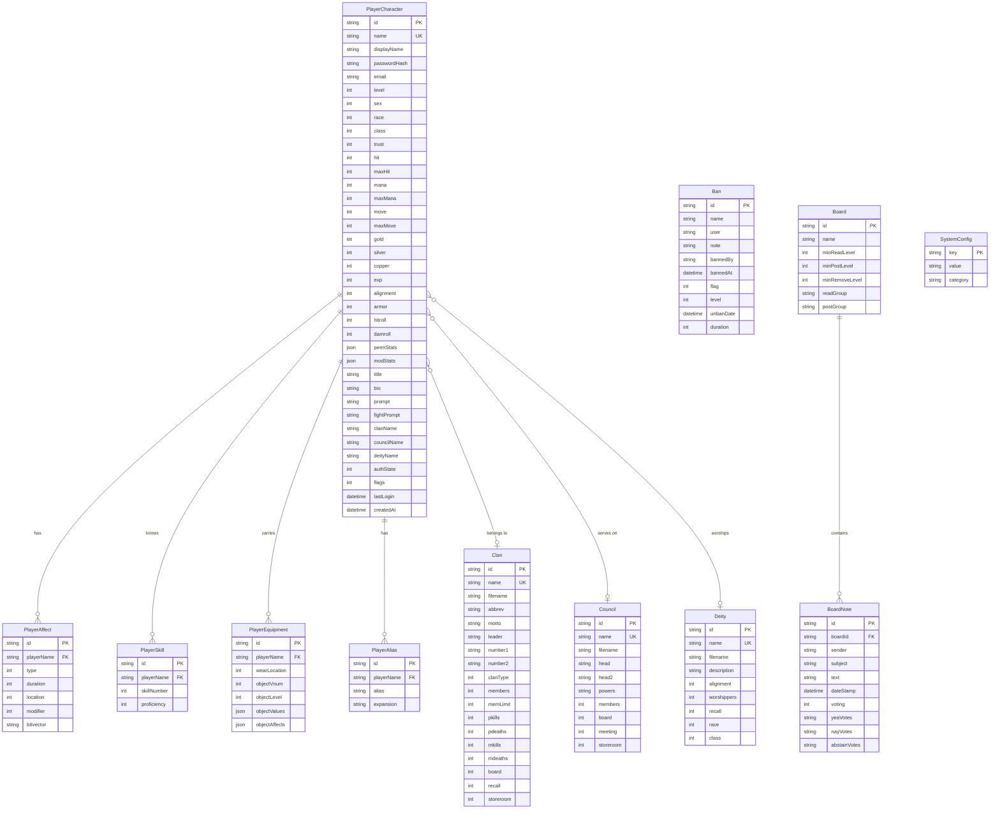

---

## §14. Economy System

### 14.1 Overview

Three-currency system: gold, silver, copper with fixed ratios (1 gold = 100 silver = 10,000 copper). Shops, repair shops, banks, and quests all participate.

**Why:** The legacy engine introduced silver and copper in later SMAUG versions to add economic depth. The fixed ratio and `conv_currency()` normalization are used everywhere. Shopkeeper pricing includes charisma and race modifiers that create emergent economic gameplay.

```typescript
// src/game/economy/Currency.ts

export interface Currency {
  gold: number;
  silver: number;
  copper: number;
}

/** Convert a currency triple to total copper value. */
export function toCopper(c: Currency): number {
  return c.gold * 10000 + c.silver * 100 + c.copper;
}

/** Normalize excess copper/silver upward. */
export function normalizeCurrency(c: Currency): Currency {
  let total = toCopper(c);
  const gold = Math.floor(total / 10000);
  total -= gold * 10000;
  const silver = Math.floor(total / 100);
  const copper = total - silver * 100;
  return { gold, silver, copper };
}

/** Check if character can afford a copper-denominated cost. */
export function canAfford(c: Currency, costInCopper: number): boolean {
  return toCopper(c) >= costInCopper;
}

/**
 * Shop buy price calculation.
 * Replicates legacy get_cost() in shops.c.
 */
export function shopBuyPrice(
  objCost: Currency,
  profitBuy: number,
  profitSell: number,
  buyerLevel: number,
  buyerCha: number,
  buyerRace: number
): number {
  const profitMod = getRaceProfitMod(buyerRace);
  const base = toCopper(objCost);
  const cost = Math.floor(
    base * Math.max(profitSell + 1, profitBuy + profitMod) / 100
    * (80 + Math.min(buyerLevel, 65)) / 100
  );
  return cost;
}

function getRaceProfitMod(race: number): number {
  // Legacy racial modifiers for shop prices
  switch (race) {
    case 1: return -10; // Elf
    case 2: return 3;   // Dwarf
    case 3: return -2;  // Halfling
    case 4: return -8;  // Pixie
    case 6: return 7;   // Half-orc
    default: return 0;
  }
}
```

### 14.2 Shop and Repair Shop Interfaces

```typescript
export interface ShopData {
  keeperVnum: number;
  buyTypes: number[];        // Up to 5 item types accepted
  profitBuy: number;         // Markup percentage (default 120)
  profitSell: number;        // Sell-back percentage (default 90)
  openHour: number;
  closeHour: number;
}

export interface RepairShopData {
  keeperVnum: number;
  fixTypes: number[];        // Up to 3 repairable item types
  profitFix: number;         // Repair markup (default 1000 = 100%)
  shopType: 'fix' | 'recharge';
  openHour: number;
  closeHour: number;
}
```

---

## §15. Social and Guild Systems

### 15.1 Overview

Clans, councils, guilds, orders — all use the `Clan` data structure with different `clanType` values. The legacy engine distinguishes them by type for behavior differences (PK requirements, skill granting, leadership hierarchy).

**Why:** The legacy `clan_data` structure serves quadruple duty: clans (PK groups), guilds (class-specific), orders (organization), and nokill clans (non-PK). Each has different induction rules, PK flag behavior, and skill mechanics. We preserve this unified structure with a type discriminator because the admin commands (`cset`, `makeclan`) work identically across all types.

```typescript
// src/game/social/ClanSystem.ts

export enum ClanType {
  Plain     = 0,
  Vampire   = 1,
  Warrior   = 2,
  Druid     = 3,
  Mage      = 4,
  Order     = 18,
  Guild     = 19,
  NoKill    = 17,
}

export interface ClanData {
  name: string;
  filename: string;
  abbrev: string;
  motto: string;
  description: string;
  leader: string;
  number1: string;   // First officer
  number2: string;   // Second officer
  clanType: ClanType;
  members: number;
  memLimit: number;
  alignment: number;
  classRestriction: number;   // For guilds
  board: number;              // Board vnum
  recall: number;             // Recall room vnum
  storeroom: number;          // Storeroom vnum
  guard1: number;             // Guard mob vnum
  guard2: number;
  clanObjects: number[];      // Up to 5 clan item vnums
  pkills: number[];           // 7 level-range buckets
  pdeaths: number[];
  mkills: number;
  mdeaths: number;
  score: number;
  favour: number;
  strikes: number;
}

/**
 * Induct a player into a clan.
 * Replicates legacy do_council_induct() / do_induct().
 *
 * Why: Different clan types have different induction requirements:
 * - PK clans set PCFLAG_DEADLY and remove PLR_NICE
 * - Guilds check class match
 * - All set LANG_CLAN speaking bit
 * - Guilds grant full proficiency in class guild skills
 */
export function inductPlayer(
  inducer: import('../entities/Player').Player,
  target: import('../entities/Player').Player,
  clan: ClanData
): boolean {
  if (target.level < 10) {
    inducer.sendToChar("They must be at least level 10.\r\n");
    return false;
  }

  if (clan.clanType === ClanType.Guild && target.class_ !== clan.classRestriction) {
    inducer.sendToChar("They are the wrong class for this guild.\r\n");
    return false;
  }

  target.pcData.clanName = clan.name;
  clan.members++;

  // PK clans set deadly flag
  if (clan.clanType !== ClanType.Guild &&
      clan.clanType !== ClanType.Order &&
      clan.clanType !== ClanType.NoKill) {
    target.pcData.flags |= 0x01; // PCFLAG_DEADLY
  }

  return true;
}
```

### 15.2 Board System

```typescript
export interface BoardData {
  name: string;
  filename: string;
  minReadLevel: number;
  minPostLevel: number;
  minRemoveLevel: number;
  readGroup: string | null;  // Clan/council name
  postGroup: string | null;
  extraReaders: string[];    // Individual player names
  extraRemovers: string[];
  notes: BoardNote[];
}

export interface BoardNote {
  sender: string;
  subject: string;
  text: string;
  dateStamp: Date;
  voting: 'none' | 'open' | 'closed' | 'ballot';
  yeaVotes: string[];
  nayVotes: string[];
  abstainVotes: string[];
}
```

### 15.3 Housing System

```typescript
export interface HouseData {
  owner: string;
  apartment: boolean;
  rooms: number[];     // Up to 6 room vnums
}
```

---

## §16. MUD Programming/Scripting System

### 16.1 Overview

MUD programs (mprogs) are event-driven scripts attached to mobs, objects, or rooms. They use a simple line-based interpreted language with conditionals, variable substitution, and the ability to execute any NPC command.

**Why:** MUD programs are the primary content creation tool for builders. They give NPCs personality: shopkeepers that banter, quest mobs that check conditions, trap rooms that fire on entry. The legacy engine's mprog system is used in thousands of area files and must be supported unchanged. The ifcheck library, variable substitution (`$n`, `$t`, `$i`, etc.), and nesting rules must match exactly.

```typescript
// src/scripting/MudProgEngine.ts

import { Character } from '../game/entities/Character';
import { Mobile } from '../game/entities/Mobile';
import { GameObject } from '../game/entities/GameObject';
import { Room } from '../game/entities/Room';

/** Trigger types matching legacy mprog types. */
export enum MudProgTrigger {
  // Mob triggers
  ActProg          = 'ACT_PROG',
  AllGreetProg     = 'ALL_GREET_PROG',
  BribeGoldProg    = 'BRIBE_GOLD_PROG',
  BribeSilverProg  = 'BRIBE_SILVER_PROG',
  BribeCopperProg  = 'BRIBE_COPPER_PROG',
  CmdProg          = 'CMD_PROG',
  DeathProg        = 'DEATH_PROG',
  EntryProg        = 'ENTRY_PROG',
  FightProg        = 'FIGHT_PROG',
  GiveProg         = 'GIVE_PROG',
  GreetProg        = 'GREET_PROG',
  HitPrcntProg     = 'HITPRCNT_PROG',
  HourProg         = 'HOUR_PROG',
  LoginProg        = 'LOGIN_PROG',
  RandProg         = 'RAND_PROG',
  SpeechProg       = 'SPEECH_PROG',
  TellProg         = 'TELL_PROG',
  TimeProg         = 'TIME_PROG',
  ScriptProg       = 'SCRIPT_PROG',

  // Object triggers
  DropProg         = 'DROP_PROG',
  ExamineProg      = 'EXA_PROG',
  GetProg          = 'GET_PROG',
  PullProg         = 'PULL_PROG',
  PushProg         = 'PUSH_PROG',
  UseProg          = 'USE_PROG',
  WearProg         = 'WEAR_PROG',
  RemoveProg       = 'REMOVE_PROG',
  ZapProg          = 'ZAP_PROG',
  DamageProg       = 'DAMAGE_PROG',
  SacProg          = 'SAC_PROG',

  // Room triggers
  EnterProg        = 'ENTER_PROG',
  LeaveProg        = 'LEAVE_PROG',
  RFightProg       = 'RFIGHT_PROG',
  RDeathProg       = 'RDEATH_PROG',
  RestProg         = 'REST_PROG',
  SleepProg        = 'SLEEP_PROG',
}

export interface MudProgData {
  trigger: MudProgTrigger;
  argList: string;
  commandList: string;
}

export interface MudProgContext {
  mob: Mobile;          // The executing mob (or supermob)
  actor: Character | null;
  victim: Character | null;
  obj: GameObject | null;
  target: Character | null;
  room: Room | null;
}

/**
 * MUD Program execution engine.
 * Replicates legacy mprog_driver() in mud_prog.c.
 *
 * Why: The execution model is line-based interpretation with a fixed
 * if/or/else/endif nesting stack (MAX_IFS = 20). After each command,
 * we check if the mob died (char_died) to prevent crashes. The supermob
 * pattern allows object and room progs to execute commands as if they
 * were an NPC standing in the room.
 */
export class MudProgEngine {
  private static readonly MAX_IFS = 20;
  private static readonly MAX_NEST = 20;

  /**
   * Execute a MUD program command list.
   */
  execute(prog: MudProgData, context: MudProgContext): void {
    const lines = prog.commandList.split('\n');
    const ifState: boolean[] = new Array(MudProgEngine.MAX_IFS).fill(true);
    let ifLevel = 0;

    for (let i = 0; i < lines.length; i++) {
      const line = lines[i].trim();
      if (!line) continue;

      if (line.startsWith('if ')) {
        ifLevel++;
        if (ifLevel >= MudProgEngine.MAX_IFS) break;
        ifState[ifLevel] = this.evaluateIfcheck(line.substring(3), context);
      } else if (line.startsWith('or ')) {
        if (!ifState[ifLevel]) {
          ifState[ifLevel] = this.evaluateIfcheck(line.substring(3), context);
        }
      } else if (line === 'else') {
        ifState[ifLevel] = !ifState[ifLevel];
      } else if (line === 'endif') {
        ifLevel = Math.max(0, ifLevel - 1);
      } else if (line === 'break') {
        break;
      } else if (ifState[ifLevel]) {
        // Execute command
        const expanded = this.substituteVariables(line, context);
        // context.mob.interpretCommand(expanded);

        // Safety: check if mob died
        // if (this.charDied(context.mob)) return;
      }
    }
  }

  /**
   * Variable substitution.
   * Replicates legacy mprog_translate().
   */
  private substituteVariables(line: string, ctx: MudProgContext): string {
    return line
      .replace(/\$n/g, ctx.actor?.name ?? 'someone')
      .replace(/\$N/g, ctx.actor?.shortDescription ?? 'someone')
      .replace(/\$i/g, ctx.mob.name)
      .replace(/\$I/g, ctx.mob.shortDescription)
      .replace(/\$t/g, ctx.victim?.name ?? 'someone')
      .replace(/\$T/g, ctx.victim?.shortDescription ?? 'someone')
      .replace(/\$p/g, ctx.obj?.name ?? 'something')
      .replace(/\$P/g, ctx.obj?.shortDescription ?? 'something')
      .replace(/\$\$/g, '$');
  }

  /**
   * Evaluate an ifcheck condition.
   * Replicates legacy mprog_do_ifcheck().
   */
  private evaluateIfcheck(condition: string, ctx: MudProgContext): boolean {
    // Parse: ifcheck(target) [operator value]
    const match = condition.match(/(\w+)\((\$\w)\)\s*(==|!=|>|<|>=|<=)?\s*(.*)?/);
    if (!match) return false;

    const [, check, targetVar, operator, value] = match;
    const target = this.resolveTarget(targetVar, ctx);

    switch (check) {
      case 'ispc': return target instanceof Character && !target.isNpc;
      case 'isnpc': return target instanceof Character && target.isNpc;
      case 'level': return this.compareNumber((target as Character)?.level ?? 0, operator, value);
      case 'rand': return Math.random() * 100 < parseInt(value ?? '50');
      case 'hitprcnt': {
        const ch = target as Character;
        if (!ch) return false;
        const pct = Math.floor((ch.hit * 100) / ch.maxHit);
        return this.compareNumber(pct, operator, value);
      }
      case 'inroom': return ctx.mob.inRoom?.vnum === parseInt(value ?? '0');
      case 'isfight': return (target as Character)?.isFighting ?? false;
      // ... 50+ more ifchecks
      default: return false;
    }
  }

  private resolveTarget(varName: string, ctx: MudProgContext): any {
    switch (varName) {
      case '$n': return ctx.actor;
      case '$i': return ctx.mob;
      case '$t': return ctx.victim;
      case '$r': return null; // Random PC in room
      case '$p': return ctx.obj;
      default: return null;
    }
  }

  private compareNumber(value: number, operator: string | undefined, target: string | undefined): boolean {
    const t = parseInt(target ?? '0');
    switch (operator) {
      case '==': return value === t;
      case '!=': return value !== t;
      case '>':  return value > t;
      case '<':  return value < t;
      case '>=': return value >= t;
      case '<=': return value <= t;
      default: return false;
    }
  }
}
```

---

## §17. OLC System

### 17.1 Overview

Online Creation (OLC) allows builders to create and edit rooms, mobs, and objects in real-time through in-game commands.

**Why:** The legacy OLC spans `build.c` (11,286 lines) and `ibuild.c` (3,976 lines). It uses the substate system to put the connection into editing mode, and vnum range enforcement prevents builders from modifying areas outside their assigned ranges. We replicate this as a state machine on the `Descriptor`, with TypeScript validation replacing the C permission checks.

```typescript
// src/game/commands/olc.ts

import { Player } from '../entities/Player';
import { OlcEditorData } from '../../network/ConnectionManager';
import { VnumRegistry } from '../world/VnumRegistry';

export type OlcMode = 'room' | 'mobile' | 'object' | 'area';

/**
 * Check if a player can modify a given vnum.
 * Replicates legacy can_rmodify(), can_mmodify(), can_oedit().
 *
 * Why: Builders are assigned vnum ranges per entity type. This prevents
 * builders from editing other builders' areas. High-level immortals
 * (>= level_modify_proto) bypass range checks.
 */
export function canModifyVnum(player: Player, vnum: number, type: OlcMode): boolean {
  // High-level immortals bypass
  if (player.getTrust() >= 59) return true; // LEVEL_GREATER

  const pc = player.pcData;
  switch (type) {
    case 'room':
      return vnum >= pc.rRangeLo && vnum <= pc.rRangeHi;
    case 'mobile':
      return vnum >= pc.mRangeLo && vnum <= pc.mRangeHi;
    case 'object':
      return vnum >= pc.oRangeLo && vnum <= pc.oRangeHi;
    case 'area':
      return true; // Area editing checks done separately
  }
}

/**
 * Room editor command handler.
 */
export function doRedit(player: Player, argument: string): void {
  if (!player.inRoom) return;

  if (!canModifyVnum(player, player.inRoom.vnum, 'room')) {
    player.sendToChar("That vnum is not in your assigned range.\r\n");
    return;
  }

  // Enter OLC mode
  if (player.descriptor) {
    player.descriptor.olcData = {
      mode: 'room',
      vnum: player.inRoom.vnum,
      modified: false,
    };
  }

  player.sendToChar(`Editing room ${player.inRoom.vnum}: ${player.inRoom.name}\r\n`);
  player.sendToChar("Type 'done' to exit the editor.\r\n");
}
```

---

## §18. Administration System

### 18.1 Trust Level Hierarchy

**Why:** The legacy engine uses a numeric trust level (0–65) that determines what commands a player can execute. This is the sole authorization mechanism — there are no roles, just a number. Higher trust = more power. We preserve this because existing world data files reference trust levels in reset commands, command definitions, and help files.

```typescript
// src/admin/TrustLevels.ts

export const TRUST_LEVELS = {
  MORTAL:        0,
  AVATAR:        50,  // First immortal level
  NEOPHYTE:      51,
  ACOLYTE:       52,
  CREATOR:       53,
  SAVANT:        54,
  DEMI_GOD:      55,
  LESSER_GOD:    56,
  GOD:           57,
  GREATER_GOD:   58,
  ASCENDANT:     59,
  SUB_IMPLEM:    60,
  IMPLEMENTOR:   61,
  ETERNAL:       62,
  INFINITE:      63,
  SUPREME:       65,  // MAX_LEVEL
} as const;

export function isImmortal(trust: number): boolean {
  return trust >= TRUST_LEVELS.AVATAR;
}

export function isHero(trust: number): boolean {
  return trust >= TRUST_LEVELS.NEOPHYTE;
}
```

### 18.2 Ban System

```typescript
// src/admin/BanSystem.ts

export interface BanEntry {
  name: string;          // Site or character name
  user: string;
  note: string;
  bannedBy: string;
  bannedAt: Date;
  flagType: 'newbie' | 'mortal' | 'all' | 'level' | 'warn';
  level: number;         // Level cap for 'level' type
  unbanDate: Date | null;
  duration: number;      // Days, -1 = permanent
  prefix: boolean;       // Match as prefix
  suffix: boolean;       // Match as suffix
}

export class BanSystem {
  private bans: BanEntry[] = [];

  /**
   * Check if a connection should be banned.
   * Replicates legacy check_bans() logic.
   */
  checkBan(host: string, level: number): BanEntry | null {
    for (const ban of this.bans) {
      // Check expiration
      if (ban.unbanDate && new Date() > ban.unbanDate) continue;

      // Match host
      if (!this.matchHost(host, ban)) continue;

      // Check ban type vs level
      switch (ban.flagType) {
        case 'newbie': if (level > 1) continue; break;
        case 'mortal': if (level > 50) continue; break;
        case 'level':  if (level > ban.level) continue; break;
        case 'warn':   return ban;  // Warning only
        case 'all':    return ban;  // Block all
      }

      return ban;
    }
    return null;
  }

  private matchHost(host: string, ban: BanEntry): boolean {
    const lowerHost = host.toLowerCase();
    const lowerBan = ban.name.toLowerCase();

    if (ban.prefix && ban.suffix) return lowerHost.includes(lowerBan);
    if (ban.prefix) return lowerHost.startsWith(lowerBan);
    if (ban.suffix) return lowerHost.endsWith(lowerBan);
    return lowerHost === lowerBan;
  }
}
```

### 18.3 Authorization Workflow

```typescript
/**
 * Authorization states for new characters.
 * Replicates legacy auth_state progression.
 *
 * Why: New characters must be approved by an immortal to prevent
 * inappropriate names. The workflow: create → wait → approve/deny.
 * Denied characters get a reason code and must re-choose their name.
 */
export enum AuthState {
  Created         = 0,  // Character created
  NameChosen      = 1,  // Name selected
  PasswordSet     = 2,  // Password set (denied names land here)
  WaitingApproval = 3,  // Waiting for immortal authorization
  Authorized      = 4,  // Approved, normal play
}

export type DenialReason = 'immsim' | 'mobsim' | 'swear' | 'plain' | 'unpronu' | 'deny';
```

---

## §19. Admin Dashboard

### 19.1 Overview

A React + Vite SPA served on a sub-path (`/admin`) of the main HTTP server. Communicates with the game engine via a REST API and WebSocket for real-time updates.

**Why:** The legacy engine has no admin UI — all administration is done through in-game immortal commands. A web dashboard provides monitoring capabilities (player count graphs, lag alerts, error logs) without requiring an immortal character. It also enables operations like ban management and area deployment from a browser.

### API Design (REST Endpoints)

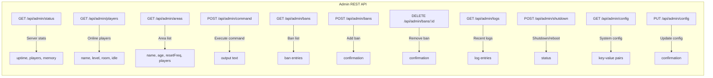

### 19.2 Admin Router

```typescript
// src/admin/AdminRouter.ts

import { Router, Request, Response, NextFunction } from 'express';
import * as jwt from 'jsonwebtoken';
import { GameLoop } from '../core/GameLoop';
import { ConnectionManager } from '../network/ConnectionManager';
import { AreaManager } from '../game/world/AreaManager';
import { BanSystem } from './BanSystem';

export function createAdminRouter(
  gameLoop: GameLoop,
  connectionMgr: ConnectionManager,
  areaMgr: AreaManager,
  banSystem: BanSystem,
  jwtSecret: string
): Router {
  const router = Router();

  // JWT auth middleware
  const authMiddleware = (req: Request, res: Response, next: NextFunction) => {
    const token = req.headers.authorization?.replace('Bearer ', '');
    if (!token) return res.status(401).json({ error: 'No token' });
    try {
      const payload = jwt.verify(token, jwtSecret) as { name: string; trust: number };
      if (payload.trust < 60) return res.status(403).json({ error: 'Insufficient trust' });
      (req as any).admin = payload;
      next();
    } catch {
      return res.status(401).json({ error: 'Invalid token' });
    }
  };

  router.use(authMiddleware);

  // GET /api/admin/status
  router.get('/status', (_req, res) => {
    res.json({
      uptime: process.uptime(),
      pulse: gameLoop.currentPulse,
      players: connectionMgr.getPlayingDescriptors().length,
      memoryMB: process.memoryUsage().heapUsed / 1024 / 1024,
      areas: areaMgr.getAllAreas().length,
    });
  });

  // GET /api/admin/players
  router.get('/players', (_req, res) => {
    const players = connectionMgr.getPlayingDescriptors().map(d => ({
      name: d.character?.name,
      level: d.character?.level,
      room: d.character?.inRoom?.vnum,
      idle: d.idle,
      host: d.host,
    }));
    res.json(players);
  });

  // GET /api/admin/areas
  router.get('/areas', (_req, res) => {
    const areas = areaMgr.getAllAreas().map(a => ({
      name: a.name,
      filename: a.filename,
      author: a.author,
      age: a.age,
      resetFrequency: a.resetFrequency,
    }));
    res.json(areas);
  });

  // POST /api/admin/command
  router.post('/command', (req, res) => {
    const { command } = req.body;
    // Execute command as admin and capture output
    res.json({ output: `Executed: ${command}` });
  });

  // Bans CRUD
  router.get('/bans', (_req, res) => {
    res.json([]); // banSystem.getAllBans()
  });

  router.post('/bans', (req, res) => {
    // banSystem.addBan(req.body)
    res.json({ success: true });
  });

  router.delete('/bans/:id', (req, res) => {
    // banSystem.removeBan(req.params.id)
    res.json({ success: true });
  });

  // GET /api/admin/logs
  router.get('/logs', (_req, res) => {
    res.json([]); // Recent log entries
  });

  return router;
}
```

### 19.3 Dashboard React Components

```typescript
// src/dashboard/src/App.tsx (sketch)

import React, { useEffect, useState } from 'react';

interface ServerStatus {
  uptime: number;
  pulse: number;
  players: number;
  memoryMB: number;
  areas: number;
}

export default function App() {
  const [status, setStatus] = useState<ServerStatus | null>(null);

  useEffect(() => {
    const interval = setInterval(async () => {
      const res = await fetch('/api/admin/status', {
        headers: { Authorization: `Bearer ${localStorage.getItem('token')}` },
      });
      setStatus(await res.json());
    }, 5000);
    return () => clearInterval(interval);
  }, []);

  return (
    <div className="dashboard">
      <h1>SMAUG 2.0 Admin Dashboard</h1>
      {status && (
        <div className="status-panel">
          <div>Players Online: {status.players}</div>
          <div>Uptime: {Math.floor(status.uptime / 3600)}h</div>
          <div>Memory: {status.memoryMB.toFixed(1)} MB</div>
          <div>Areas: {status.areas}</div>
          <div>Pulse: {status.pulse}</div>
        </div>
      )}
      {/* PlayerList, AreaList, BanManager, LogViewer, CommandConsole */}
    </div>
  );
}
```

---

## §20. Browser Play UI

### 20.1 Overview

A React + Vite SPA that connects via Socket.IO and renders the MUD's ANSI-colored text output in a terminal-like interface. This is the primary way web users play the game.

**Why:** Traditional MUDs require a dedicated client (Mudlet, TinTin++). A browser client opens the game to casual players. The client must render ANSI color codes, support scrollback, handle input with command history (up-arrow recall), and feel responsive despite the 250ms pulse interval.

```typescript
// src/client/src/Terminal.tsx (sketch)

import React, { useRef, useEffect, useState, useCallback } from 'react';
import { io, Socket } from 'socket.io-client';

interface TerminalProps {
  serverUrl: string;
}

export function Terminal({ serverUrl }: TerminalProps) {
  const [lines, setLines] = useState<string[]>([]);
  const [input, setInput] = useState('');
  const [history, setHistory] = useState<string[]>([]);
  const [historyIndex, setHistoryIndex] = useState(-1);
  const socketRef = useRef<Socket | null>(null);
  const outputRef = useRef<HTMLDivElement>(null);

  useEffect(() => {
    const socket = io(serverUrl, { path: '/play' });
    socketRef.current = socket;

    socket.on('output', (data: string) => {
      setLines(prev => [...prev, ...data.split('\r\n')]);
    });

    return () => { socket.disconnect(); };
  }, [serverUrl]);

  // Auto-scroll to bottom
  useEffect(() => {
    if (outputRef.current) {
      outputRef.current.scrollTop = outputRef.current.scrollHeight;
    }
  }, [lines]);

  const sendCommand = useCallback(() => {
    if (!input.trim()) return;
    socketRef.current?.emit('input', input + '\n');
    setHistory(prev => [...prev, input]);
    setHistoryIndex(-1);
    setInput('');
  }, [input]);

  const handleKeyDown = (e: React.KeyboardEvent) => {
    if (e.key === 'Enter') {
      sendCommand();
    } else if (e.key === 'ArrowUp') {
      e.preventDefault();
      if (history.length > 0) {
        const idx = historyIndex < 0 ? history.length - 1 : Math.max(0, historyIndex - 1);
        setHistoryIndex(idx);
        setInput(history[idx]);
      }
    } else if (e.key === 'ArrowDown') {
      e.preventDefault();
      if (historyIndex >= 0) {
        const idx = historyIndex + 1;
        if (idx >= history.length) {
          setHistoryIndex(-1);
          setInput('');
        } else {
          setHistoryIndex(idx);
          setInput(history[idx]);
        }
      }
    }
  };

  return (
    <div className="terminal">
      <div className="terminal-output" ref={outputRef}>
        {lines.map((line, i) => (
          <AnsiLine key={i} text={line} />
        ))}
      </div>
      <input
        className="terminal-input"
        value={input}
        onChange={e => setInput(e.target.value)}
        onKeyDown={handleKeyDown}
        placeholder="Enter command..."
        autoFocus
      />
    </div>
  );
}

function AnsiLine({ text }: { text: string }) {
  // Convert ANSI escape codes to styled spans
  const parts = parseAnsi(text);
  return (
    <div className="terminal-line">
      {parts.map((part, i) => (
        <span key={i} style={part.style}>{part.text}</span>
      ))}
    </div>
  );
}

interface AnsiPart {
  text: string;
  style: React.CSSProperties;
}

function parseAnsi(text: string): AnsiPart[] {
  // Parse ANSI escape sequences and convert to CSS styles
  const parts: AnsiPart[] = [];
  const regex = /\x1b\[([0-9;]*)m/g;
  let lastIndex = 0;
  let currentStyle: React.CSSProperties = {};
  let match: RegExpExecArray | null;

  while ((match = regex.exec(text)) !== null) {
    if (match.index > lastIndex) {
      parts.push({ text: text.substring(lastIndex, match.index), style: { ...currentStyle } });
    }
    currentStyle = ansiCodesToStyle(match[1], currentStyle);
    lastIndex = match.index + match[0].length;
  }

  if (lastIndex < text.length) {
    parts.push({ text: text.substring(lastIndex), style: { ...currentStyle } });
  }

  return parts.length > 0 ? parts : [{ text, style: {} }];
}

const ANSI_COLORS = ['#000', '#a00', '#0a0', '#a50', '#00a', '#a0a', '#0aa', '#aaa'];
const ANSI_BRIGHT = ['#555', '#f55', '#5f5', '#ff5', '#55f', '#f5f', '#5ff', '#fff'];

function ansiCodesToStyle(codes: string, current: React.CSSProperties): React.CSSProperties {
  const style = { ...current };
  for (const code of codes.split(';').map(Number)) {
    if (code === 0) return {};
    if (code === 1) (style as any).__bold = true;
    if (code >= 30 && code <= 37) {
      const idx = code - 30;
      style.color = (style as any).__bold ? ANSI_BRIGHT[idx] : ANSI_COLORS[idx];
    }
    if (code >= 40 && code <= 47) {
      style.backgroundColor = ANSI_COLORS[code - 40];
    }
  }
  return style;
}
```

---

## §21. Prisma Schema

The complete Prisma schema for PostgreSQL persistence.

**Why:** We store player data, system configuration, clans, councils, deities, bans, and boards in PostgreSQL for transactional integrity and queryability. World data (rooms, mobs, objects) stays in JSON files because builders need to edit it with text editors. This split matches the legacy pattern: player files are saved/loaded individually, while area files are loaded once at boot and saved on demand.

```prisma
// prisma/schema.prisma

generator client {
  provider = "prisma-client-js"
}

datasource db {
  provider = "postgresql"
  url      = env("DATABASE_URL")
}

// ─── Enums ──────────────────────────────────────────────────────────────

enum Sex {
  NEUTRAL
  MALE
  FEMALE
}

enum ClanType {
  PLAIN
  VAMPIRE
  WARRIOR
  DRUID
  MAGE
  CELTIC
  DEMON
  ANGEL
  ARCHER
  THIEF
  CLERIC
  PIRATE
  ASSASSIN
  UNDEAD
  CHAOTIC
  NEUTRAL_ALIGN
  LAWFUL
  NOKILL
  ORDER
  GUILD
}

enum BanType {
  NEWBIE
  MORTAL
  ALL
  LEVEL
  WARN
}

enum BoardVoteType {
  NONE
  OPEN
  CLOSED
  BALLOT
}

enum AuthState {
  CREATED
  NAME_CHOSEN
  PASSWORD_SET
  WAITING_APPROVAL
  AUTHORIZED
}

// ─── Player System ──────────────────────────────────────────────────────

model PlayerCharacter {
  id            String   @id @default(cuid())
  name          String   @unique
  displayName   String
  passwordHash  String
  email         String?
  totpSecret    String?   // Optional 2FA

  // Core attributes
  level         Int      @default(1)
  sex           Sex      @default(NEUTRAL)
  race          Int      @default(0)
  class         Int      @default(0)
  trust         Int      @default(0)

  // Vitals
  hit           Int      @default(20)
  maxHit        Int      @default(20)
  mana          Int      @default(100)
  maxMana       Int      @default(100)
  move          Int      @default(100)
  maxMove       Int      @default(100)

  // Stats (JSON for flexibility)
  permStats     Json     @default("{\"str\":13,\"int\":13,\"wis\":13,\"dex\":13,\"con\":13,\"cha\":13,\"lck\":13}")
  modStats      Json     @default("{\"str\":0,\"int\":0,\"wis\":0,\"dex\":0,\"con\":0,\"cha\":0,\"lck\":0}")

  // Combat
  hitroll       Int      @default(0)
  damroll       Int      @default(0)
  armor         Int      @default(100)
  alignment     Int      @default(0)
  wimpy         Int      @default(0)
  numAttacks    Int      @default(1)

  // Saving throws
  savingPoison  Int      @default(0)
  savingRod     Int      @default(0)
  savingPara    Int      @default(0)
  savingBreath  Int      @default(0)
  savingSpell   Int      @default(0)

  // Economy
  gold          Int      @default(0)
  silver        Int      @default(0)
  copper        Int      @default(0)
  exp           Int      @default(0)
  goldBalance   Int      @default(0)
  silverBalance Int      @default(0)
  copperBalance Int      @default(0)

  // Bitvectors (stored as strings for bigint support)
  actFlags      String   @default("0")
  affectedBy    String   @default("0")
  immune        Int      @default(0)
  resistant     Int      @default(0)
  susceptible   Int      @default(0)

  // Position
  position      Int      @default(12) // POS_STANDING
  style         Int      @default(0)

  // Language
  speaking      Int      @default(0)
  speaks        Int      @default(0)

  // Physical
  height        Int      @default(72)
  weight        Int      @default(180)

  // Identity
  title         String   @default("")
  rank          String   @default("")
  bio           String   @default("")
  homepage      String   @default("")
  prompt        String   @default("<%h/%Hhp %m/%Mmana %v/%Vmv> ")
  fightPrompt   String   @default("<%h/%Hhp %m/%Mmana %v/%Vmv> [%c: %C] ")
  bamfIn        String   @default("")
  bamfOut       String   @default("")

  // Affiliations
  clanName      String?
  councilName   String?
  deityName     String?

  // Conditions: [hunger, thirst, blood, bleed]
  conditions    Json     @default("[48,48,0,0]")

  // PK stats
  pkills        Int      @default(0)
  pdeaths       Int      @default(0)
  mkills        Int      @default(0)
  mdeaths       Int      @default(0)
  illegalPk     Int      @default(0)

  // Admin
  authState     AuthState @default(CREATED)
  wizInvis      Int      @default(0)
  minSnoop      Int      @default(0)
  bestowments   String   @default("")
  flags         Int      @default(0)

  // Editor ranges
  rRangeLo      Int      @default(0)
  rRangeHi      Int      @default(0)
  mRangeLo      Int      @default(0)
  mRangeHi      Int      @default(0)
  oRangeLo      Int      @default(0)
  oRangeHi      Int      @default(0)

  // Quest
  questNumber   Int      @default(0)
  questCurrent  Int      @default(0)
  questAccum    Int      @default(0)

  // Pager
  pagerLen      Int      @default(24)
  pagerOn       Boolean  @default(true)

  // Stances (JSON array)
  stances       Json     @default("[]")

  // Colors (JSON map)
  colors        Json     @default("{}")

  // Ignored players (comma-separated)
  ignored       String   @default("")

  // Marriage
  spouse        String?

  // Room vnum where last saved
  lastRoom      Int      @default(0)

  // Timestamps
  played        Int      @default(0)  // Total seconds played
  lastLogin     DateTime?
  createdAt     DateTime @default(now())
  updatedAt     DateTime @updatedAt

  // Hell/jail
  releaseDate   DateTime?
  helledBy      String?

  // Relations
  affects       PlayerAffect[]
  skills        PlayerSkill[]
  equipment     PlayerEquipment[]
  aliases       PlayerAlias[]
  inventory     PlayerInventory[]

  // Clan relation
  clan          Clan?    @relation(fields: [clanName], references: [name])
  council       Council? @relation(fields: [councilName], references: [name])
  deity         Deity?   @relation(fields: [deityName], references: [name])

  @@index([level])
  @@index([clanName])
  @@index([lastLogin])
}

model PlayerAffect {
  id          String @id @default(cuid())
  playerName  String
  type        Int      // Spell/skill number
  duration    Int      // -1 = permanent
  location    Int      // ApplyType enum
  modifier    Int
  bitvector   String   @default("0")

  player      PlayerCharacter @relation(fields: [playerName], references: [name], onDelete: Cascade)

  @@index([playerName])
}

model PlayerSkill {
  id          String @id @default(cuid())
  playerName  String
  skillNumber Int
  proficiency Int    // 0-100

  player      PlayerCharacter @relation(fields: [playerName], references: [name], onDelete: Cascade)

  @@unique([playerName, skillNumber])
  @@index([playerName])
}

model PlayerEquipment {
  id           String @id @default(cuid())
  playerName   String
  wearLocation Int
  objectVnum   Int
  objectLevel  Int    @default(1)
  objectValues Json   @default("[]")
  objectAffects Json  @default("[]")
  extraFlags   Int    @default(0)
  timer        Int    @default(0)

  player       PlayerCharacter @relation(fields: [playerName], references: [name], onDelete: Cascade)

  @@index([playerName])
}

model PlayerInventory {
  id           String @id @default(cuid())
  playerName   String
  objectVnum   Int
  objectLevel  Int    @default(1)
  objectValues Json   @default("[]")
  objectAffects Json  @default("[]")
  extraFlags   Int    @default(0)
  timer        Int    @default(0)
  containedIn  String? // ID of parent PlayerInventory if in a container

  player       PlayerCharacter @relation(fields: [playerName], references: [name], onDelete: Cascade)

  @@index([playerName])
  @@index([containedIn])
}

model PlayerAlias {
  id         String @id @default(cuid())
  playerName String
  alias      String
  expansion  String

  player     PlayerCharacter @relation(fields: [playerName], references: [name], onDelete: Cascade)

  @@unique([playerName, alias])
}

// ─── Clan System ────────────────────────────────────────────────────────

model Clan {
  id             String   @id @default(cuid())
  name           String   @unique
  filename       String   @unique
  abbrev         String   @default("")
  motto          String   @default("")
  description    String   @default("")
  leader         String   @default("")
  number1        String   @default("")
  number2        String   @default("")
  clanType       ClanType @default(PLAIN)
  members        Int      @default(0)
  memLimit       Int      @default(0)
  alignment      Int      @default(0)
  classRestr     Int      @default(-1)  // -1 = no restriction
  board          Int      @default(0)
  recall         Int      @default(0)
  storeroom      Int      @default(0)
  guard1         Int      @default(0)
  guard2         Int      @default(0)
  clanObjects    Json     @default("[]")
  pkills         Json     @default("[0,0,0,0,0,0,0]")
  pdeaths        Json     @default("[0,0,0,0,0,0,0]")
  mkills         Int      @default(0)
  mdeaths        Int      @default(0)
  score          Int      @default(0)
  favour         Int      @default(0)
  strikes        Int      @default(0)

  playerMembers  PlayerCharacter[]

  @@index([clanType])
}

// ─── Council System ─────────────────────────────────────────────────────

model Council {
  id           String @id @default(cuid())
  name         String @unique
  filename     String @unique
  description  String @default("")
  head         String @default("")
  head2        String @default("")
  powers       String @default("")
  abbrev       String @default("")
  members      Int    @default(0)
  board        Int    @default(0)
  meeting      Int    @default(0)
  storeroom    Int    @default(0)

  playerMembers PlayerCharacter[]
}

// ─── Deity System ───────────────────────────────────────────────────────

model Deity {
  id           String @id @default(cuid())
  name         String @unique
  filename     String @unique
  description  String @default("")
  alignment    Int    @default(0)
  worshippers  Int    @default(0)
  recall       Int    @default(0)
  race         Int    @default(-1)
  class        Int    @default(-1)
  sex          Int    @default(-1)
  // Deity favor actions stored as JSON
  actions      Json   @default("{}")

  followers    PlayerCharacter[]
}

// ─── Ban System ─────────────────────────────────────────────────────────

model Ban {
  id         String   @id @default(cuid())
  name       String
  user       String   @default("")
  note       String   @default("")
  bannedBy   String
  bannedAt   DateTime @default(now())
  banType    BanType  @default(ALL)
  level      Int      @default(0)
  unbanDate  DateTime?
  duration   Int      @default(-1) // days, -1 = permanent
  prefix     Boolean  @default(false)
  suffix     Boolean  @default(false)

  @@index([name])
  @@index([banType])
}

// ─── Board System ───────────────────────────────────────────────────────

model Board {
  id             String @id @default(cuid())
  name           String @unique
  filename       String @unique
  minReadLevel   Int    @default(0)
  minPostLevel   Int    @default(0)
  minRemoveLevel Int    @default(60)
  readGroup      String?
  postGroup      String?
  extraReaders   String @default("")
  extraRemovers  String @default("")

  notes          BoardNote[]
}

model BoardNote {
  id          String      @id @default(cuid())
  boardId     String
  sender      String
  subject     String
  text        String
  dateStamp   DateTime    @default(now())
  voting      BoardVoteType @default(NONE)
  yeaVotes    String      @default("")
  nayVotes    String      @default("")
  abstainVotes String     @default("")

  board       Board       @relation(fields: [boardId], references: [id], onDelete: Cascade)

  @@index([boardId])
  @@index([sender])
}

// ─── Housing System ─────────────────────────────────────────────────────

model PlayerHouse {
  id         String  @id @default(cuid())
  owner      String  @unique
  apartment  Boolean @default(false)
  rooms      Json    @default("[]")  // Array of room vnums
}

// ─── System Configuration ───────────────────────────────────────────────

model SystemConfig {
  key      String @id
  value    String
  category String @default("general")

  @@index([category])
}

// ─── Audit Log ──────────────────────────────────────────────────────────

model AuditLog {
  id        String   @id @default(cuid())
  actor     String
  action    String
  target    String?
  details   String?
  timestamp DateTime @default(now())

  @@index([actor])
  @@index([timestamp])
  @@index([action])
}
```

---

## §22. World Data Schema

World data is stored as JSON files on disk, one subdirectory per area. Below are the JSON Schema definitions.

**Why:** JSON files are human-readable, git-diffable, and can be edited with any text editor. This replaces the legacy `.are` text format while preserving the same data. Builders can use standard JSON tooling (VS Code, jq) rather than learning the custom `.are` format.

### 22.1 Area Schema

```json
{
  "$schema": "http://json-schema.org/draft-07/schema#",
  "title": "Area",
  "type": "object",
  "required": ["name", "filename", "author", "vnumRanges"],
  "properties": {
    "name": { "type": "string", "description": "Display name of the area" },
    "filename": { "type": "string", "description": "Unique filename identifier" },
    "author": { "type": "string" },
    "credits": { "type": "string" },
    "resetMessage": { "type": "string", "description": "Message shown when area resets" },
    "flags": { "type": "integer", "default": 0 },
    "resetFrequency": { "type": "integer", "default": 15, "description": "Reset interval in area ticks" },
    "vnumRanges": {
      "type": "object",
      "required": ["rooms", "mobiles", "objects"],
      "properties": {
        "rooms":   { "$ref": "#/definitions/vnumRange" },
        "mobiles": { "$ref": "#/definitions/vnumRange" },
        "objects": { "$ref": "#/definitions/vnumRange" }
      }
    },
    "levelRange": {
      "type": "object",
      "properties": {
        "softLow": { "type": "integer" },
        "softHigh": { "type": "integer" },
        "hardLow": { "type": "integer" },
        "hardHigh": { "type": "integer" }
      }
    },
    "economy": {
      "type": "object",
      "properties": {
        "highEconomy": { "type": "integer", "default": 0 },
        "lowEconomy": { "type": "integer", "default": 0 }
      }
    },
    "climate": {
      "type": "object",
      "properties": {
        "temp": { "type": "integer" },
        "precip": { "type": "integer" },
        "wind": { "type": "integer" }
      }
    }
  },
  "definitions": {
    "vnumRange": {
      "type": "object",
      "required": ["low", "high"],
      "properties": {
        "low": { "type": "integer" },
        "high": { "type": "integer" }
      }
    }
  }
}
```

### 22.2 Room Schema

```json
{
  "$schema": "http://json-schema.org/draft-07/schema#",
  "title": "Rooms",
  "type": "array",
  "items": {
    "type": "object",
    "required": ["vnum", "name", "sectorType"],
    "properties": {
      "vnum": { "type": "integer" },
      "name": { "type": "string" },
      "description": { "type": "string" },
      "sectorType": { "type": "integer", "minimum": 0, "maximum": 15 },
      "roomFlags": { "type": "integer", "default": 0 },
      "light": { "type": "integer", "default": 0 },
      "tunnel": { "type": "integer", "default": 0, "description": "Max occupants, 0=unlimited" },
      "teleport": {
        "type": "object",
        "properties": {
          "vnum": { "type": "integer" },
          "delay": { "type": "integer" }
        }
      },
      "exits": {
        "type": "array",
        "items": {
          "type": "object",
          "required": ["direction", "toVnum"],
          "properties": {
            "direction": { "type": "integer", "minimum": 0, "maximum": 10 },
            "toVnum": { "type": "integer" },
            "keyword": { "type": "string", "default": "" },
            "description": { "type": "string", "default": "" },
            "exitFlags": { "type": "integer", "default": 0 },
            "key": { "type": "integer", "default": -1 },
            "distance": { "type": "integer", "default": 1 },
            "pull": { "type": "integer", "default": 0 },
            "pullType": { "type": "integer", "default": 0 }
          }
        }
      },
      "extraDescriptions": {
        "type": "array",
        "items": {
          "type": "object",
          "required": ["keywords", "description"],
          "properties": {
            "keywords": { "type": "array", "items": { "type": "string" } },
            "description": { "type": "string" }
          }
        }
      }
    }
  }
}
```

### 22.3 Mobile Prototype Schema

```json
{
  "$schema": "http://json-schema.org/draft-07/schema#",
  "title": "Mobiles",
  "type": "array",
  "items": {
    "type": "object",
    "required": ["vnum", "name", "level"],
    "properties": {
      "vnum": { "type": "integer" },
      "name": { "type": "string" },
      "shortDescription": { "type": "string" },
      "longDescription": { "type": "string" },
      "description": { "type": "string", "default": "" },
      "keywords": { "type": "array", "items": { "type": "string" } },
      "level": { "type": "integer" },
      "sex": { "type": "integer", "default": 0 },
      "race": { "type": "integer", "default": 0 },
      "class": { "type": "integer", "default": 0 },
      "alignment": { "type": "integer", "default": 0 },
      "actFlags": { "type": "string", "default": "0", "description": "BigInt as string" },
      "affectedBy": { "type": "string", "default": "0" },
      "position": { "type": "integer", "default": 12 },
      "defaultPosition": { "type": "integer", "default": 12 },
      "stats": {
        "type": "object",
        "properties": {
          "str": { "type": "integer", "default": 13 },
          "int": { "type": "integer", "default": 13 },
          "wis": { "type": "integer", "default": 13 },
          "dex": { "type": "integer", "default": 13 },
          "con": { "type": "integer", "default": 13 },
          "cha": { "type": "integer", "default": 13 },
          "lck": { "type": "integer", "default": 13 }
        }
      },
      "combat": {
        "type": "object",
        "properties": {
          "hitDice": { "type": "string", "description": "NdS+P format, e.g. '5d8+100'" },
          "damDice": { "type": "string" },
          "hitroll": { "type": "integer", "default": 0 },
          "damroll": { "type": "integer", "default": 0 },
          "armor": { "type": "integer", "default": 100 },
          "numAttacks": { "type": "integer", "default": 1 },
          "attacks": { "type": "integer", "default": 0 },
          "defenses": { "type": "integer", "default": 0 }
        }
      },
      "savingThrows": {
        "type": "object",
        "properties": {
          "poison": { "type": "integer", "default": 0 },
          "rod": { "type": "integer", "default": 0 },
          "para": { "type": "integer", "default": 0 },
          "breath": { "type": "integer", "default": 0 },
          "spell": { "type": "integer", "default": 0 }
        }
      },
      "ris": {
        "type": "object",
        "properties": {
          "immune": { "type": "integer", "default": 0 },
          "resistant": { "type": "integer", "default": 0 },
          "susceptible": { "type": "integer", "default": 0 }
        }
      },
      "economy": {
        "type": "object",
        "properties": {
          "gold": { "type": "integer", "default": 0 },
          "silver": { "type": "integer", "default": 0 },
          "copper": { "type": "integer", "default": 0 },
          "exp": { "type": "integer", "default": 0 }
        }
      },
      "languages": {
        "type": "object",
        "properties": {
          "speaking": { "type": "integer", "default": 0 },
          "speaks": { "type": "integer", "default": 0 }
        }
      },
      "specFun": { "type": "string", "description": "Name of special function", "default": "" },
      "stances": { "type": "array", "items": { "type": "integer" }, "default": [] }
    }
  }
}
```

### 22.4 Object Prototype Schema

```json
{
  "$schema": "http://json-schema.org/draft-07/schema#",
  "title": "Objects",
  "type": "array",
  "items": {
    "type": "object",
    "required": ["vnum", "name", "itemType"],
    "properties": {
      "vnum": { "type": "integer" },
      "name": { "type": "string" },
      "shortDescription": { "type": "string" },
      "description": { "type": "string" },
      "actionDescription": { "type": "string", "default": "" },
      "keywords": { "type": "array", "items": { "type": "string" } },
      "itemType": { "type": "integer" },
      "level": { "type": "integer", "default": 1 },
      "weight": { "type": "integer", "default": 1 },
      "extraFlags": { "type": "integer", "default": 0 },
      "magicFlags": { "type": "integer", "default": 0 },
      "wearFlags": { "type": "integer", "default": 0 },
      "values": {
        "type": "array",
        "items": { "type": "integer" },
        "maxItems": 6,
        "default": [0, 0, 0, 0, 0, 0]
      },
      "cost": {
        "type": "object",
        "properties": {
          "gold": { "type": "integer", "default": 0 },
          "silver": { "type": "integer", "default": 0 },
          "copper": { "type": "integer", "default": 0 }
        }
      },
      "layers": { "type": "integer", "default": 0 },
      "timer": { "type": "integer", "default": 0 },
      "affects": {
        "type": "array",
        "items": {
          "type": "object",
          "properties": {
            "location": { "type": "integer" },
            "modifier": { "type": "integer" }
          }
        },
        "default": []
      },
      "extraDescriptions": {
        "type": "array",
        "items": {
          "type": "object",
          "properties": {
            "keywords": { "type": "array", "items": { "type": "string" } },
            "description": { "type": "string" }
          }
        },
        "default": []
      }
    }
  }
}
```

### 22.5 Reset Schema

```json
{
  "$schema": "http://json-schema.org/draft-07/schema#",
  "title": "Resets",
  "type": "array",
  "items": {
    "type": "object",
    "required": ["command", "arg1"],
    "properties": {
      "command": { "type": "string", "enum": ["M", "O", "P", "G", "E", "D", "R"] },
      "arg1": { "type": "integer" },
      "arg2": { "type": "integer", "default": 0 },
      "arg3": { "type": "integer", "default": 0 },
      "extra": { "type": "integer", "description": "Max count for M resets" }
    }
  }
}
```

### 22.6 Shop Schema

```json
{
  "$schema": "http://json-schema.org/draft-07/schema#",
  "title": "Shops",
  "type": "array",
  "items": {
    "type": "object",
    "required": ["keeperVnum"],
    "properties": {
      "keeperVnum": { "type": "integer" },
      "buyTypes": { "type": "array", "items": { "type": "integer" }, "maxItems": 5 },
      "profitBuy": { "type": "integer", "default": 120 },
      "profitSell": { "type": "integer", "default": 90 },
      "openHour": { "type": "integer", "default": 0 },
      "closeHour": { "type": "integer", "default": 23 }
    }
  }
}
```

### 22.7 MUD Program Schema

```json
{
  "$schema": "http://json-schema.org/draft-07/schema#",
  "title": "MudPrograms",
  "type": "object",
  "properties": {
    "mobProgs": {
      "type": "array",
      "items": {
        "type": "object",
        "required": ["mobVnum", "programs"],
        "properties": {
          "mobVnum": { "type": "integer" },
          "programs": {
            "type": "array",
            "items": {
              "type": "object",
              "required": ["trigger", "argList", "commandList"],
              "properties": {
                "trigger": { "type": "string" },
                "argList": { "type": "string" },
                "commandList": { "type": "string" }
              }
            }
          }
        }
      }
    },
    "objProgs": { "type": "array", "items": { "$ref": "#/properties/mobProgs/items" } },
    "roomProgs": { "type": "array", "items": { "$ref": "#/properties/mobProgs/items" } }
  }
}
```

---

## §23. Legacy Import Utility

### 23.1 Overview

The migration utility converts legacy `.are` files to the JSON world data format and legacy player saves to PostgreSQL records.

**Why:** Existing SMAUG MUDs have hundreds of area files and thousands of player saves. A migration utility is essential for any port to be useful. The legacy `.are` format uses a section-based text format with `~` string terminators, `#SECTION` headers, and space-delimited values. The parser must handle all three mobile complexity levels (`S`, `C`, `V`), spell slot-to-skill-number mapping, and the various object value semantics.

```typescript
// src/migration/AreFileParser.ts

import * as fs from 'fs/promises';
import * as path from 'path';

interface ParsedArea {
  area: any;
  rooms: any[];
  mobiles: any[];
  objects: any[];
  resets: any[];
  shops: any[];
  repairShops: any[];
  programs: { mobProgs: any[]; objProgs: any[]; roomProgs: any[] };
}

export class AreFileParser {
  private content: string = '';
  private pos: number = 0;

  /**
   * Parse a legacy .are file and return structured JSON data.
   */
  async parseFile(filePath: string): Promise<ParsedArea> {
    this.content = await fs.readFile(filePath, 'utf-8');
    this.pos = 0;

    const result: ParsedArea = {
      area: null,
      rooms: [],
      mobiles: [],
      objects: [],
      resets: [],
      shops: [],
      repairShops: [],
      programs: { mobProgs: [], objProgs: [], roomProgs: [] },
    };

    while (this.pos < this.content.length) {
      const section = this.readSection();
      if (!section) break;

      switch (section) {
        case '#AREA':       result.area = this.parseAreaHeader(); break;
        case '#MOBILES':    result.mobiles = this.parseMobiles(); break;
        case '#OBJECTS':    result.objects = this.parseObjects(); break;
        case '#ROOMS':      result.rooms = this.parseRooms(); break;
        case '#RESETS':     result.resets = this.parseResets(); break;
        case '#SHOPS':      result.shops = this.parseShops(); break;
        case '#REPAIRSHOPS': result.repairShops = this.parseRepairShops(); break;
        case '#MUDPROGS':   result.programs.mobProgs = this.parseMudProgs(); break;
        case '#OPROGS':     result.programs.objProgs = this.parseMudProgs(); break;
        case '#RPROGS':     result.programs.roomProgs = this.parseMudProgs(); break;
        case '#END':        break;
        default:
          this.skipToNextSection();
      }
    }

    return result;
  }

  /**
   * Write parsed data to JSON files in the target directory.
   */
  async writeToJson(parsed: ParsedArea, outputDir: string): Promise<void> {
    await fs.mkdir(outputDir, { recursive: true });
    await fs.writeFile(path.join(outputDir, 'area.json'), JSON.stringify(parsed.area, null, 2));
    await fs.writeFile(path.join(outputDir, 'rooms.json'), JSON.stringify(parsed.rooms, null, 2));
    await fs.writeFile(path.join(outputDir, 'mobiles.json'), JSON.stringify(parsed.mobiles, null, 2));
    await fs.writeFile(path.join(outputDir, 'objects.json'), JSON.stringify(parsed.objects, null, 2));
    await fs.writeFile(path.join(outputDir, 'resets.json'), JSON.stringify(parsed.resets, null, 2));
    if (parsed.shops.length > 0) {
      await fs.writeFile(path.join(outputDir, 'shops.json'), JSON.stringify(parsed.shops, null, 2));
    }
    await fs.writeFile(path.join(outputDir, 'programs.json'), JSON.stringify(parsed.programs, null, 2));
  }

  // ─── Internal parsers ────────────────────────────────────────────────

  private readSection(): string | null {
    this.skipWhitespace();
    if (this.pos >= this.content.length) return null;
    const start = this.pos;
    while (this.pos < this.content.length && !this.isWhitespace(this.content[this.pos])) {
      this.pos++;
    }
    return this.content.substring(start, this.pos);
  }

  private parseAreaHeader(): any {
    // Parse: Name, Author, Flags, Ranges, etc.
    return {
      name: this.readString(),
      filename: '',
      author: this.readString(),
      vnumRanges: {
        rooms: { low: this.readNumber(), high: this.readNumber() },
        mobiles: { low: this.readNumber(), high: this.readNumber() },
        objects: { low: this.readNumber(), high: this.readNumber() },
      },
      resetFrequency: this.readNumber() || 15,
    };
  }

  private parseMobiles(): any[] {
    const mobs: any[] = [];
    while (true) {
      this.skipWhitespace();
      if (this.peek() === '#' && this.peekWord() === '#0') break;

      const vnum = this.readVnum();
      if (vnum === 0) break;

      const mob: any = {
        vnum,
        name: this.readString(),
        shortDescription: this.readString(),
        longDescription: this.readString(),
        description: this.readString(),
      };

      // Complexity level
      const complexity = this.readWord();
      mob.level = this.readNumber();
      // ... parse remaining fields based on S/C/V complexity

      mobs.push(mob);
    }
    return mobs;
  }

  private parseObjects(): any[] {
    const objects: any[] = [];
    // Similar pattern: read vnum, strings, type, values, affects (A), extra descs (E)
    return objects;
  }

  private parseRooms(): any[] {
    const rooms: any[] = [];
    // Read vnum, name, description, flags, sector, exits (D), extra descs (E)
    return rooms;
  }

  private parseResets(): any[] {
    const resets: any[] = [];
    while (true) {
      this.skipWhitespace();
      const cmd = this.readWord();
      if (cmd === 'S' || cmd === '#END') break;

      resets.push({
        command: cmd,
        arg1: this.readNumber(),
        arg2: this.readNumber(),
        arg3: this.readNumber(),
        extra: this.readNumber(),
      });
      this.readToEol();
    }
    return resets;
  }

  private parseShops(): any[] {
    const shops: any[] = [];
    // Read keeper vnum, buy types, profit margins, hours
    return shops;
  }

  private parseRepairShops(): any[] { return []; }
  private parseMudProgs(): any[] { return []; }

  // ─── Primitives ──────────────────────────────────────────────────────

  /** Read a tilde-terminated string (legacy format). */
  private readString(): string {
    this.skipWhitespace();
    const start = this.pos;
    const end = this.content.indexOf('~', this.pos);
    if (end === -1) {
      this.pos = this.content.length;
      return this.content.substring(start).trim();
    }
    this.pos = end + 1;
    return this.content.substring(start, end).trim();
  }

  private readNumber(): number {
    this.skipWhitespace();
    const start = this.pos;
    if (this.content[this.pos] === '-') this.pos++;
    while (this.pos < this.content.length && /\d/.test(this.content[this.pos])) this.pos++;
    return parseInt(this.content.substring(start, this.pos)) || 0;
  }

  private readVnum(): number {
    this.skipWhitespace();
    if (this.content[this.pos] === '#') this.pos++;
    return this.readNumber();
  }

  private readWord(): string {
    this.skipWhitespace();
    const start = this.pos;
    while (this.pos < this.content.length && !this.isWhitespace(this.content[this.pos])) this.pos++;
    return this.content.substring(start, this.pos);
  }

  private readToEol(): void {
    while (this.pos < this.content.length && this.content[this.pos] !== '\n') this.pos++;
    if (this.pos < this.content.length) this.pos++;
  }

  private peek(): string { return this.content[this.pos] ?? ''; }
  private peekWord(): string {
    const saved = this.pos;
    const word = this.readWord();
    this.pos = saved;
    return word;
  }

  private skipWhitespace(): void {
    while (this.pos < this.content.length && this.isWhitespace(this.content[this.pos])) this.pos++;
  }

  private skipToNextSection(): void {
    while (this.pos < this.content.length && this.content[this.pos] !== '#') this.pos++;
  }

  private isWhitespace(ch: string): boolean {
    return ch === ' ' || ch === '\t' || ch === '\r' || ch === '\n';
  }
}
```

### 23.2 Player File Migration

```typescript
// src/migration/PlayerFileParser.ts

import * as fs from 'fs/promises';
import * as bcrypt from 'bcrypt';
import { PrismaClient } from '@prisma/client';

/**
 * Migrate legacy player save files to PostgreSQL.
 *
 * Why: Legacy player files use a key-value text format with ~ string terminators.
 * Passwords are stored as unsalted SHA256 hex — we must re-hash with bcrypt.
 * Since we can't reverse SHA256, players will need to reset their password on
 * first login to the new system. We store a flag indicating legacy migration.
 */
export class PlayerFileParser {
  constructor(private readonly prisma: PrismaClient) {}

  async migratePlayerDir(playerDir: string): Promise<{ migrated: number; errors: string[] }> {
    const files = await fs.readdir(playerDir);
    let migrated = 0;
    const errors: string[] = [];

    for (const file of files) {
      if (!file.endsWith('.plr') && !file.match(/^[A-Z]/)) continue;

      try {
        const content = await fs.readFile(`${playerDir}/${file}`, 'utf-8');
        const data = this.parsePlayerFile(content);
        await this.writeToDatabase(data);
        migrated++;
      } catch (err: any) {
        errors.push(`${file}: ${err.message}`);
      }
    }

    return { migrated, errors };
  }

  private parsePlayerFile(content: string): any {
    const data: any = {};
    const lines = content.split('\n');

    for (const line of lines) {
      const [key, ...rest] = line.trim().split(/\s+/);
      const value = rest.join(' ').replace(/~$/, '');

      switch (key) {
        case 'Name': data.name = value; break;
        case 'Password': data.legacyPasswordHash = value; break;
        case 'Level': data.level = parseInt(value); break;
        case 'Sex': data.sex = parseInt(value); break;
        case 'Race': data.race = parseInt(value); break;
        case 'Class': data.class = parseInt(value); break;
        case 'Trust': data.trust = parseInt(value); break;
        case 'AttrPerm': {
          const [str, int, wis, dex, con, cha, lck] = rest.map(Number);
          data.permStats = { str, int, wis, dex, con, cha, lck };
          break;
        }
        case 'HpManaMove': {
          const [h, mh, m, mm, v, mv] = rest.map(Number);
          data.hit = h; data.maxHit = mh;
          data.mana = m; data.maxMana = mm;
          data.move = v; data.maxMove = mv;
          break;
        }
        case 'Gold': data.gold = parseInt(value); break;
        case 'Silver': data.silver = parseInt(value); break;
        case 'Copper': data.copper = parseInt(value); break;
        case 'Exp': data.exp = parseInt(value); break;
        case 'Skill': {
          // Format: <percent> '<skill_name>'
          if (!data.skills) data.skills = [];
          const match = line.match(/Skill\s+(\d+)\s+'([^']+)'/);
          if (match) {
            data.skills.push({ name: match[2], proficiency: parseInt(match[1]) });
          }
          break;
        }
        case 'AffectData': {
          if (!data.affects) data.affects = [];
          // Parse affect data
          break;
        }
      }
    }

    return data;
  }

  private async writeToDatabase(data: any): Promise<void> {
    // Generate a placeholder password hash — player must reset on first login
    const placeholderHash = await bcrypt.hash('MIGRATION_REQUIRED', 12);

    await this.prisma.playerCharacter.upsert({
      where: { name: data.name?.toLowerCase() ?? '' },
      create: {
        name: data.name?.toLowerCase() ?? '',
        displayName: data.name ?? '',
        passwordHash: placeholderHash,
        level: data.level ?? 1,
        sex: data.sex === 1 ? 'MALE' : data.sex === 2 ? 'FEMALE' : 'NEUTRAL',
        race: data.race ?? 0,
        class: data.class ?? 0,
        trust: data.trust ?? 0,
        hit: data.hit ?? 20,
        maxHit: data.maxHit ?? 20,
        mana: data.mana ?? 100,
        maxMana: data.maxMana ?? 100,
        move: data.move ?? 100,
        maxMove: data.maxMove ?? 100,
        gold: data.gold ?? 0,
        silver: data.silver ?? 0,
        copper: data.copper ?? 0,
        exp: data.exp ?? 0,
        permStats: data.permStats ?? {},
      },
      update: {},
    });
  }
}
```

### 23.3 Migration Runner

```typescript
// src/migration/MigrationRunner.ts

import { AreFileParser } from './AreFileParser';
import { PlayerFileParser } from './PlayerFileParser';
import { PrismaClient } from '@prisma/client';
import * as fs from 'fs/promises';
import * as path from 'path';

export class MigrationRunner {
  private areParser = new AreFileParser();
  private playerParser: PlayerFileParser;

  constructor(prisma: PrismaClient) {
    this.playerParser = new PlayerFileParser(prisma);
  }

  /**
   * Migrate all .are files from a legacy area directory.
   */
  async migrateAreas(legacyDir: string, outputDir: string): Promise<void> {
    const files = (await fs.readdir(legacyDir)).filter(f => f.endsWith('.are'));
    console.log(`Found ${files.length} area files to migrate.`);

    for (const file of files) {
      const areaName = file.replace('.are', '');
      console.log(`Migrating: ${file}...`);

      const parsed = await this.areParser.parseFile(path.join(legacyDir, file));
      parsed.area.filename = areaName;

      const areaOutputDir = path.join(outputDir, areaName);
      await this.areParser.writeToJson(parsed, areaOutputDir);
      console.log(
        `  → ${parsed.rooms.length} rooms, ${parsed.mobiles.length} mobs, ` +
        `${parsed.objects.length} objects, ${parsed.resets.length} resets`
      );
    }
  }

  /**
   * Migrate legacy player save files.
   */
  async migratePlayers(playerDir: string): Promise<void> {
    const result = await this.playerParser.migratePlayerDir(playerDir);
    console.log(`Migrated ${result.migrated} players.`);
    if (result.errors.length > 0) {
      console.warn(`${result.errors.length} errors:`);
      for (const err of result.errors) {
        console.warn(`  ${err}`);
      }
    }
  }
}
```

---

## §24. Error Handling and Logging

### 24.1 Overview

The engine uses structured logging with severity levels and domain tags. Errors in game logic must never crash the process — they are caught, logged, and the offending command returns a user-friendly message.

**Why:** The legacy engine uses `bug()`, `log_string()`, and `log_string_plus()` for logging, with a `LOG_NEVER` through `LOG_ALWAYS` severity scale. Critical bugs call `abort()` — which we absolutely must not do in a production Node.js process. Instead, we catch all exceptions at the command dispatch boundary and log them.

```typescript
// src/utils/Logger.ts

export enum LogLevel {
  Debug = 0,
  Info  = 1,
  Warn  = 2,
  Error = 3,
  Fatal = 4,
}

export interface LogEntry {
  timestamp: Date;
  level: LogLevel;
  domain: string;
  message: string;
  data?: Record<string, any>;
}

export class Logger {
  private minLevel: LogLevel;
  private entries: LogEntry[] = [];
  private readonly maxEntries = 10000;

  constructor(minLevel: LogLevel = LogLevel.Info) {
    this.minLevel = minLevel;
  }

  debug(domain: string, message: string, data?: Record<string, any>): void {
    this.log(LogLevel.Debug, domain, message, data);
  }

  info(domain: string, message: string, data?: Record<string, any>): void {
    this.log(LogLevel.Info, domain, message, data);
  }

  warn(domain: string, message: string, data?: Record<string, any>): void {
    this.log(LogLevel.Warn, domain, message, data);
  }

  error(domain: string, message: string, data?: Record<string, any>): void {
    this.log(LogLevel.Error, domain, message, data);
  }

  fatal(domain: string, message: string, data?: Record<string, any>): void {
    this.log(LogLevel.Fatal, domain, message, data);
  }

  /** Called by CommandRegistry to wrap command execution with error handling. */
  wrapCommandExecution(
    commandName: string,
    handler: () => void,
    playerName: string
  ): void {
    try {
      handler();
    } catch (err: any) {
      this.error('command', `Exception in '${commandName}' for ${playerName}: ${err.message}`, {
        stack: err.stack,
        command: commandName,
        player: playerName,
      });
    }
  }

  getRecentLogs(count: number = 100, minLevel?: LogLevel): LogEntry[] {
    const filtered = minLevel !== undefined
      ? this.entries.filter(e => e.level >= minLevel)
      : this.entries;
    return filtered.slice(-count);
  }

  private log(level: LogLevel, domain: string, message: string, data?: Record<string, any>): void {
    if (level < this.minLevel) return;

    const entry: LogEntry = { timestamp: new Date(), level, domain, message, data };
    this.entries.push(entry);
    if (this.entries.length > this.maxEntries) {
      this.entries.splice(0, this.entries.length - this.maxEntries);
    }

    const prefix = `[${LogLevel[level].toUpperCase()}] [${domain}]`;
    const line = `${entry.timestamp.toISOString()} ${prefix} ${message}`;

    switch (level) {
      case LogLevel.Debug: console.debug(line); break;
      case LogLevel.Info:  console.log(line); break;
      case LogLevel.Warn:  console.warn(line); break;
      case LogLevel.Error:
      case LogLevel.Fatal: console.error(line); break;
    }
  }
}
```

### 24.2 Process-Level Error Handling

```typescript
// In main.ts:

process.on('uncaughtException', (err) => {
  logger.fatal('process', `Uncaught exception: ${err.message}`, { stack: err.stack });
  // Save all players, then exit
  gracefulShutdown();
});

process.on('unhandledRejection', (reason) => {
  logger.error('process', `Unhandled rejection: ${reason}`);
});
```

---

## §25. Testing Strategy

### 25.1 Overview

Testing is organized in three layers: unit tests for pure functions and isolated classes, integration tests for subsystem interactions, and end-to-end tests for full game scenarios.

**Why:** The legacy codebase has zero automated tests — all testing was manual play-testing. This made refactoring dangerous. We invest in automated tests to enable confident iteration. The game loop's deterministic pulse model makes testing straightforward: we can advance the game state by calling `tickEngine.pulse()` directly.

### 25.2 Test Structure

```
tests/
├── unit/
│   ├── core/
│   │   ├── TickEngine.test.ts
│   │   └── EventBus.test.ts
│   ├── combat/
│   │   ├── DamageCalculator.test.ts
│   │   └── SavingThrows.test.ts
│   ├── entities/
│   │   ├── Character.test.ts
│   │   ├── Affect.test.ts
│   │   └── GameObject.test.ts
│   ├── commands/
│   │   ├── CommandRegistry.test.ts
│   │   ├── movement.test.ts
│   │   └── communication.test.ts
│   ├── economy/
│   │   └── Currency.test.ts
│   ├── utils/
│   │   ├── AnsiColors.test.ts
│   │   ├── Dice.test.ts
│   │   └── BitVector.test.ts
│   └── migration/
│       └── AreFileParser.test.ts
├── integration/
│   ├── CombatRound.test.ts
│   ├── AreaResetCycle.test.ts
│   ├── SpellCasting.test.ts
│   ├── PlayerSaveLoad.test.ts
│   └── CommandDispatch.test.ts
├── e2e/
│   ├── PlayerLogin.test.ts
│   ├── CombatScenario.test.ts
│   └── ShopTransaction.test.ts
└── fixtures/
    ├── testArea/
    │   ├── area.json
    │   ├── rooms.json
    │   ├── mobiles.json
    │   └── objects.json
    └── legacyFiles/
        ├── test.are
        └── testplayer.plr
```

### 25.3 Example Unit Test

```typescript
// tests/unit/combat/SavingThrows.test.ts

import { describe, it, expect } from 'vitest';
import { savingThrow } from '../../../src/game/spells/SpellEngine';
import { SaveType } from '../../../src/game/entities/types';

describe('Saving Throws', () => {
  it('should succeed more often at higher victim levels', () => {
    const victim = createMockCharacter({ level: 50, savingSpell: 0 });
    let successes = 0;
    for (let i = 0; i < 1000; i++) {
      if (savingThrow(10, victim, SaveType.SpellStaff)) successes++;
    }
    // Level 50 victim vs level 10 caster should save most of the time
    expect(successes).toBeGreaterThan(800);
  });

  it('should be harder to save against same-level casters', () => {
    const victim = createMockCharacter({ level: 30, savingSpell: 0 });
    let successes = 0;
    for (let i = 0; i < 1000; i++) {
      if (savingThrow(30, victim, SaveType.SpellStaff)) successes++;
    }
    // Same level should be roughly 50/50
    expect(successes).toBeGreaterThan(400);
    expect(successes).toBeLessThan(600);
  });

  it('should clamp save chance between 5% and 95%', () => {
    const weakVictim = createMockCharacter({ level: 1, savingSpell: -50 });
    let successes = 0;
    for (let i = 0; i < 10000; i++) {
      if (savingThrow(65, weakVictim, SaveType.SpellStaff)) successes++;
    }
    // Should save at least 5% of the time (floor)
    expect(successes).toBeGreaterThan(300);
  });
});

function createMockCharacter(overrides: Partial<any> = {}): any {
  return {
    level: 10,
    savingPoison: 0,
    savingRod: 0,
    savingPara: 0,
    savingBreath: 0,
    savingSpell: 0,
    ...overrides,
  };
}
```

### 25.4 Example Integration Test

```typescript
// tests/integration/AreaResetCycle.test.ts

import { describe, it, expect, beforeEach } from 'vitest';
import { AreaManager } from '../../src/game/world/AreaManager';
import { VnumRegistry } from '../../src/game/world/VnumRegistry';
import { ResetEngine } from '../../src/game/world/ResetEngine';
import { EventBus } from '../../src/core/EventBus';

describe('Area Reset Cycle', () => {
  let areaManager: AreaManager;
  let vnumRegistry: VnumRegistry;

  beforeEach(async () => {
    const eventBus = new EventBus();
    vnumRegistry = new VnumRegistry();
    const resetEngine = new ResetEngine();
    areaManager = new AreaManager(vnumRegistry, resetEngine, eventBus);

    await areaManager.loadAllAreas('./tests/fixtures/testArea');
  });

  it('should populate rooms with mobs after area load', () => {
    const room = vnumRegistry.getRoom(3001);
    expect(room).toBeDefined();
    expect(room!.characters.length).toBeGreaterThan(0);
  });

  it('should not exceed max mob count on reset', () => {
    // Reset the area multiple times
    for (let i = 0; i < 10; i++) {
      // Trigger area reset
    }
    // Verify mob counts don't exceed reset max_count
  });
});
```

---

## §26. Migration Path

### 26.1 Phased Approach

The migration follows a five-phase approach. Each phase produces a working (if incomplete) system.

**Why:** A 200,000-line port cannot be done in one shot. Each phase adds a vertical slice of functionality that can be tested with real gameplay. Phase 1 alone produces a telnet-like experience where players can log in, walk around, and talk — the minimum viable MUD.

### Phase 1: Foundation (Weeks 1–4)
- Core engine: game loop, tick engine, event bus
- Network layer: WebSocket server, connection manager, nanny state machine
- Entity system: Character, Player, Mobile, Room, GameObject, Affect base classes
- World loading: JSON area file loader, vnum registry
- Persistence: Prisma schema, player save/load
- Basic commands: movement (n/s/e/w/u/d), look, say, quit, score, who
- Legacy import: `.are` file parser (rooms, mobs, objects, resets)

### Phase 2: Combat & Magic (Weeks 5–8)
- Combat engine: violence_update, multi_hit, one_hit, damage, death handler
- Spell system: do_cast pipeline, spell functions (offensive, defensive, utility)
- Skill system: proficiency checks, learning, practice
- Affect system: apply/remove/strip, duration ticking, equipment affects
- Commands: kill, flee, cast, backstab, kick, bash, consider, wimpy
- Area resets: full reset engine with M/O/G/E/D/R commands

### Phase 3: World Systems (Weeks 9–12)
- Economy: shops, repair shops, banks, currency conversion
- Communication: all channels, language system, tell/reply, ignore, color system
- Social commands: all socials, emote, group, follow
- Information: help system, who filters, examine, pager
- Quest system: auto-quest generation, rewards
- Object interaction: get, drop, wear, remove, eat, drink, containers

### Phase 4: Building & Social (Weeks 13–16)
- OLC system: redit, medit, oedit, area editing
- MUD programs: full mprog engine, ifchecks, variable substitution
- Clan/council/guild system: induction, outcast, PK mechanics
- Board system: notes, mail, voting
- Housing system: homebuy, gohome, accessories
- Admin commands: authorize, ban, freeze, trust, transfer, snoop

### Phase 5: Frontend & Polish (Weeks 17–20)
- Admin dashboard: React SPA with monitoring, player list, ban manager
- Browser play client: Terminal component with ANSI rendering
- Legacy migration: full `.are` parser, player file migration
- Testing: comprehensive unit and integration tests
- Performance: profiling, optimization of hot paths
- Documentation: API docs, builder guide, admin guide

### Infrastructure Architecture

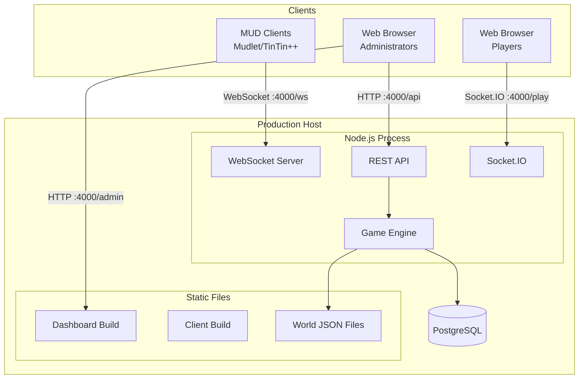

### Deployment Architecture

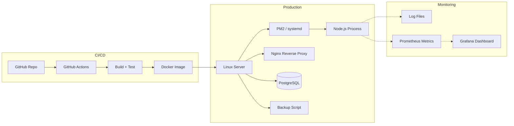

### CI/CD Pipeline

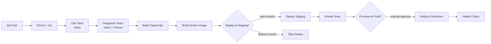

---

## Appendix: Utility Classes

### Dice Roller

```typescript
// src/utils/Dice.ts

/**
 * Roll dice in NdS format.
 * Replicates legacy dice() function.
 */
export function rollDice(numDice: number, sizeDice: number): number {
  if (numDice <= 0 || sizeDice <= 0) return 0;
  let total = 0;
  for (let i = 0; i < numDice; i++) {
    total += Math.floor(Math.random() * sizeDice) + 1;
  }
  return total;
}

/**
 * Random number in range [low, high] inclusive.
 * Replicates legacy number_range().
 */
export function numberRange(low: number, high: number): number {
  if (low >= high) return low;
  return low + Math.floor(Math.random() * (high - low + 1));
}

/**
 * Parse a dice string like "3d8+10" into components.
 */
export function parseDiceString(dice: string): { numDice: number; sizeDice: number; bonus: number } {
  const match = dice.match(/^(\d+)d(\d+)(?:\+(\d+))?$/);
  if (!match) return { numDice: 1, sizeDice: 4, bonus: 0 };
  return {
    numDice: parseInt(match[1]),
    sizeDice: parseInt(match[2]),
    bonus: parseInt(match[3] ?? '0'),
  };
}
```

### BitVector Utility

```typescript
// src/utils/BitVector.ts

/**
 * BitVector utilities for working with flag sets.
 * Uses bigint for >32 bit flag sets (affectedBy, actFlags).
 *
 * Why: The legacy engine uses 32-bit integers with BV00-BV31 macros.
 * Some flag sets (affected_by) have outgrown 32 bits in extended SMAUG.
 * We use bigint for unlimited flag capacity while maintaining the same
 * bit-testing semantics.
 */
export function hasFlag(flags: bigint, flag: bigint): boolean {
  return (flags & flag) !== 0n;
}

export function setFlag(flags: bigint, flag: bigint): bigint {
  return flags | flag;
}

export function removeFlag(flags: bigint, flag: bigint): bigint {
  return flags & ~flag;
}

export function toggleFlag(flags: bigint, flag: bigint): bigint {
  return flags ^ flag;
}

export function flagsToArray(flags: bigint, mapping: Record<string, bigint>): string[] {
  return Object.entries(mapping)
    .filter(([, bit]) => hasFlag(flags, bit))
    .map(([name]) => name);
}
```

**Why:** BigInt-based bitvectors preserve the exact semantics of SMAUG's C-level `xSET_BIT` / `xREMOVE_BIT` / `xTOGGLE_BIT` macros while remaining type-safe in TypeScript and easily serialisable for database storage.

---

*End of ARCHITECTURE.md — SMAUG 2.0 → Node.js/TypeScript Port*